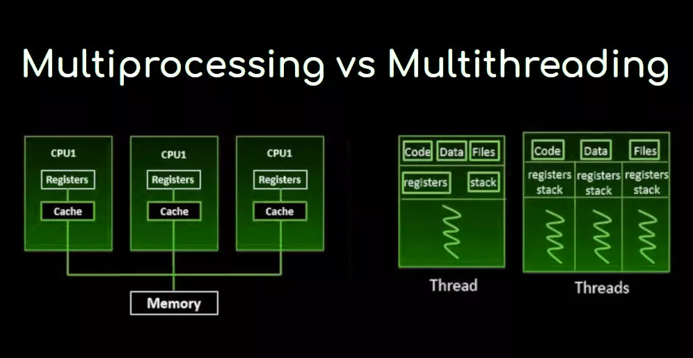

# Concurrencia

Desde hace ya bastantes años, los sistemas operativos son multitarea, lo que les permite ejecutar diversos procesos de forma simultánea. Esta capacidad ha permitido optimizar la programación para transitar hacia modelos multiproceso o multihilo.

En este capítulo, le presentamos el concepto de threads o hilos, y proporcionamos numerosas formas de administrar estos utilizando el API de concurrency. Los threads y la concurrencia son temas difíciles de comprender para muchos programadores, ya que los problemas con los threads pueden ser complejos y frustrantes incluso para los desarrolladores veteranos. En la práctica, los problemas de concurrencia se encuentran entre los más difíciles de diagnosticar y resolver.

# Introducción Threads(Hilos)

Comenzamos este capítulo revisando la terminología común asociada con los threads. 

- Un ***Thread (Hilo)*** es la unidad de ejecución más pequeña que puede programar el sistema operativo. 
- Un ***Proceso*** es un grupo de threads asociados que se ejecutan en el mismo entorno compartido. De ello se deduce, entonces, que un proceso de un thread es aquel que contiene exactamente un thread, mientras que un proceso de multithreaded(MiltiHilos) múltiples admite más de un thread.

- ***Entorno compartido(Shared memory)***, queremos decir que los threads en el mismo proceso comparten el mismo espacio de memoria y pueden comunicarse directamente entre sí. 



Esta figura muestra un solo proceso con tres threads. También muestra cómo se asignan a un número arbitrario de n CPU disponibles en el sistema. Tenga en cuenta este diagrama cuando analicemos los programadores de tareas más adelante en esta sección.

En este documento, hablamos mucho sobre las tareas y sus relaciones con los hilos. 

- Una ***tarea(Task o Job)*** es una sola unidad de trabajo realizada por un thread. A lo largo del tema, una tarea se implementará comúnmente como una expresión lambda. 
  
- Un thread puede completar varias tareas independientes, pero solo una tarea a la vez.

# Callable

Desde los primeros días de Java, los threads múltiples han sido un aspecto importante del lenguaje. Runnable es la interfaz principal provista para representar tareas multiproceso, y Java 1.5 proporcionó Callable como una versión mejorada de Runnable .

En este tutorial, exploraremos las diferencias y las aplicaciones de ambas interfaces.

## Understanding Thread Concurrency

La propiedad de ejecutar múltiples hilos(Multithreading) y procesos al mismo tiempo se conoce como **concurrencia**. 

¿Cómo decide el sistema operativo qué ejecutar cuando hay más hilos disponibles que CPUs? 

- Los sistemas operativos utilizan un **Administrador de hilos o thread scheduler** para determinar qué threads deben estar ejecutándose actualmente.

Por ejemplo, un **thread scheduler** puede emplear round-robin schedule en el que cada thread disponible recibe el mismo número de ciclos de CPU para ejecutarse. Lo que se infiere de esto es que, como programadores poco podemos hacer para priorizar unos hilos sobre otros, esa es una tarea del administrador de tareas del SO, de echo tratar de programar hilos en base a prioridades es un error conceptual.

Cuando se completa el tiempo asignado de un hilo pero el hilo no ha terminado de procesarse, se produce un **cambio de contexto(context swicth)**. 
- Un **cambio de contexto(context swicth)** es el proceso de almacenar el estado actual de un hilo y luego restaurar el estado del hilo para continuar la ejecución. Vamos, para continuar por donde iba. 
  
- Tenga en cuenta que a menudo se asocia un costo con un cambio de contexto debido a la pérdida de tiempo y la necesidad de recargar el estado del hilo. Los programadores de hilos inteligentes hacen todo lo posible para minimizar la cantidad de cambios de contexto mientras mantienen una aplicación funcionando sin problemas.

Finalmente, un thread puede interrumpir o reemplazar a otro thread si tiene una prioridad de thread más alta que el otro thread.

Una prioridad de thread es un valor numérico asociado con un thread que el planificador de thread tiene en cuenta al determinar qué thread deben ejecutarse actualmente. En Java, las prioridades de thread se especifican como valores enteros.

## Creating a Thread

Una de las formas más comunes de definir una tarea para un thread es mediante la instancia de Runnable. 
Runnable es un funcional

```java
    @FunctionalInterface 
    public interface Runnable { 
        void run();
    }
```

Con esto, es fácil crear e iniciar un hilo. De hecho, puedes hacerlo en una línea de código usando la clase Thread:

```java
    new Thread(() -> System.out.print("Hello")).start(); 
    System.out.print("World");
```

La primera línea crea un nuevo objeto Thread y luego lo inicia con el método start(). 
Y ... ¿Este código imprime *HelloWorld* o *WorldHello*? 
La respuesta es que no lo sabemos. Dependiendo del *thread priority/scheduler*, cualquiera de los dos es posible.
- Recuerda que el orden de ejecución de los threads, a menudo, no está garantizado. 

Compliquemoslo un poco, con este ejemplo:

 ```java
    Runnable printInventory = () -> System.out.println("Printing zoo inventory");
    Runnable printRecords = () -> {
        for (int i = 0; i < 3; i++)
            System.out.println("Printing record: " + i);
    };

    System.out.println("begin");
    new Thread(printInventory).start();
    new Thread(printRecords).start();
    new Thread(printInventory).start();
    System.out.println("end");
```
¿Que imprime esto y en que orden? ¿Cuantos Threads hay en es este ejemplo?

- La respuesta de que imprime es desconocida hasta que se ejecute. El ejemplo usa 4 hilos. Los tres que creamos en el ejemplo y el main() que se este ejecutando, que es otro thread, por supuesto ;-).

Cada hilo creado en estas líneas se ejecuta como una tarea asíncrona. Por asincrónico, queremos decir que el hilo que ejecuta el método main() no espera los resultados de cada hilo para continuar, recuerda, ya no es secuencial exactamente.

Si bien el orden de ejecución de los hilos es indeterminado una vez que se han iniciado, el orden dentro de un solo hilo sigue siendo secuencial. Vamos, que el bucle for se seguirá imprimiendo de forma secuencial, obviamente ... ;-)

**Calling run() Instead of start()**

En el examen, tenga en cuenta el código que intenta iniciar un `Thread` llamando a `run()` en lugar de start(). Llamar a `run()` en un Thread o un Runnable no inicia un nuevo hilo. 

El siguiente codigo, compila pero no ejecuta una tarea en un hilo separado:

```java
    System.out.println("begin");
    new Thread(printInventory).run();
    new Thread(printRecords).run();
    new Thread(printInventory).run();
    System.out.println("end");
```

A diferencia del ejemplo anterior, cada línea de este código es sincrona, esperará hasta que se complete el método run() antes de pasar a la siguiente línea. 

Podemos crear un `Thread` de dos formas posibles:

- Proveer de un objeto Runnable o una lambda expresion al constructor de un `Thread` .
- Crear una clase que herede de `Thread` y sobreescriba el método run.

## Distinguishing Thread Types

A lo mejor te sorprede que todas las aplicaciones Java, incluidas todas las que se presentan como ejemplos en cualquier parte, hasta las mas simples como un "Hello Word" son multihilo, porque incluyes *system threads*.

- Los ***system threads*** en Java son creados por la *Java Virtual Machine* (JVM) y corren de forma subyacente en tu aplicación. Por ejemplo, el *garbage collector* de Java es gestionado por un *system thread* y creado por la *Java Virtual Machine*

- Los ***user-threads*** son aquellos creados pro los programadores para completar una tarea.

La mayoría de los programas que vemos en ejemplos de internet contienen solo un thread definido por el usuario, que llaman al método main(). Para simplificar, comúnmente nos referimos a los programas que contienen un solo hilo definido por el usuario como *single-threaded applications*.

Los *System* y *user-defined thread* se pueden crear como hilos daemon. 

- Un ***thread daemon*** es aquel que no evitará que la JVM se cierre cuando finalice el programa. Una aplicación Java finaliza cuando los únicos hilos que se ejecutan son hilos daemon. Por ejemplo, si el *garbage collector* es el único hilo que queda en ejecución, la JVM se cerrará automáticamente.

```java
    public class Zoo {
    
        public static void pause() { // Defines the thread task
            try {
                Thread.sleep(10_000); // Wait for 10 seconds
            } catch (InterruptedException e) {
            }
            System.out.println("Thread finished!");
        }
    
        public static void main(String[] args) {
            var job = new Thread(() -> pause()); // Create thread
            job.start();
            System.out.println("Main method finished!");
        }
    }
```

El programa generará dos salidas con aproximadamente 10 segundos de diferencia:

```json
    Main method finished!
    --- 10 second wait ---
    Thread finished!
```

Así es. Aunque el método main() esté terminado, la JVM esperará a que termine el  user-thread antes de finalizar el programa. Esto plantea una pregunta interesante:
Mmmmmm ... ¿ Y qué pasaría si cambiamos job para ser un Thread tipo *daemon*?

```java
    job.setDaemon(true);
```

El programa imprimirá la primera frase y terminará sin imprimir la segunda...

```css
    Main method finished!
```
Recuerda que por defecto todo `Thread` creado es de tipo *user-thread* ,lo que tiene todo el sentido, ya que la clase fue creada para permitir que los desarrolladores podamos programar cosas con MultiThreading ¿No crees?. 

## Managing a Thread’s Life Cycle

Una vez que se ha creado un `Thread`, se encuentra en uno de los seis estados, que se muestran en la siguiente figura. Puedes consultar el estado de un hilo llamando a `getState()` sobre la instancia del `Thread`.

Aquí viene un poco el lio:


- ***New*** Este es el estado después de que el hilo instanciado se haya creado, pero el método start() no ha sido invocado todavía Es un objeto Thread vivo, pero aún sin ejecutar. En este punto el hilo se considera “not alive”. 

- ***Runnable*** En este estado, el hilo puede estar ejecutandose o ser elegido para ser ejecutado por el administrador de tareas(scheduler). El hilo entra en el estado de runnable por primera vez cuando el método start(). 
  
- El hilo una vez este en ejecucion puede cambiar de estado y que bloqueado a la espera de que se libere un recurso ***BLOCKED***, esperar para ser notificado ***WAITING***, ponerse a dormir si ejecuta el metodo sleep ***TIMED_WAITING*** o pasar a ***TERMINATED*** si completa su tarea.

Las transiciones de estados se cubren en parte, pero solo en parte, ya que estan mas haya del alcance del examen, y sinceramente, son muy difiles de usar correctamente. Usar Threads es una forma de programar a bajo nivel, que se debe evitar siempre en practica y usar las API de concurrencia (u otras APIs de alto nivel). 

## Polling with Sleep

Aunque la programación *Multithreading* te permite ejecutar varias tareas al mismo tiempo, un thread a menudo necesita esperar a que procedan los resultados de otro thread. Una solución es utilizar el sondeo. El sondeo es el proceso de verificar datos de forma intermitente en un intervalo fijo.

Digamos que tiene un thread que modifica un valor de contador estático compartido, y su thread main() está esperando que el thread alcance 1 millón:

```java
    public class CheckResults {
        private static int counter = 0;
    
        public static void main(String[] args) {
            new Thread(() -> {
                for (int i = 0; i < 1_000_000; i++) counter++;
            }).start();
            while (counter < 1_000_000) {
                System.out.println("Not reached yet");
            }
            System.out.println("Reached: " + counter);
        }
    }
```

¿Cuántas veces imprime este programa *"Not reached yet"*? 

La respuesta es, ***¡no lo sabemos!***. Podría imprimirse 0, 10 o un millón de veces. Usar un blucle while() para checkear por datos sin algun tipo de pausa o *delay* se considera una mala práctica, ya que estamos comiendonos recursos de la CPU sin motivo alguno.

Podemos mejorar este resultado utilizando el método Thread.sleep() para suspender el proceso principal por un segundo, por ejemplo.

```java
    public class CheckResultsWithSleep {
        private static int counter = 0;
    
        public static void main(String[] a) {
            new Thread(() -> {
                for (int i = 0; i < 1_000_000; i++) counter++;
            }).start();
            while (counter < 1_000_000) {
                System.out.println("Not reached yet");
                try {
                    Thread.sleep(1_000); // 1 SECOND
                    System.out.println("Interrupted!");
                } catch (InterruptedException e) {
                    System.out.println("Interrupted!");
                }
            }
            System.out.println("Reached: " + counter);
        }

    }
```

Si bien un segundo puede parecer una cantidad pequeña, ahora liberamos a la CPU para que realice cualquier otro trabajo en lugar de verificar la variable del contador infinitamente dentro de un bucle. Observe tambien, que el thread main() alterna entre *TIMED_WAITING* y *RUNNABLE* cuando se ingresa y se sale de `sleep()`, respectivamente.

## Interrupting a Thread

Si bien nuestra solución anterior evitó que la CPU esperara interminablemente en un ciclo while(), tuvo el costo de insertar retrasos de un segundo en nuestro programa. Si la tarea tarda 2,1 segundos en ejecutarse, el programa usará los 3 segundos completos y perderá 0,9 segundos.

Una forma de mejorar este programa es permitir que el subproceso interrumpa el subproceso main() cuando haya terminado:

```java
public static void main(String[] a) {
    
    var mainThread = Thread.currentThread();
    
    new Thread(() -> {
        for (int i = 0; i < 1_000_000; i++)
            counter++;
        mainThread.interrupt();
    }).start();

    while (counter < 1_000_000) {
        
        System.out.println("Not reached yet");
        try {
            Thread.sleep(1_000); // 1 SECOND
        } catch (InterruptedException e) {
            System.out.println("Interrupted!");
        }
    }
    
        /**
        * Esta versión mejorada incluye tanto sleep(), para evitar sobrecargar la CPU, como interrupt(), 
        * por lo que el trabajo del subproceso(thread work) finaliza sin retrasar el programa. 
        * Como antes, el estado de nuestro subproceso main() alterna entre TIMED_WAITING y RUNNABLE. 
        * Llamar a interrupt() en un subproceso en el estado TIMED_WAITING o WAITING hace que el subproceso principal() vuelva a ser RUNNABLE,
        * lo que desencadena una InterruptedException. 
        * El subproceso también puede pasar a un estado BLOQUEADO si necesita volver a adquirir recursos cuando se despierta.
        */
    System.out.println("Reached: " + counter);
}

```
Esta versión mejorada incluye tanto sleep(), para evitar sobrecargar la CPU, como interrupt(), por lo que la tarea del hilo(thread work) finaliza sin retrasar el programa. 
Como antes, el estado de nuestro hilo main() alterna entre TIMED_WAITING y RUNNABLE. Llamar a interrupt() en un subproceso en el estado TIMED_WAITING o WAITING hace que el subproceso principal() vuelva a ser RUNNABLE, lo que desencadena una InterruptedException. El subproceso también puede pasar a un estado BLOQUEADO si necesita volver a adquirir recursos cuando se despierta.

Calling interrupt() on a thread already in a RUNNABLE state doesn’t change the state. In fact, it only changes the
behavior if the thread is peri- odically checking the Thread.isInterrupted() value state.
