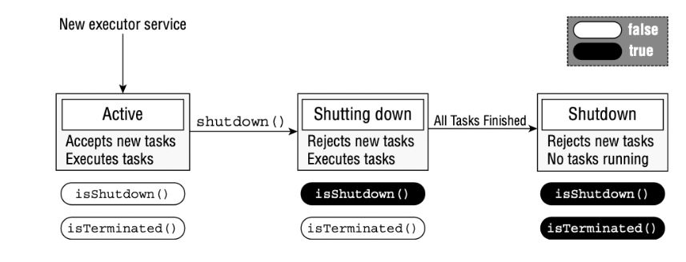
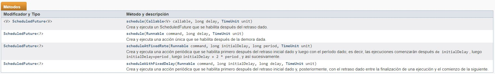

# Creando Threads con la Concurrency API

En Java 1.7 en adelante, se incluye el paquete `java.util.concurrent`, al que nos referiremos como la *Concurrency API*. Esta es una API de alto nivel que usaremos para evitar el complicado trabajo de gestionar los hilos con la clase `Thread`. La clase `Thread` es como la primera versión de Matrix, primogenita si, pero vieja y obsoleta.

La *Concurrency API* incluye la interfaz `ExecutorService`, que simplifica la ejecución de tareas en modo asíncrono. En términos generales, `ExecutorService` proporciona automáticamente *pool of threads* y una API para asignar tareas a este.

Para escribir programas MultiThread en la vida real, es mejor usar la *Concurrency API* (o algún otro SDK de Multithreading) en lugar de trabajar con objetos de `Thread` directamente. Estas librerias son mucho más robustas y es fáciles de entender, y nos ayudan gestionar los desafios complejos.

## Introduciendo Single-Thread Executor

Dado que `ExecutorService` es una interfaz, ¿cómo obtenemos una instancia de la misma? 

- La *Concurrency API* incluye la clase factory `Executors` que se puede usar para crear instancias del objeto `ExecutorService`. 
- Con el termino ***Thread Executor*** nos referimos a una instancia tipo ExecutorService

```java
    
    Runnable imprimeInventario = () -> System.out.println("imprimiendo inventario ZOO");
    Runnable imprimirRegistro = () -> {
        for (int i = 0; i <= 3; i++) {
            System.out.println("Imprimiendo Registro: "+i);
        }
    };
    

    // Aquí vemos forma de instanciar ExecutorService, existen distintas implementaciones. 
    // con newSingleThreadExecutor() tendremos un ExecutorService de UN SOLO THREAD
    ExecutorService service = Executors.newSingleThreadExecutor(); .
    
    try {
        System.out.println("Comienza ...");
        
        // Así ejecutamos un Runnable. El método execute() equivale a un start() en la clase Thread.
        service.execute(imprimeInventario); 
        service.execute(imprimirRegistro);
        service.execute(imprimeInventario);
        
        System.out.println("Fin ...");

    }finally {
        service.shutdown();
    }
```

Ten en cuenta que el bucle imprimeInventario ya no se interrumpe por otras tareas ejecutables enviadas al *Thread Executor*. Con un *Single-Thread-Executor* (`newSingleThreadExecutor()`), se garantiza que las tareas se ejecuten secuencialmente. Esto merece una explición algo mas profunda:

- `newSingleThreadExecutor()` --> Este método nos devuelve ***una instancia de un solo Thread***, no te equivoques, no se lanza un Thread cada vez que llama al execute, es un solo Thread para las 3 tareas.

Ten en cuenta además que el texto *"Fin ..."* se imprime mientras nuestras tareas del *Thread Executor* se están ejecutando. Esto se debe a que el método main() sigue siendo un `Thread` independiente del de `ExecutorService`.

## Apagar un Thread Executor

Una vez que has terminado de usar un `ExecutorService`, es importante llamar al método `shutdown()`. 

Un `ExecutorService` crea un *user-thread*, que no es un daemon, para la primera tarea que ejecuta, por lo que si no llama a shutdown(), la aplicación nunca terminará.

Si llamas a shutdown mientras el *Thread Executor* no termine, al llamar a `isShutdown()` devolverá true, mientras que `isTerminated()` devolverá false.

En este lapso de tiempo, si envias una nueva tarea al *Thread Executor*, se lanzará una `RejectedExecutionException`. 

- Una vez que se hayan completado todas las tareas activas,` isShutdown()` e `isTerminated()` devolverán true.




Para el examen, debe tener en cuenta que `shutdown()` no detiene ninguna tarea que ya se haya enviado *Thread Executor*.

¿Qué sucede queremos cancelar todas las tareas en ejecución, y tambien las que esten encoladas? 

- `ExecutorService` proporciona un método llamado `shutdownNow()`, que intenta detener todas las tareas en ejecución y descarta las que aún no se han iniciado. No se garantiza que tenga éxito porque es posible crear un threads que nunca terminen, con lo que cualquier intento de interrumpirlo puede ser ignorado.

Los recursos `ExecutorService` deben cerrarse correctamente para evitar pérdidas de memoria. Desafortunadamente, la interfaz `ExecutorService` no implenta AutoCloseable, por lo que no puede usar try-with-resources 

## Enviando Tareas para que sean ejecutadas

Puedes enviar tareas a una instancia de `ExecutorService` de distinras formas. 

El primer método que presentamos, execute(), se hereda de la interfaz Executor, que se amplía con la interfaz `ExecutorService`.

- El método execute() toma una instancia de `Runnable` y completa la tarea de forma asíncrona. Debido a que el tipo de devolución del método es nulo, no nos dice nada sobre el resultado de la tarea. Se considera un método de tipo *"fire and forget"*, ya que una vez que se envía, los resultados no están disponibles directamente para el hilo que llama.

Afortunadamente, los ingenieros de Java agregaron métodos de `submit()` a la interfaz `ExecutorService`, que, al igual que execute(), se pueden usar para completar tareas de forma asíncrona. Sin embargo, a diferencia de execute(), `submit()` devuelve una instancia de `Future` que se puede usar para determinar si la tarea está completada. También se puede usar para devolver un *? Objetodo generico* como resultado después de que se haya completado la tarea.

En la práctica, usar el método de `submit()` es bastante similar al método de execute(), excepto que el método de `submit() `devuelve una instancia de `Future` que se puede usar para determinar si la tarea ha completado la ejecución.

***Métodos de la clase ExecuteService para ejecutar tareas*** 

| Nombre método   |      Descripcion      |
|----------|:-------------:|
| void execute(Runnable c) | Ejecuta la tarea en algun momento del futuro | 
| Future<?>	submit(Runnable task) |Envía una tarea ejecutable para su ejecución y devuelve un futuro que representa esa tarea.|
|<T> Future<T> submit(Callable<T> task)|Envía una tarea que devuelve valor para su ejecución y devuelve un futuro que representa los resultados pendientes de la tarea.|
|<T> T	invokeAny(Collection<? extends Callable<T>> tasks)|Ejecuta las tareas dadas, devolviendo el resultado de una que se completó con éxito (es decir, sin lanzar una excepción), si alguna lo hace.|
|<T> List<Future<T>>	invokeAll(Collection<? extends Callable<T>> tasks) |    Ejecuta las tareas dadas, devolviendo una lista de Futuros que mantienen su estado y resultados cuando todo se completa.   |   

***Métodos de la clase ExecuteService para gestionar tareas*** 
| Nombre método   |      Descripcion      |
|----------|:-------------:|
| boolean	awaitTermination(long timeout, TimeUnit unit) | Bloquea hasta que todas las tareas hayan completado la ejecución después de una solicitud de cierre, se agote el tiempo de espera o se interrumpa el hilo actual, lo que ocurra primero. | 


## Enviando Tareas: execute() vs. submit()

Como habrás notado, los métodos de execute()  y submit() son casi idénticos cuando se aplican a expresiones *Runnable*.
El método submit() tiene la ventaja obvia de hacer lo mismo que execute(), pero con un objeto de retorno que se puede usar para rastrear el resultado. Debido a esta ventaja y al hecho de que execute() no admite expresiones "Callable", tendemos a preferir 
submit() a execute().

Para el examen, debes estar familiarizado con execute() y submit(), pero para trabajo recomendamos submit() sobre
execute() siempre que sea posible.

## Esperar a los resultados


¿Cómo sabemos cuándo se completa una tarea enviada a un `ExecutorService`?

- Como se mencionó en la sección anterior, El método `submit()` devuelve una instancia de `Future<V>` que se puede usar para determinar este resultado.

```java
    Future<?> future = service.submit(() -> System.out.println("Hello"));

```

`Future`, es en realidad una interfaz, con distintas implementaciones, de cara al examen hay que saber como operar con los metodos de esta interfaz. 


***Metodos Future***
| Nombre método   |      Descripcion      |
|boolean cancel(boolean mayInterrupt)| trata de cancelar una tarea, y devuelve true si lo consigue y false en otro caso |
|V get()| Se queda en espera(waiting) hasta que la accion se completa, despues devuelve el resultado. Puede arrojar InterrumptedException si la tarea es mietras espera interrumpida, CancelationException si alguien la cancela o ExecutionException si la tarea lanza una excepcion en tiempo de ejecucion|
|V	get(long timeout, TimeUnit unit)| Igual que la anterior pero ademas espera solo por un determinado tiempo, cuando ese tiempo pasa, trata de recuperar el resultado si no lo consigue lanza TimeoutException|
|boolean	isCancelled()|Devuelve true si la tarea se canceló antes de que se completara normalmente.|
|boolean	isDone()|devuelve true si la tarea se completo|


```java
public class CheckResults {
    private static int counter = 0;

    public static void main(String[] unused) throws Exception {
        ExecutorService service = Executors.newSingleThreadExecutor();
        try {
            Future<?> result = service.submit(() -> {
                for (int i = 0; i < 1_000_000; i++) counter++;
            }
            );
            result.get(10, TimeUnit.SECONDS); // Returns null for Runnable
            System.out.println("Reached!");
        } catch (TimeoutException e) {
            System.out.println("Not reached in time");
        } finally {
            service.shutdown();
        }
    }
}
```


Este ejemplo es similar a la *polling implementation*, pero no usa la clase `Thread` directamente. En parte, esta es la esencia de la *Concurrency API*: hacer cosas complejas con subprocesos sin tener que administrar los subprocesos directamente. 

También espera como máximo 10 segundos, lanzando una `TimeoutException` en la llamada a result.get() si la tarea no se realiza.

¿Cuál es el valor de retorno de esta tarea? 

- Como `Future<V>` es una interfaz genérica, el tipo V está determinado por el tipo de retorno del método `Runnable`. Dado que el tipo de retorno de ***Runnable.run()*** es void, el método get() siempre devuelve un valor ***null*** cuando se trabaja con expresiones `Runnable`. Lo que ves en la lambda expression es un Runnable ya que no retorna nada.


## Introduccion a Callable

La interfaz functional `java.util.concurrent.Callable`  es similar a Runnable execpto que su método `call()` devuelve un valor y puede arrojar excepciones controladas.

```java
    @FunctionalInterface 
    public interface Callable<V> { 
        V call() throws Exception;
    }
```

La interfaz `Callable` a menudo es preferible a Runnable, ya que permite recuperar detalles de la tarea una vez completada.

Afortunadamente, `ExecutorService` incluye una versión sobrecargada del método `submit()` que toma un objeto `Callable` y devuelve una instancia genérica de `Future<T>`.

A diferencia de Runnable, en el que los métodos get() siempre devuelven null, los métodos get() devuelven tipo genérico Del Future (aunque también podría ser un valor nulo).

```java
var service = Executors.newSingleThreadExecutor();
try {
    Future<Integer> result = service.submit(() -> 30 + 11);
    System.out.println(result.get()); // 41
} finally {
    service.shutdown();
}
```

## Esperar a que todas las tareas se completen

Después de enviar un conjunto de tareas a un *Thread Executor*, es común esperar los resultados. Como has visto anteriormentew, una solución es llamar a `get()` en el `Future` devuelto por el método submit(). Si no necesitamos los resultados de las tareas y hemos terminado de usar nuestro  *Thread Executor*, hay un enfoque más simple.

Primero, apagamos el  *Thread Executor* usando el método `shutdown()`. A continuación, usamos el método `awaitTermination()`disponible para todos los *Threads Executor*. El método espera el tiempo especificado para completar todas las tareas y retorna antes cuando todas las tareas finalizan, o si se detecta una `InterruptedException`. 

Estos conceptos los podemos ver programados en el siguiente ejemplo

```java
public static void main(String[] args) throws InterruptedException {

    Runnable imprimirInventario = () -> System.out.println("Imprimiendo el inventario del ZOO");
    Runnable ImprmirRegistros = () -> {
        for (int i = 0; i < 3; i++) {
            System.out.println("Mostrando el refistro: " + i);
            try {
                Thread.sleep(500);
            } catch (InterruptedException e) {
                throw new RuntimeException(e);
            }
        }
    };

    ExecutorService service = Executors.newSingleThreadExecutor(); // Un solo Thread
    try {

        System.out.println("begin");
        service.execute(imprimirInventario);
        service.execute(ImprmirRegistros);
        service.execute(imprimirInventario);
        System.out.println("end");


    } finally {
        service.shutdown();
    }
    service.awaitTermination(1, TimeUnit.SECONDS);  // Esperamos un determindao tiempo a que se complete

    if (service.isTerminated())
        System.out.println("Finalizado!");
    else
        System.out.println("Al menos una tarea esta aun corriendo");
}
```

## Programando ejecución Tareas(en el tiempo)

A menudo, en Java, necesitamos programar una tarea para que suceda en algún momento futuro. Incluso podríamos necesitar programar la tarea para que suceda repetidamente, en algún intervalo establecido. Por ejemplo, imagina que queremos comprobar el suministro de alimentos para los animales del zoológico una vez por hora y llenarlo según sea necesario. `ScheduledExecutorService`, que es una subinterfaz de `ExecutorService`, se puede usar para esa tarea.

Al igual que `ExecutorService`, obtenemos una instancia de `ScheduledExecutorService` usando un método de factoria`Executors`, como muestra el siguiente fragmento de código:

```java
    ScheduledExecutorService service = Executors.newSingleThreadScheduledExecutor();
```


En la práctica, estos métodos se encuentran entre los más convenientes en la *Concurrency API*, ya que realizan tareas relativamente complejas con una sola línea de código. Los parámetros delay y period se basan en el argumento TimeUnit para determinar el formato del valor, como segundos o milisegundos.

Los primeros dos métodos Schedule en la Tabla toman un `Callable` o `Runnable`, respectivamente; realizar la tarea después de algún retraso; y devolver una instancia de `ScheduledFuture`. La interfaz `ScheduledFuture` es idéntica a la interfaz `Future`, excepto que incluye un método `getDelay()` que devuelve el retraso restante. Lo siguiente usa el método schedule() con tareas `Callable` y `Runnable`:

```java
    public static void main(String[] args) {

        ScheduledExecutorService service = Executors.newSingleThreadScheduledExecutor();
        Runnable task1 = () -> System.out.println("Hello Zoo");
        Callable<String> task2 = () -> "Monkey";
        ScheduledFuture<?> r1 = service.schedule(task1, 10, TimeUnit.SECONDS);
        ScheduledFuture<?> r2 = service.schedule(task2, 8, TimeUnit.MINUTES);
    }
```
La primera tarea está programada 10 segundos en el futuro, mientras que la segunda tarea está programada 8 minutos en el futuro.

Si bien estas tareas están programadas para el futuro, la ejecución real puede retrasarse. Por ejemplo, es posible que no haya subprocesos disponibles para realizar las tareas, momento en el que simplemente esperarán en la cola. Además, si `ScheduledExecutorService` se cierra antes de que se alcance el tiempo de ejecución de la tarea programada, estas tareas se descartarán.

Cada uno de los métodos `ScheduledExecutorService` es importante y tiene aplicaciones del mundo real. 
Por ejemplo, puede usar el comando `schedule()` para verificar el estado de limpieza de la jaula de un león. 
Luego puede enviar notificaciones si no ha terminado, o incluso llamar schedule() para verificar nuevamente más tarde.

Los últimos dos métodos en la pueden ser un poco confusos si no los has visto antes. Conceptualmente, son similares ya que ambos realizan la misma tarea repetidamente después de un retraso inicial. La diferencia está relacionada con el momento del proceso y cuándo comienza la siguiente tarea.

El método `scheduleAtFixedRate()` crea una nueva tarea y la envía al executor periodicamente, independientemente de si la tarea anterior finalizó. El siguiente ejemplo ejecuta una tarea Runnable cada minuto, despues de un *delay* de cinco minutos:
```java

    service.scheduleAtFixedRate(command, 5, 1, TimeUnit.MINUTES);
```

El método` scheduleAtFixedRate()` es útil para tareas que deben ejecutarse a intervalos específicos, como verificar la salud de los animales una vez al día. Incluso si toma dos horas examinar a un animal el lunes, esto no significa que el examen del martes deba comenzar más tarde en el día.

Pueden ocurrir cosas malas con `scheduleAtFixedRate()` si cada tarea tarda más en ejecutarse que el intervalo de ejecución. 
Imagínese si su jefe viniera a su escritorio cada minuto y dejara una hoja de papel. Ahora imagina que te tomó cinco minutos leer cada hoja de papel. En poco tiempo, te estarías ahogando en montones de papeles. Así se siente un *Executor*. Con el tiempo suficiente, el programa enviaría más tareas al executorService de las que podrían caber en la memoria, lo que provocaría que el programa fallara.

Por otro lado, el método `scheduleWithFixedDelay()` crea una nueva tarea solo después de que finaliza la tarea anterior. 
Por ejemplo, si una tarea se ejecuta a las 12:00 y tarda cinco minutos en finalizar, con un período entre ejecuciones de dos minutos, la siguiente tarea comenzará a las 12:07.

```java
    service.scheduleWithFixedDelay(task1, 0, 2, TimeUnit.MINUTES);
```

El método scheduleWithFixedDelay() es útil para los procesos que desea que sucedan repetidamente pero cuyo tiempo específico no es importante. 
- Por ejemplo, imagine que tenemos un trabajador de la cafetería del zoológico que reabastece periódicamente la barra de ensaladas a lo largo del día. El proceso puede demorar 20 minutos o más, ya que requiere que el trabajador transporte una gran cantidad de artículos desde la trastienda. Una vez que el trabajador ha llenado la barra de ensaladas con alimentos frescos, no necesita verificar en un momento específico, solo después de que haya pasado suficiente tiempo para que se quede sin existencias nuevamente.

## Incrementando la concurrencia con Pools

Todos nuestros ejemplos hasta ahora han sido con un ejecutor de un solo subproceso que, aunque interesante, no fue particularmente útil. Después de todo, el nombre de este capítulo es "Concurrencia", ¡y no puedes hacer mucho de eso con un ejecutor de un solo subproceso!

Ahora presentamos tres métodos de fábrica adicionales en la clase Executors que actúan en un conjunto de subprocesos en lugar de en un único subproceso. Un grupo de subprocesos es un grupo de subprocesos reutilizables instanciados previamente que están disponibles para realizar un conjunto de tareas arbitrarias. La Tabla 13.5 incluye nuestros dos métodos ejecutores de subproceso único anteriores, junto con los nuevos que debe conocer para el examen.


Como se muestra en la Tabla, estos métodos devuelven los mismos tipos de instancia, `ExecutorService` y `ScheduledExecutorService`, que usamos anteriormente en este capítulo. En otras palabras, ¡todos nuestros ejemplos anteriores son compatibles con estos nuevos ***pooled-thread executors***!

La diferencia entre un  ***single-thread*** y uno de ***pooled-thread executor*** es lo que sucede cuando una tarea ya se está ejecutando. Mientras que un ***single-thread*** esperará a que el thread esté disponible antes de ejecutar la siguiente tarea, un ***pooled-thread executor***  puede ejecutar la siguiente tarea al mismo tiempo. Si el pool se queda sin threads disponibles, el ***thread executor*** pondrá en cola la tarea y esperará a que haya un thread disponible para completarse.
