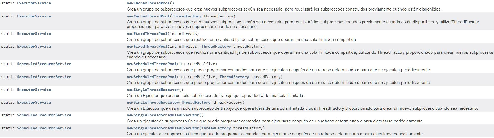

# Creando Threads con la Concurrency API

Java incluye el paquete `java.util.concurrent`, al que nos referimos como Concurrency API, para manejar el complicado trabajo de administrar threads de forma manual. La API de concurrencia incluye la interfaz `ExecutorService`, que define los servicios que crean y administran threads.

Al escribir programas de threads múltiples en la práctica, a menudo es mejor usar la Concurrency API (o algún otro SDK de threads múltiples) en lugar de trabajar con objetos de threads directamente. Las bibliotecas son mucho más robustas y es más fácil manejar interacciones complejas.

## Introduciendo Single-Thread Executor

Dado que `ExecutorService` es una interfaz, ¿cómo se obtiene una instancia de la misma? La API de concurrencia incluye la clase factory `Executors` 
que se puede usar para crear instancias del objeto `ExecutorService`. 

```java
    
    Runnable imprimeInventario = () -> System.out.println("imprimiendo inventario ZOO");
    Runnable imprimirRegistro = () -> {
        for (int i = 0; i <= 3; i++) {
            System.out.println("Imprimiendo Registro: "+i);
        }
    };
    
    ExecutorService service = Executors.newSingleThreadExecutor();
    
    try {
        System.out.println("Comienza ...");
        
        service.execute(imprimeInventario);
        service.execute(imprimirRegistro);
        service.execute(imprimeInventario);
        
        System.out.println("Fin ...");

    }finally {
        service.shutdown();
    }
```

Tenga en cuenta que el bucle printRecords ya no se interrumpe por otras tareas ejecutables enviadas al ejecutor del Hilo. Con un ejecutor de un solo Hilo(`newSingleThreadExecutor()`), se garantiza que las tareas se ejecuten secuencialmente. Tenga en cuenta que el texto final se emite mientras nuestras tareas del ejecutor de Hilo aún se están ejecutando. Esto se debe a que el método main() sigue siendo un Hilo independiente del ExecutorService.

## Shutting Down a Thread Executor

Una vez que haya terminado de usar un ExecutorService , es importante que llame al método shutdown(). Un ExecutorService  crea un threads que no es un demonio en la primera tarea que se ejecuta, por lo que si no llama a shutdown(), su aplicación nunca terminará.


Si llamas a shutdown Durante este tiempo, llamar a isShutdown() devolverá true, mientras que isTerminated() devolverá falso.

Si se envía una nueva tarea al ejecutor del threads mientras se está cerrando, se lanzará una RejectedExecutionException. Una vez que se hayan completado todas las tareas activas, isShutdown() e isTerminated() devolverán true.


Para el examen, debe tener en cuenta que shutdown() no detiene ninguna tarea que ya se haya enviado al ejecutor del threads.

¿Qué sucede si desea cancelar todas las tareas en ejecución y próximas? ExecutorService proporciona un método llamado shutdownNow(), que intenta detener todas las tareas en ejecución y descarta las que aún no se han iniciado. No se garantiza que tenga éxito porque es posible crear un threads que nunca terminará, con lo que cualquier intento de interrumpirlo puede ser ignorado.

Los recursos ExecutorService deben cerrarse correctamente para evitar pérdidas de memoria. Desafortunadamente, la interfaz ExecutorService no implentaAutoCloseable, por lo que no puede usar try-with-resources 

## Submitting Tasks

Puede enviar tareas a una instancia de ExecutorService de varias maneras. 

El primer método que presentamos, execute(), se hereda de la interfaz Executor, que se amplía con la interfaz ExecutorService.

El método execute() toma una instancia de Runnable y completa la tarea de forma asíncrona. Debido a que el tipo de devolución del método es nulo, no nos dice nada sobre el resultado de la tarea. Se considera un método de "dispara y olvida", ya que una vez que se envía, los resultados no están disponibles directamente para el hilo que llama.

Afortunadamente, los escritores de Java agregaron métodos de submit () a la interfaz ExecutorService, que, al igual que execute(), se pueden usar para completar tareas de forma asíncrona. Sin embargo, a diferencia de execute(), submit() devuelve una instancia de Future que se puede usar para determinar si la tarea está completa. También se puede usar para devolver un objeto de resultado genérico después de que se haya completado la tarea.

En la práctica, usar el método de submit() es bastante similar al método de execute(), excepto que el método de submit() devuelve una instancia de Future que se puede usar para determinar si la tarea ha completado la ejecución..


Métodos de la clase ExecuteService 

| Nombre método   |      Descripcion      |
|----------|:-------------:|
| boolean	awaitTermination(long timeout, TimeUnit unit) | Bloquea hasta que todas las tareas hayan completado la ejecución después de una solicitud de cierre, se agote el tiempo de espera o se interrumpa el hilo actual, lo que ocurra primero. | 
| void execute(Runnable c) | Ejecuta la tarea en algun momento del futuro | 
| Future<?>	submit(Runnable task) |Envía una tarea ejecutable para su ejecución y devuelve un futuro que representa esa tarea.|
|<T> Future<T> submit(Callable<T> task)|Envía una tarea que devuelve valor para su ejecución y devuelve un futuro que representa los resultados pendientes de la tarea.|
|<T> T	invokeAny(Collection<? extends Callable<T>> tasks)|Ejecuta las tareas dadas, devolviendo el resultado de una que se completó con éxito (es decir, sin lanzar una excepción), si alguna lo hace.|
|<T> List<Future<T>>	invokeAll(Collection<? extends Callable<T>> tasks) |    Ejecuta las tareas dadas, devolviendo una lista de Futuros que mantienen su estado y resultados cuando todo se completa.   |   


**Submitting Tasks: execute() vs. submit()**

As you might have noticed, the execute() and submit() methods are nearly identical when applied to Runnable expressions.
The submit() method has the obvious advantage of doing the same thing execute() does, but with a return object that can
be used to track the result. Because of this advantage and the fact that execute() does not support Callable
expressions, we tend to prefer submit() over execute(), even if we don’t store the Future reference.

For the exam, you need to be familiar with both execute() and submit(), but in your own code we recommend submit() over
execute() whenever possible.

## Waiting for Results

How do we know when a task submitted to an ExecutorService is complete? As mentioned in the previous section, the
submit() method returns a Future<V> instance that can be used to determine this result.

    Future<?> future = service.submit(() -> System.out.println("Hello"));

The Future type is actually an interface. For the exam, you don’t need to know any of the classes that implement Future,
just that a Future instance is returned by various API methods.


    public class CheckResults {
        private static int counter = 0;
    
        public static void main(String[] unused) throws Exception {
            ExecutorService service = Executors.newSingleThreadExecutor();
            try {
                Future<?> result = service.submit(() -> {
                    for (int i = 0; i < 1_000_000; i++) counter++;
                }
                );
                result.get(10, TimeUnit.SECONDS); // Returns null for Runnable
                System.out.println("Reached!");
            } catch (TimeoutException e) {
                System.out.println("Not reached in time");
            } finally {
                service.shutdown();
            }
        }
    }

This example is similar to our earlier polling implementation, but it does not use the Thread class directly. In part,
this is the essence of the Concurrency API: to do complex things with threads without having to manage threads directly.
It also waits at most 10 seconds, throwing a TimeoutException on the call to result.get() if the task is not done.

What is the return value of this task? As Future<V> is a generic interface, the type V is determined by the return type
of the Runnable method. Since the return type of Runnable.run() is void, the get() method always returns null when
working with Runnable expressions.

The Future.get() method can take an optional value and enum type java.util.concurrent.TimeUnit. Table 13.3 presents the
full list of TimeUnit values since numerous methods in the Concurrency API use this enum.


## Introducing Callable

The java.util.concurrent.Callable functional interface is similar to Runnable except that its call() method returns a
value and can throw a checked exception. The following is the definition of the Callable interface:

    @FunctionalInterface 
    public interface Callable<V> { 
        V call() throws Exception;
    }

The Callable interface is often preferable over Runnable, since it allows more details to be retrieved easily from the
task after it is completed.

Luckily, the ExecutorService includes an overloaded version of the submit() method that takes a Callable object and
returns a generic Future<T> instance.

Unlike Runnable, in which the get() methods always return null, the get() methods on a Future instance return the
matching generic type (which could also be a null value).

    var service = Executors.newSingleThreadExecutor();
    try {
        Future<Integer> result = service.submit(() -> 30 + 11);
        System.out.println(result.get()); // 41
        service.shutdown();
    } finally {
        service.shutdown();
    }

## Waiting for All Tasks to Finish

After submitting a set of tasks to a thread executor, it is common to wait for the results. As you saw in the previous
sections, one solution is to call get() on each Future object returned by the submit() method. If we don’t need the
results of the tasks and are finished using our thread executor, there is a simpler approach.

First, we shut down the thread executor using the shutdown() method. Next, we use the awaitTermination() method
available for all thread executors. The method waits the specified time to complete all tasks, returning sooner if all
tasks finish or an InterruptedException is detected. You can see an example of this in the following code snippet:

    public static void main(String[] args) throws InterruptedException {

        Runnable printInventory = () -> System.out.println("Printing zoo inventory");
        Runnable printRecords = () -> {
            for (int i = 0; i < 3; i++) {
                System.out.println("Printing record: " + i);
                try {
                    Thread.sleep(500);
                } catch (InterruptedException e) {
                    throw new RuntimeException(e);
                }
            }
        };

        ExecutorService service = Executors.newSingleThreadExecutor();
        try {

            System.out.println("begin");
            service.execute(printInventory);
            service.execute(printRecords);
            service.execute(printInventory);
            System.out.println("end");


        } finally {
            service.shutdown();
        }
        service.awaitTermination(1, TimeUnit.SECONDS);
        // Check whether all tasks are finished

        if (service.isTerminated())
            System.out.println("Finished!");
        else
            System.out.println("At least one task is still running");
    }

## Scheduling Tasks

Often in Java, we need to schedule a task to happen at some future time. We might even need to schedule the task to
happen repeatedly, at some set interval. For example, imagine that we want to check the supply of food for zoo animals
once an hour and fill it as needed. ScheduledExecutorService, which is a subinterface of ExecutorService, can be used
for just such a task.

Like ExecutorService, we obtain an instance of ScheduledExecutorService using a factory method in the Executors class,
as shown in the following snippet:

    ScheduledExecutorService service = Executors.newSingleThreadScheduledExecutor();

We could store an instance of ScheduledExecutorService in an ExecutorService variable, although doing so would mean we’d
have to cast the object to call any scheduling methods.


In practice, these methods are among the most convenient in the Concurrency API, as they perform relatively complex
tasks with a single line of code. The delay and period parameters rely on the TimeUnit argument to determine the format
of the value, such as seconds or milliseconds.

The first two schedule() methods in Table 13.4 take a Callable or Runnable, respectively; perform the task after some
delay; and return a ScheduledFuture instance. The ScheduledFuture interface is identical to the Future interface, except
that it includes a getDelay() method that returns the remaining delay. The following uses the schedule()
method with Callable and Runnable tasks:

    public static void main(String[] args) {

        ScheduledExecutorService service = Executors.newSingleThreadScheduledExecutor();
        Runnable task1 = () -> System.out.println("Hello Zoo");
        Callable<String> task2 = () -> "Monkey";
        ScheduledFuture<?> r1 = service.schedule(task1, 10, TimeUnit.SECONDS);
        ScheduledFuture<?> r2 = service.schedule(task2, 8, TimeUnit.MINUTES);
    }

The first task is scheduled 10 seconds in the future, whereas the second task is scheduled 8 minutes in the future.

While these tasks are scheduled in the future, the actual execution may be delayed. For example, there may be no threads
available to perform the tasks, at which point they will just wait in the queue. Also, if the ScheduledExecutorService
is shut down by the time the scheduled task execution time is reached, then these tasks will be discarded.

Each of the ScheduledExecutorService methods is important and has real-world applications. For example, you can use the
schedule() command to check on the state of cleaning a lion’s cage. It can then send out notifications if it is not
finished or even call schedule() to check again later.

The last two methods in Table 13.4 might be a little confusing if you have not seen them before. Conceptually, they are
similar as they both perform the same task repeatedly after an initial delay. The difference is related to the timing of
the process and when the next task starts.

The scheduleAtFixedRate() method creates a new task and submits it to the executor every period, regardless of whether
the previous task finished. The following example executes a Runnable task every minute, following an initial
five-minute delay:

    service.scheduleAtFixedRate(command, 5, 1, TimeUnit.MINUTES

The scheduleAtFixedRate() method is useful for tasks that need to be run at specific intervals, such as checking the
health of the animals once a day. Even if it takes two hours to examine an animal on Monday, this doesn’t mean that
Tuesday’s exam should start any later in the day.

Bad things can happen with scheduleAtFixedRate() if each task consistently takes longer to run than the execution
interval. Imagine if your boss came by your desk every minute and dropped off a piece of paper. Now imagine that it took
you five minutes to read each piece of paper. Before long, you would be drowning in piles of paper. This is how an
executor feels. Given enough time, the program would submit more tasks to the executor service than could fit in memory,
causing the program to crash.

On the other hand, the scheduleWithFixedDelay() method creates a new task only after the previous task has finished. For
example, if a task runs at 12:00 and takes five minutes to finish, with a period between executions of two minutes, the
next task will start at 12:07.

    service.scheduleWithFixedDelay(task1, 0, 2, TimeUnit.MINUTES);

The scheduleWithFixedDelay() method is useful for processes that you want to happen repeatedly but whose specific time
is unimportant. For example, imagine that we have a zoo cafeteria worker who periodically restocks the salad bar
throughout the day. The process can take 20 minutes or more, since it requires the worker to haul a large number of
items from the back room. Once the worker has filled the salad bar with fresh food, they don’t need to check at some
specific time, just after enough time has passed for it to become low on stock again.

## Incrementando Concurrency with Pools

Todos nuestros ejemplos hasta ahora han sido con un ejecutor de un solo subproceso que, aunque interesante, no fue particularmente útil. Después de todo, el nombre de este capítulo es "Concurrencia", ¡y no puedes hacer mucho de eso con un ejecutor de un solo subproceso!

Ahora presentamos tres métodos de fábrica adicionales en la clase Executors que actúan en un conjunto de subprocesos en lugar de en un único subproceso. Un grupo de subprocesos es un grupo de subprocesos reutilizables instanciados previamente que están disponibles para realizar un conjunto de tareas arbitrarias. La Tabla 13.5 incluye nuestros dos métodos ejecutores de subproceso único anteriores, junto con los nuevos que debe conocer para el examen.



Como se muestra en la Tabla, estos métodos devuelven los mismos tipos de instancia, ExecutorService y ScheduledExecutorService, que usamos anteriormente en este capítulo. En otras palabras, ¡todos nuestros ejemplos anteriores son compatibles con estos nuevos ejecutores de threads agrupados!

La diferencia entre un ejecutor de threads único y uno de threads agrupados es lo que sucede cuando una tarea ya se está ejecutando. Mientras que un ejecutor de threads único esperará a que el threads esté disponible antes de ejecutar la siguiente tarea, un ejecutor de threads agrupados puede ejecutar la siguiente tarea al mismo tiempo. Si el grupo se queda sin threads disponibles, el ejecutor del threads pondrá en cola la tarea y esperará a que se complete.
