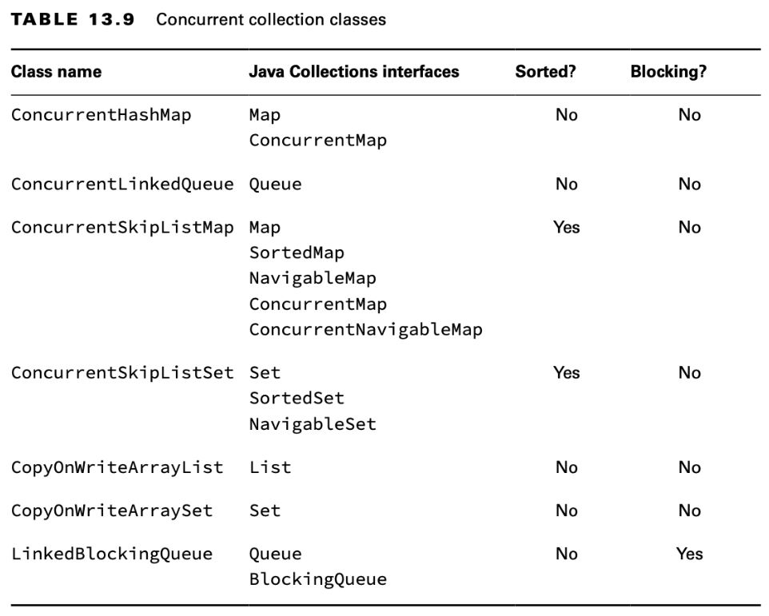
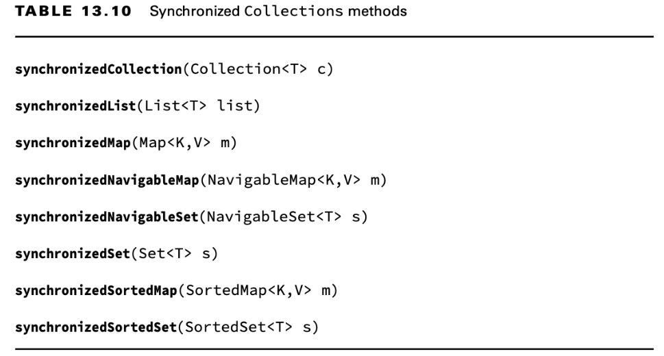

# Using Concurrent Collections

Ademas de usar threads, la `Concurrency API` incluye colecciones concurrentes que nos ayudan a gestionar tareas
multihilo con colecciones compartidas.

## Understanding Memory Consistency Errors

El propósito de las collecciones del paquete `java.util.concurrent` es resolver errores comunes de consistencia de memoria. Se produce un error de coherencia en memoria cuando dos threads tienen vistas incoherentes de lo que deberían ser los mismos datos. Conceptualmente, queremos al escribir en un threads la colección esté disponible para otro threads.

Cuando dos threads intentan modificar la misma colección no concurrente, la JVM puede generar una `ConcurrentModificationException` en tiempo de ejecución. 

De hecho, puede suceder con un solo hilo. Mira el siguiete código:

```java
    var mapNumAnimales = new HashMap<String, Integer>();
		mapNumAnimales.put("Perros", 3);
		mapNumAnimales.put("Gatos", 2);

		try {
			for (Map.Entry<String, Integer> entry : mapNumAnimales.entrySet()) 
				mapNumAnimales.remove("Perros"); // java.util.ConcurrentModificationException
			
		} catch (ConcurrentModificationException e) {
			System.err.println("Error al remover: "+e);
		}
```

Este fragmento generará una `ConcurrentModificationException` durante la segunda iteración del ciclo, ya que el iterador en keySet() no se actualiza correctamente después de eliminar el primer elemento.

Cambiar la primera línea para usar un `ConcurrentHashMap` evitará que el código genere una excepción en tiempo de ejecución.

```java
    	var mapNumAnimalesConcurrent = new ConcurrentHashMap<>(mapNumAnimales);
		for (Map.Entry<String, Integer> entry : mapNumAnimales.entrySet()) 
			mapNumAnimales.remove("Perros");
		
		System.out.println(mapNumAnimalesConcurrent); // {Gatos=2}

```

Aunque normalmente no modificamos una variable de bucle, este ejemplo destaca el hecho de que `ConcurrentHashMap` ordena el acceso de lectura/escritura de modo que todos los accesos a la clase sean coherentes. En este fragmento de código, el iterador creado por `keySet()` se actualiza tan pronto como se elimina un objeto del mapa.

Las clases concurrentes se crearon para ayudar a evitar problemas comunes en los que varios threads agregan y eliminan objetos de las mismas colecciones. En cualquier instancia dada, todos los threads deben tener la misma vista coherente de la estructura de la colección.

## Working with Concurrent Classes

Debes usar una coleccion concurrente cada vez que tenga varios threads que modifiquen una colección fuera de un bloque o método sincronizado, incluso si no espera un problema de concurrencia. Sin en las colecciones concurrentes, los threads que acceden a una colección podrían generar una excepción o, lo que es peor, datos corruptos.

Si la colección es *inmutable* (y contiene *objetos inmutables*), las colecciones concurrentes no son necesarias. Cualquier cantidad de threads puede acceder a los *objetos inmutables* y no requieren sincronización. Por definición, no cambian, por lo que no hay posibilidad de que se produzca un error de coherencia de la memoria.



Las clases Skip pueden sonar extrañas, pero son solo versiones *"ordenadas"* de las colecciones concurrentes asociadas. Cuando vea una clase con Skip en el nombre, solo piense en colecciones "concurrentes ordenadas", el resto debería seguir de forma natural.

Las clases `CopyOnWrite` se comportan de manera un poco diferente a los otros ejemplos concurrentes que hemos visto. Estas clases crean una copia de la colección cada vez que se agrega, elimina o cambia una referencia en la colección y luego actualizan la referencia de la colección original para que apunte a la copia.

```java
    List<Integer> favNumbers = new CopyOnWriteArrayList<>(List.of(4, 3, 42));
    for (var n : favNumbers) {
        System.out.print(n + " "); // 4 3 42
        favNumbers.add(n + 1);
    }

    System.out.println();
    System.out.println("Size: " + favNumbers.size()); // Size: 6
    System.out.println(favNumbers); // [4, 3, 42, 5, 4, 43]
```

A pesar de agregar elementos, el iterador no se modifica y el ciclo se ejecuta exactamente tres veces. Alternativamente, si hubiéramos usado un objeto `ArrayList` normal, se habría lanzado una `ConcurrentModificationException` en tiempo de ejecución. 

- Las clases `CopyOnWrite` pueden usar mucha memoria, ya que se crea una nueva estructura de colección cada vez que se modifica la colección. 

- `CopyOnWrite` se usan comúnmente en situaciones de entornos de subprocesos múltiples donde las lecturas son mucho más comunes que las escrituras.

Una instancia de `CopyOnWrite` es similar a un objeto **inmutable**, ya que se crea una nueva estructura subyacente cada vez que se modifica la colección. Sin embargo, a diferencia de un verdadero objeto **inmutable**, la referencia al objeto permanece igual incluso cuando se modifican los datos subyacentes.

`LinkedBlockingQueue`, que implementa la interfaz `BlockingQueue` concurrente. Esta clase es como una `Queue` regular, excepto que incluye versiones sobrecargadas de `offer()` y `poll()` que toman un tiempo de espera. Estos métodos esperan (o bloquean) hasta una cantidad específica de tiempo para completar una operación.

## Obtaining Synchronized Collections

Además de las clases de colección concurrentes que hemos cubierto, la API de concurrencia también incluye métodos para obtener versiones sincronizadas de objetos de colección no concurrentes existentes. Estos métodos sincronizados se definen en la clase Collections. Operan en la colección ingresada y devuelven una referencia que es del mismo tipo que la colección subyacente.


