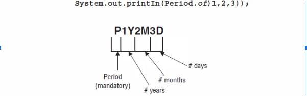
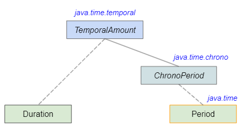
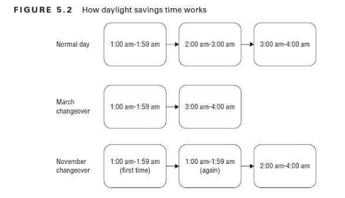
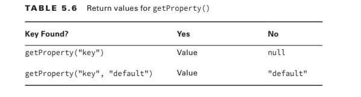
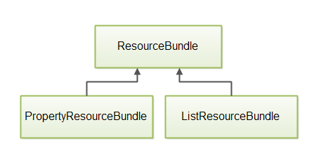
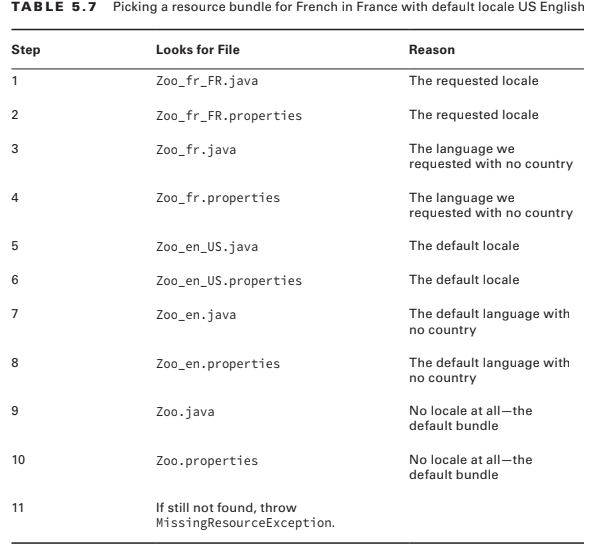

# Date, Strings and Localization.

1. Use Java SE 8 Date/Time API
    - Crear y gestionar date y time events incluyendo combinación de date y tiempos en un Objeto simple.
       - LocalDate
       - LocalTime
       - LocalDateTime
       - Instant
       - Period
       - Duration
    - Trabajar con Dates y Times con distintos TimeZone y gestionar cambios en los resultados de “daylight savings” incluyendo Format y date values.
    - Definir, crear y gestionar eventos que se basen en fechas time(Java 8) incluyendo:
        - Instant
        - Period 
        - Durationgit
        - TemporalUnit


2. Localización.
    - Leer y establecer el local con ayuda de Locale
    - Crear y leer archivos de propiedades 
    - Construir un resource bundle por cada locale y cargar el bundle en una aplicación.

En la versión 8 de Java Oracle rompe con la forma  que tenía para representar las fechas.  Se ha añadido a la versión 8 el paquete java.time, no obstante en el examen, si bien no se menciona como funciona la antigua API, si que puede haber preguntas que usen las anteriores clases. 

    import java.time.*;

## 1.1	Las Fechas y las zonas horarias.

En el mundo real normalmente usamos las fechas y los timezones como si la otra persona estuviese cerca de nosotros. Por ejemplo, si dices, “Te llamaré a las 11:00 el Lunes, asumes que las 11 significa lo mismo para los dos. Pero si vives en Madrid y la otra persona en New York se necesita ser más específico”. 

En Madrid el 18 de Agosto a las 9:00 am se usan los siguientes TimeZones
| Hora      | Descripción |
| ----------- | ----------- |
| Hora estándar:      |  UTC/GMT +1 hora|       |
| Horario de verano:   | +1 hora        |


Sin embargo en New York son 6 horas menos, su hora estándar es GMT -4

| Hora      | Descripción |
| ----------- | ----------- |
| Hora estándar:      |  UTC/GMT -5 horas|       |
| Horario de verano:   | +1 hora        |


Hay una serie de abreviaturas que ayudan a entendernos EST(Eastern Standard Time) El horario de new york o el horario central Europeo CET(Central European Time) o CEST en horario de verano(Central European Summer Time).

Así que para comunicarnos con propiedad con alguien que esté en otra zona horaria tendremos que decir la zona horaria. Podremos quedar con un neoyorkino para una teleconferencia a las 13:00 EST por ejemplo, que significa que en verano quedaremos a las siete de la tarde en Centro Europa.

## 1.2 Tipos de objectos Java 8 para Fechas.

**`LocalDate`** → Simplemente un Date, sin timezone ni Time. Por ejemplo la fecha de un cumpleaños, un festivo, el día de fin de año etc.

    2020-05-27


**`LocalTime`** → Solo un tiempo, sin Date, ni Zona. Ejemplo es media noche asociado al timeZone local.

    09:13:07.768

**`LocalDateTime`** → Contiene las dos cosas hora y fecha, asociado al timeZone local.

    2015-05-25T09:13:07.768

**`ZonedDateTime`** → Contiene el además de la fecha y la hora la zona horaria. Un buen ejemplo es cuando, tienes una conferencia a las 9: AM EST … Si vives en Madrid y quieres asistir a esa conferencia tienes que hacer los cálculos para poder asistir. Al igual que si, por ejemplo, un youtuber anuncia de qué va a hacer un directo a las 13:00 EST(Imaginemos que tiene seguidores en todo el mundo) no va a poner en el anuncio con todas las correspondencias de las fechas horarias en todo el mundo, eres tú el que haces los cálculos a partir de su fecha, hora y zona horaria.

    2015-05-25T09:13:07.769-04:00[America/New_York].


Señalar que Java usa la ‘T’ para separar Date y Time, cuando lo convierte a String.

## 1.3 ¿Qué es eso de GMT y UTC? 

Viene de Greenwich Mean Time y es un ‘time zone’ en Europa que es usado como la time zero cuando hablamos precisamente de la Zona Cero, es decir la hora que no tiene +1 o +N o menos -N. 

```c
    GMT 2015-06-20 5:50 // El jodido tiempo absoluto en Greenwich
```


También habrás oído hablar, si te has tenido que pegar con las fechas, de UTC ... que viene de Coordinated Universal Time que es es un time zone standar(Estandar a nivel planetario). Lo importante a saber es que UTC usa al mismo time Zone zero qué GMT.

Asegurémonos de que comprendemos cómo funciona UTC. Incluiremos nombres de time zones(Zonas Horarias) en los ejemplos para que sean más fáciles de representar. El examen te dará la UTC compensar. No se espera que memorices ninguna zona horaria.

```c
    2015-06-20T07:50+02:00[Europe/Paris]  // El jodido UTC te da la compensacion
````
Primero, intentemos averiguar como de distantes están estos momentos en el tiempo. Observa cómo la India tiene una compensación de media hora, no una hora completa. Para abordar un problema como este, resta la zona horaria(Time Zone) de la hora. Esto le da el equivalente GMT de la hora:

```c
    2015-06-20T07:50+02:00[Europe/Paris] --> GMT 2015-06-20 5:50

    2015-06-20T06:50+05:30[Asia/Kolkata] --> GMT 2015-06-20 1:20

```

Como vemos en la misma hora UTC hay una diferencia horaria de 4 horas y media entre París y Kolkata(que no tengo ni idea de donde esta … pero para el caso, nos es igual :-)


```
    Notas de Examen: El time zone offset(que significa el 
    desplazamiento de zona horaria) puede ser representada de distintas formas: 
    +02: 00, GMT + 2
    UTC + 2  
    Lo importante es que sepas que todos significan lo mismo. Es posible que veas alguno de ellos en el examen.

```

## 1.4 Instanciando LocalDate

```java
    LocalDate date1 = LocalDate.of(2015, Month.JANUARY, 20);
    LocalDate date2 = LocalDate.of(2015, 1, 20);
```

Las dos fechas son iguales.

`Month` es un enum . Recuerda que un enum no es un int y no puede ser comparado con uno, por ejemplo:
```java
    Month month = Month.JANUARY;
    boolean b1 = month == 1; // DOES NOT COMPILE
    boolean b2 = month == Month.APRIL; // false
```

El método of está sobrescrito y puedes usar diferentes configuraciones para crear la Fecha(Date) o la hora(Time) que desees.

```java
    LocalTime time1 = LocalTime.of(6, 15); // hour and minute
    LocalTime time2 = LocalTime.of(6, 15, 30); // + seconds
    LocalTime time3 = LocalTime.of(6, 15, 30, 200); // + nanoseconds
```


Podemos usar `LocalDateTime` para combinar fecha y hora.

```java
    LocalDateTime dateTime1 = LocalDateTime.of(2015, Month.JANUARY, 20, 6, 15, 30);
    LocalDateTime dateTime2 = LocalDateTime.of(date1, time1);
```


Para crear un `ZonedDateTime`, primero necesitamos obtener la zona horaria deseada. Lo haremos use US / Eastern en nuestros ejemplos

```java
    ZoneId zone = ZoneId.of("US/Eastern");
    ZonedDateTime zoned1 = ZonedDateTime.of(2015, 1, 20, 6, 15, 30, 200, zone);
    ZonedDateTime zoned2 = ZonedDateTime.of(date1, time1, zone);
    ZonedDateTime zoned3 = ZonedDateTime.of(dateTime1, zone);
```


Descubrir su zona horaria es fácil. Simplemente puede imprimir `ZoneId.systemDefault().` `ZoneId` es una clase que también proporciona la nueva API de java 8 

```java
    ZoneId.getAvailableZoneIds().stream()
    .filter(z -> z.contains("US") || z.contains("America"))
    .sorted().forEach(System.out::println);
    //This printed 177 lines when we ran it. We prefer the US/Eastern time //zone to America/New_York since it is more general.
```

## 1.5  Manipulando fechas y horas.

Las fechas y las horas son inmutables, así que tenemos que asegurarnos de pasarla a una variable de referencia, de forma que no sean perdidas. Aquí ejemplos de cómo se suma:

```java
    LocalDate date = LocalDate.of(2014, Month.JANUARY, 20);
    System.out.println(date); // 2014-01-20
    date = date.plusDays(2);
    System.out.println(date); // 2014-01-22
    date = date.plusWeeks(1);
    System.out.println(date); // 2014-01-29
    date = date.plusMonths(1);
    System.out.println(date); // 2014-02-28
    date = date.plusYears(5);
    System.out.println(date); // 2019-02-28
```


Ejemplos de cómo se resta

```java
    LocalDate date = LocalDate.of(2020, Month.JANUARY, 20);
    LocalTime time = LocalTime.of(5, 15);
    LocalDateTime dateTime = LocalDateTime.of(date, time);
    System.out.println(dateTime);      // 2020-01-20T05:15
    dateTime = dateTime.minusDays(1);
    System.out.println(dateTime);      // 2020-01-19T05:15
    dateTime = dateTime.minusHours(10);
    System.out.println(dateTime);      // 2020-01-18T19:15
    dateTime = dateTime.minusSeconds(30);
    System.out.println(dateTime);      // 2020-01-18T19:14:30
```


En java 8 es común que los métodos de fecha y hora estén encadenados. Por ejemplo, sin la impresión declaraciones, el ejemplo anterior se podría reescribir de la siguiente manera:

```java
    LocalDate date = LocalDate.of(2020, Month.JANUARY, 20);
    LocalTime time = LocalTime.of(5, 15);
    LocalDateTime dateTime = LocalDateTime.of(date, time).minusDays(1).minusHours(10).minusSeconds(30);

```
Cuando tienes que hacer muchas manipulaciones, este encadenamiento de fechas resulta útil. Existen dos formas en las que los creadores de exámenes pueden intentar engañarte. ¿Qué crees que imprime esto?

```java
    LocalDate date = LocalDate.of(2020, Month.JANUARY, 20);
    date.plusDays(10);
    System.out.println(date);
```

Se imprime el 20 de enero de 2020. Agregar 10 días fue inútil porque el programa ignoró el resultado. Siempre que veas tipos inmutables, presta atención para asegurarte de que el valor de retorno de una llamada a un método no se ignora. 

El examen también puede cuestionar tu conocimiento sobre la diferencia entre objetos de LocalDate y LocalTime. 

¿Ves lo que está mal aquí?

```java
    LocalDate date = LocalDate.of(2020, Month.JANUARY, 20);
    date = date.plusMinutes(1); // DOES NOT COMPILE
```

LocalDate no tiene hora, así que no puedes añadirle minutos …

## 1.6   Trabajar con periodos:
¡Ahora sabes lo suficiente para hacer algo divertido con fechas! 

Supongamos un zoológico que realiza entretenimiento animal, actividades para darles a los animales algo divertido que hacer de vez en cuando. El jefe del zoológico ha decidido cambiar los juguetes todos los meses. Este sistema continuará durante tres meses para ver cómo funciona.

```java
    public static void main(String[] args) {
        LocalDate start = LocalDate.of(2015, Month.JANUARY, 1);
        LocalDate end = LocalDate.of(2015, Month.MARCH, 30);
        performAnimalEnrichment(start, end);
    }
    private static void performAnimalEnrichment(LocalDate start, LocalDate end) {
        LocalDate upTo = start;
        while (upTo.isBefore(end)) { // testea si la fecha es anterior a la fechade fin
            System.out.println("Dar un juguete: " + upTo); // ACCION de entretener
            upTo = upTo.plusMonths(1); // añadir un mes
        }   
    }   
```

Este código funciona bien. Agrega un mes a la fecha hasta que llega a la fecha de finalización. 
El problema es que este método no se puede reutilizar y nuestro cuidador quiere probar diferentes horarios para ver cuál funciona mejor.

Por suerte, Java tiene una clase Period class que puede ser pasada como parámetro:

```java
    public static void main(String[] args) {
        LocalDate start = LocalDate.of(2015, Month.JANUARY, 1);
        LocalDate end = LocalDate.of(2015, Month.MARCH, 30);
        Period period = Period.ofMonths(1); // Crear periodo
        performAnimalEnrichment(start, end, period);
    }

    private static void performAnimalEnrichment(LocalDate start, LocalDate end,
    Period period) { // usa el periodo generico.
        LocalDate upTo = start;
        while (upTo.isBefore(end)) {
            System.out.println("give new toy: " + upTo);
            upTo = upTo.plus(period); // adds the period
        }      
    }
```
Los periodos por definición son unidades temporales de mas de 1 dia, es decir, que no podemos crear periodos con horas o minutos etc...

Distintos modos legales de instanciar periodos.

```java
Period annually = Period.ofYears(1); // every 1 year
Period quarterly = Period.ofMonths(3); // every 3 months
Period everyThreeWeeks = Period.ofWeeks(3); // every 3 weeks
Period everyOtherDay = Period.ofDays(2); // every 2 days
Period everyYearAndAWeek = Period.of(1, 0, 7); // every year and 7 days
```

## Imprimir Periods



```java
    System.out.println(Period.ofMonths(3));
```
El output es `P3M`. Recuerda que Java omite cualquier medida que sea cero. Probemos con otro.

```java
    System.out.println(Period.of(0, 20, 47));
```
El output es  `P20M47D`. No hay años así que se omite esa parte. Está bien tener más
días que en un mes. También está bien tener más meses de los que hay en un año. Usos de Java las medidas previstas para cada uno.

Ahora intentemos uno complicado:

```java
    System.out.println(Period.ofWeeks(3));
```
Imprime `P21D`  ya que no hay semanas en Periodos para la salida.

```java
    LocalDate date = LocalDate.of(2015, 1, 20);
    LocalTime time = LocalTime.of(6, 15);
    LocalDateTime dateTime = LocalDateTime.of(date, time);
    Period period = Period.ofMonths(1);
    System.out.println(date.plus(period)); // 2015–02–20
    System.out.println(dateTime.plus(period)); // 2015–02–20T06:15
    System.out.println(time.plus(period)); // !!!!!! ---- UnsupportedTemporalTypeException!!!!
```
En el código anterior quizás te preguntes como una `time` no tiene sentido sumarle periodos ¿porque hay una excepción en tiempo de ejecucion y no un fallo de compilación? , ya que estos, los Period, por definicion son tramos horarios de un dia o mas.



Como se puede ver en la imagen tranajamos con unidades Temporales, asi que el metodo plus recime un TemporalAmount

## 1  Trabajar con Durations

Las duraciones son para periodos más pequeños que no son fechas. Podemos especificar, días, horas, minutos, segundos, milisegundos y nanos. 
Y sí, podrías pasar 365 días para hacer un año, pero no debería hacerlo, para eso es Period.

Podemos crear Duration con diferentes granularidades:

```java
    Duration daily = Duration.ofDays(1); // PT24H
    Duration hourly = Duration.ofHours(1); // PT1H
    Duration everyMinute = Duration.ofMinutes(1); // PT1M
    Duration everyTenSeconds = Duration.ofSeconds(10); // PT10S
    Duration everyMilli = Duration.ofMillis(1); // PT0.001S
    Duration everyNano = Duration.ofNanos(1); // PT0.000000001S
```

Hay otras formas de especificar ... haciendo uso de Unidades temporales con  `ChronoUnit`
```java
    Duration daily = Duration.of(1, ChronoUnit.DAYS);
    Duration hourly = Duration.of(1, ChronoUnit.HOURS);
    Duration everyMinute = Duration.of(1, ChronoUnit.MINUTES);
    Duration everyTenSeconds = Duration.of(10, ChronoUnit.SECONDS);
    Duration everyMilli = Duration.of(1, ChronoUnit.MILLIS);
    Duration everyNano = Duration.of(1, ChronoUnit.NANOS);

    LocalTime one = LocalTime.of(5, 15);
    LocalTime two = LocalTime.of(6, 30);
    LocalDate date = LocalDate.of(2016, 1, 20);
    System.out.println(ChronoUnit.HOURS.between(one, two)); // 1
    System.out.println(ChronoUnit.MINUTES.between(one, two)); // 75
    System.out.println(ChronoUnit.MINUTES.between(one, date)); // DateTimeException
```

La clase `ChronoUnit` tiene distintos métodos que pueden ser usados como `ChronoUnit.MINUTES.between` en la última linea de código se produce 
`DateTimeException` porque no se puede calcular la diferencia entre diferentes unidades temporales.

Se usa `Duration` del mismo modo que `Period`

```java
    LocalDate date = LocalDate.of(2015, 1, 20);
    LocalTime time = LocalTime.of(6, 15);
    LocalDateTime dateTime = LocalDateTime.of(date, time);
    Duration duration = Duration.ofHours(6);
    System.out.println(dateTime.plus(duration)); // 2015–01–20T12:15
    System.out.println(time.plus(duration)); // 12:15
    System.out.println(date.plus(duration)); // UnsupportedTemporalException
```

Existe excepcion ya que a una fecha `LocalDate` no se le pueden sumar horas.

```java

    LocalDate date = LocalDate.of(2015, 1, 20);
    LocalTime time = LocalTime.of(6, 15);
    LocalDateTime dateTime = LocalDateTime.of(date, time);
    Duration duration = Duration.ofHours(23);
    System.out.println(dateTime.plus(duration)); // 2015–01–21T05:15
    System.out.println(time.plus(duration)); // 05:15
    System.out.println(date.plus(duration)); // UnsupportedTemporalException
```
## Trabajar con Instants

Un instant representa un momento específico en el tiempo en el **GMT** time zone. Supón que queremos hacer correr un reloj


```java
    Instant now = Instant.now();
    // hacemos algo que consuma tiempo
    Instant later = Instant.now();
    Duration duration = Duration.between(now, later);
    System.out.println(duration.toMillis());
```

Si tienes un `ZonedDateTime`, lo puedes pasar a un `Instant`.

```java
    LocalDate date = LocalDate.of(2015, 5, 25);
    LocalTime time = LocalTime.of(11, 55, 00);
    ZoneId zone = ZoneId.of("US/Eastern");
    ZonedDateTime zonedDateTime = ZonedDateTime.of(date, time, zone);
    Instant instant = zonedDateTime.toInstant(); // 2015-05-25T15:55:00Z
    System.out.println(zonedDateTime); // 2015-05-25T11:55-04:00[US/Eastern]
    System.out.println(instant); // 2015-05-25T15:55:00Z
```

Las últimas dos líneas representan el mismo momento en el tiempo, una está sobre **GMT**.  La `ZonedDateTime` incluye un time zone, o sea **UTC**.

Usando ese `Instant`, puedes hacer matemáticas. `Instant` le permite agregar cualquier unidad de día o menos, por ejemplo:

```java
    Instant nextDay = instant.plus(1, ChronoUnit.DAYS);
    System.out.println(nextDay); // 2015–05–26T15:55:00Z
    Instant nextHour = instant.plus(1, ChronoUnit.HOURS);
    System.out.println(nextHour); // 2015–05–25T16:55:00Z
    Instant nextWeek = instant.plus(1, ChronoUnit.WEEKS); // exception
```

Es raro pero `Instant` muestra los meses y los años, pero no te deja hacer operaciones sobre ellos. Esto hay que saberlo para el examen. 

## Contabilización del horario de verano.

Como sabemos muchos países tienen estas modificaciones para hacer un mejor uso de las horas solares, tanto en invierno como en verano.

En el caso de USA, en Marzo se mueven los relojes una hora más en verano y una hora menos en invierno.



Por ejemplo, el 13 de marzo de 2016, adelantamos nuestros relojes una hora y saltamos de `2:00 a.m. a 3:00 a.m.` Esto significa que no hay 2:30 a.m. ese día. 

Si quisiéramos saber la hora una hora después de la 1:30, serían las 3:30 ya que en verano se suma una hora

```java
    LocalDate date = LocalDate.of(2016, Month.MARCH, 13);
    LocalTime time = LocalTime.of(1, 30);
    ZoneId zone = ZoneId.of("US/Eastern");
    ZonedDateTime dateTime = ZonedDateTime.of(date, time, zone);
    System.out.println(dateTime); // 2016-03-13T01:30-05:00[US/Eastern]
    dateTime = dateTime.plusHours(1);
    System.out.println(dateTime); // 2016-03-13T03:30-04:00[US/Eastern]
```

En invierno se restan las horas.

```java
    LocalDate date = LocalDate.of(2016, Month.NOVEMBER, 6);
    LocalTime time = LocalTime.of(1, 30);
    ZoneId zone = ZoneId.of("US/Eastern");
    ZonedDateTime dateTime = ZonedDateTime.of(date, time, zone);
    System.out.println(dateTime); // 2016-11-06T01:30-04:00[US/Eastern]
    dateTime = dateTime.plusHours(1);
    System.out.println(dateTime); // 2016-11-06T01:30-05:00[US/Eastern]
    dateTime = dateTime.plusHours(1);
    System.out.println(dateTime); // 2016-11-06T02:30-05:00[US/Eastern]
```


## Internazionalizacion y localización

La **internacionalización** es el proceso de diseñar su programa para que pueda adaptarse a diferentes idiomas. 

Esto implica colocar cadenas en un archivos de propiedades y usar clases como DateFormat para que se use el formato correcto según las preferencias del usuario. 

La **localización** significa realmente admitir múltiples configuraciones regionales. Oracle define un lugar como "una región geográfica, política o cultural específica". 

La configuración regional es como una combinación de idioma y país. 

Puede pasar por el proceso de localización muchas veces en la misma aplicación a medida que agrega más idiomas y países.
 
Dado que internacionalización y localización son palabras tan largas, a menudo se abrevian como `i18n` y `l10n`. 

## Seleccionando un Locale

La clase `Locale` esta en el paquete `java.util`. La forma de saber cual es el `Locale` actual es mediante el siguiente código:

```java
    Locale locale = Locale.getDefault();
    System.out.println(locale);
```
Así accedemos a nuestro `Locale`, es decir la localizacion geografica y de lenguaje que esta corriendo en nuestra JVM actualmente y que depende a su vez del SO sobre el que se este ejecutando.

Si ejecutamos este código nos puede dar el siguiente resultado, en el caso de que nuestro locale sea Español y España:

```html
    <!--La salida por consola es--> es_ES
```
En este caso lo primero es el lenguaje que viene en minusculas, luego el pais que es en mayúsculas separados por un underscore. El pais es opcional.

**RECUERDA** -> Para una localización es valido poner solo el lenguaje.


Los siguientes ejemplos están MAL

```java
US // Podemos tener leguaje sin pais pero no al revés.
enUS // Falta el underscore
US_en // Estan invertidos los ordenes.
EN // El lenguaje tiene que estar en minusculas
```
La versión correcta es `en_US` .

Tenemos tres formas de crear Locales, podemos hacer uso de las constantes que devuelven un locale, es una opción interesante porque estas constantes contienen la versión ISO del país.

```java
System.out.println(Locale.GERMAN); // de
System.out.println(Locale.GERMANY); // de_DE
```

Otra forma es mediante constructores y escribir los literales, esta opción sera menos limpia y propensa a errores.

```java
System.out.println(new Locale("fr")); // fr
System.out.println(new Locale("hi", "IN")); // hi_IN
```
El lenguaje es el Frances pero el país es India.

Esta opción nos permite ser más especificos con respecto a las compinaciones, pero como hemos dicho anteriormente será mas propenso a errores.

Java te permitirá crear lenguajes y paises que no existan, no hay errores en tiempo de ejecución, pero no se comportarán claro, de la forma esperada.

La tercera forma es mediante un constructor, en este caso, no aporta mayor legibilidad que el constructor y son mas lineas.

```java
Locale l1 = new Locale.Builder()
    .setLanguage("en")
    .setRegion("US")
    .build();
Locale l2 = new Locale.Builder()
    .setRegion("US")
    .setLanguage("en")
    .build();
```
Para cambiar el locale simplemente los establecemos en el sistema.
```java
System.out.println(Locale.getDefault()); // en_US
Locale locale = new Locale("fr");
Locale.setDefault(locale); // cambiamos el Locale por defecto
System.out.println(Locale.getDefault()); // fr
```

Esto solo tiene efecto en tiempo de ejecución para tu programa, el Locale depende de la localizacion de tu sistema operativo, por tanto cuando acaba el programa en la siguiente ejecución volverá a aparecer el Locale por defecto.


## Creando el archivo de propiedades.

Sintaxis del archivo propiedades

Formas de mostrar clave valor:
```properties
! La normal
    animal=dolphin 
! Raras pero validas
    animal:dolphin
    animal dolphin
```

Quizás se pregunte cómo expresar algunas otras ideas en un archivo de propiedades. Los comunes son estos:

- Si una línea comienza con # o !, es un comentario.
- Se ignoran los espacios antes o después del carácter separador.
- Se ignoran los espacios al principio de una línea.
- Los espacios al final de una línea no se ignoran.
- Finalice una línea con una barra invertida si desea dividir la línea para mejorar la legibilidad.
- Puede utilizar caracteres de escape normales de Java, como \t y \n.
Poniendo estos juntos, podemos escribir lo siguiente:
```properties

    #un comentario
    ! otro comentario
    key = value\tafter tab
    ling= abcdefghijklm\
    nopqrstuvwxyz

!Imprimir estas dos propiedades en un programa nos da esto:

    value → after tab
    abcdefghijklmnopqrstuvwxyz
```

Ejemplo de como usar los .properties y mostrar en pantalla:

- Dados los siguientes archivos de propiedades apuntando al classpath

```properties

Zoo_en.properties
    hello=Hello
    open=The zoo is open.
Zoo_fr.properties
    hello=Bonjour
    open=Le zoo est ouvert
```

```java
public class ZooOpen {
	
	public static void main(String ...args) {
		var us = Locale.US;
		var france = Locale.FRANCE;

		System.out.println(us);

		System.out.println(france);
		System.out.println();
		
		printProperties(france);

		System.out.println();
		printProperties(us);
		

		// Podemos Iterar con Java 8
		System.out.println("----------- Iterando en Java 8 -----");
		var resource = ResourceBundle.getBundle("Zoo", us);
		var conjunto =  resource.keySet();
		conjunto.stream().map(k -> resource.getString(k)).forEach(System.out::println);;
	}
	
	public static void printProperties(Locale locale) {
		var resource = ResourceBundle.getBundle("Zoo", locale);
		System.out.println(resource.getString("hello"));
		System.out.println(resource.getString("open"));
	}

}
```
Imprime

```console
    en_US
    fr_FR

    Bonjour
    Le zoo est ouvert

    Hello
    The zoo is open.
    ----------- Iterando en Java 8 -----
    Hello
    The zoo is open.

```


Por ultimo decir que tambien podemos usar la clase Properties, pasar lo anterior a propiedades es sencillo:


```java
Properties props = new Properties();
rb.keySet().stream()
.forEach(k -> props.put(k, rb.getString(k)));

```





## Creando la clase Java Resource Bundle

Además de usar un archivo de propiedades podemos usar una clase Java para representar nuestros recursos.

Para eso tenemos que extender de la clase abstracta `ListResourceBundle` 


```java
    public class Zoo_en extends ListResourceBundle {
        protected Object[][] getContents() {
            return new Object[][] {
                { "hello", "Hello" },
                { "open", "The zoo is open" } 
            };
        }
    }    
```

La diferencia entre tener una valor en un archivo a tenerlo en una clase es que en la clase podemos asociar el valor a un objeto.


```java
    protected Object[][] getContents() {
        return new Object[][] { { "tax", new UsTaxCode() } 
    };

```

## Determinando que Resource Bundle usar.

Esta clase se utiliza en aplicaciones de proucción para tener textos en distintos lenguajes. Vamos, que su mas habitual uso es para la Internacionalización, por ejemplo, de una web. En este caso los literales a mostrar dependeran del lenguaje seleccionado por el usuario. 


En este caso, la web de una conocida aerolinea, esta internacionalizada.

### Jerarquia de clases ResourceBundle.




Tenemos dos formas de recuperar el los resource-bundle(paquete de recursos)

```java 
    ResourceBundle.getBundle("name");
    ResourceBundle.getBundle("name", locale);
```

La Tabla 5.7 muestra como Java encuentra el recurso cuando se le solicita el Resource-Bundle con el nombre Zoo con la configuración regional new Locale("fr", "FR") y la configuración regional predeterminada es inglés estadounidense.




Como regla los archivos `.java` tienen preferencia sobre los archivos `.properties`.

Siempre trata de buscar el locale exacto con lenguaje y pais, si no lo localiza coge el del lenguaje solamente.

Si no localizase ningun reecurso para la configuruación pasada, trata de buscar la configuracion  locale por defecto.

Si no lo localiza para el por defecto lenguaje usa el nombre del recurso exacto Zoo.java y depues Zoo.properties, es decir sin extensiones.

Si ya despúes de eso no lo localiza se lanza excepción.

¿Cuántos archivos cree que necesitaría buscar Java para encontrar el paquete de recursos con el código?
```java 
Locale.setDefault(nueva Locale("hi"));
ResourceBundle rb = ResourceBundle.getBundle("Zoo", new Locale("en"));
```

La respuesta es seis. Se enumeran aquí:
1. Zoo_hi.java
2. Zoo_hi.propiedades
3. Zoo_en.java
4. Zoo_es.propiedades
5. Zoo.java
6. Zoo.propiedades.

Esta vez, no especificamos ningún código de país, por lo que Java se saltó la búsqueda. Si solicitamos la configuración regional predeterminada, Java comenzará a buscar los paquetes a partir del paso 6 en Tabla 5.7 y yendo hasta el final (o hasta que encuentre una coincidencia).

¿Lo pillas? Guay, porque hay un giro. Los pasos que hemos discutido hasta ahora son para encontrar el paquete de recursos correspondiente para usarlo como base. No se requiere Java para obtener todas las claves del mismo paquete de recursos. Puede obtenerlos de cualquier paquete de recursos padre correspondiente. 


```properties
#Zoo.properties
    name=Vancouver Zoo
#Zoo_en.properties
    hello=Hello
    open=is open
#Zoo_en_CA.properties
    visitor=Canada visitor
#Zoo_fr.properties
    hello=Bonjour
    open=est ouvert

#Zoo_fr_CA.properties
    visitor=Canada visiteur

```


Supon que tenemos un visitante de Quebec (con el locale por defecto en frances ) y le pide a nuestro programa que quiere que se presente la información en Ingles. ¿ Cual crees que es la salida  de este código?

```java
    2: Locale locale = new Locale("en", "CA");
    3: ResourceBundle rb = ResourceBundle.getBundle("Zoo", locale);
    4: System.out.print(rb.getString("hello"));
    5: System.out.print(". ");
    6: System.out.print(rb.getString("name"));
    7: System.out.print(" ");
    8: System.out.print(rb.getString("open"));
    9: System.out.print(" ");
    10: System.out.print(rb.getString("visitor"));


```
La respuesta es Hello. Vancouver Zoo is open Canada visitor.


## Formateando Numbers

Los Resource-Bundles son geniales para contenido que no cambia, como textos de bienvenida etc ... Sin embargo cuando hablamos de fechas y precios los formatos varian, y no solo el texto.

Para esto estan las clases derivadas del paquete `java.text` que nos ayudan con estos formatos ...


## Formateando y Parseando Numbers y Currency(Monedas)


    a. Format

| Descripcion | Using Default Locale and a Specified Locale  |
| ----------- | ----------- |
| Instancia de proposito general | NumberFormat.getInstance() |
|                                | NumberFormat.getInstance(locale) |
| Igual que *getInstance*         | NumberFormat.getNumberInstance() |
|                                | NumberFormat.getNumberInstance(locale) |

| formatear cantidades de dinero        | NumberFormat.getCurrencyInstance() |
|                                | NumberFormat.getCurrencyInstance(locale) |

| Formatear porcentajes         | NumberFormat.getNumberInstance() |
|                                | NumberFormat.getNumberInstance(locale) |

En el ejemplo anterior del Zoo podemos hacer unos calculos sobre el numero de visitas y mostrar ese numero con distintos 
Locales

```java
public class FormatNumbers {

	public static void main(String[] args) {
		
		int visitantesAnio = 3_200_000;
		int visitantesMes = visitantesAnio/12;
		
		NumberFormat us = NumberFormat.getInstance(Locale.US);
		System.out.println(us.format(visitantesMes));
		
		NumberFormat es = NumberFormat.getInstance(new Locale("es", "ES"));
		System.out.println(es.format(visitantesMes));
		
		NumberFormat ca = NumberFormat.getInstance(Locale.CANADA_FRENCH);
		System.out.println(ca.format(visitantesMes));

	}

}
```

La salida es 

```
266,666
266.666
266 666
```
Como vemos para representar cantidades, cada pais tiene distintos modos de representar la misma información

Exactamente lo mismo ocurre cuando hablamos de dinero

```java
    double price = 48;
    NumberFormat us = NumberFormat.getCurrencyInstance();
    System.out.println(us.format(price));

```

Imprime `$48.00` en el caso de que el default locale este `en_US`  o 
Imprime `48,00 €` en el caso de que estemos en algun pais de la comunidad economica europea.


    b. Parse

La clase NumberFormat tiene el método parse, este metodo recibe un String y trata de pasarlo al formato que depende del locale.
Recuerda que estos método lanzan la excepcion controlada ParseException si fallan que tendrás que controlar de algun modo.

En el siguiente ejemplo asumiendo que el extracto de código se esta tratando la excepcion de algun modo

```java
    NumberFormat en = NumberFormat.getInstance(Locale.US);
    NumberFormat fr = NumberFormat.getInstance(Locale.FRANCE);
    String s = "40.45";
    System.out.println(en.parse(s)); // 40.45
    System.out.println(fr.parse(s)); // 40

```

Dos formas de representar un numero que varian en funcion del Locale

Recuerda que el método parse de NumberFormat elimina de la derecha todo lo que no le gusta, pero lo que esta mas a la izquierda lo tiene que entender o fallará

```java
    NumberFormat nf = NumberFormat.getInstance();
    String one = "456abc";
    String two = "-2.5165x10";
    String three = "x85.3";
    System.out.println(nf.parse(one)); // 456
    System.out.println(nf.parse(two)); // -2.5165
    System.out.println(nf.parse(three));// throws ParseException

```
Los primeros dos funcionan correctamente, eliminando la parte que no entiende, pero el tercero no es un numero y no lo puede parsear.

Con el parse del Currency ocurre exactamente lo mismo:

```java
    String amt = "$92,807.99";
    NumberFormat cf = NumberFormat.getCurrencyInstance();
    double value = (Double) cf.parse(amt);
    System.out.println(value); // 92807.99
````

## Formateando Dates y Times

Las clases de date y time soportan muchos métodos para extraer información de el:

```java
LocalDate date = LocalDate.of(2020, Month.JANUARY, 20);
System.out.println(date.getDayOfWeek()); // MONDAY
System.out.println(date.getMonth()); // JANUARY
System.out.println(date.getYear()); // 2020
System.out.println(date.getDayOfYear()); // 20
```

Podemos usar esa informacion para mostrar acerca de la fecha. De todos modos, puede haber mas trabajo del necesario. 
La clase DateTimeFormater nos ayuda con esto, podemos usarla para cambair el formato de culquier date o time

DateTimeFormatter esta en el paquete java.time.format.

```java
LocalDate date = LocalDate.of(2020, Month.JANUARY, 20);
LocalTime time = LocalTime.of(11, 12, 34);
LocalDateTime dateTime = LocalDateTime.of(date, time);
System.out.println(date.format(DateTimeFormatter.ISO_LOCAL_DATE));
System.out.println(time.format(DateTimeFormatter.ISO_LOCAL_TIME));
System.out.println(dateTime.format(DateTimeFormatter.ISO_LOCAL_DATE_TIME));
```

ISO es un "STANDAR"  para fechas. La salida se pinta de la siguiente forma.

```
2020–01–20
11:12:3
2020–01–20T11:12:34
```

Tener un standar es una forma razonable de comunicarlse entre computadoras, pero probablemente no es lo que tu quieres pintar en tu programa, que puede estar en Español, Italiano. Indio, etc.

Hay algunos formatos predefinidos:
```java
    DateTimeFormatter shortDateTime =
    DateTimeFormatter.ofLocalizedDate(FormatStyle.SHORT);
    System.out.println(shortDateTime.format(dateTime)); // 1/20/20
    System.out.println(shortDateTime.format(date)); // 1/20/20
    System.out.println(
    shortDateTime.format(time)); // UnsupportedTemporalTypeException
```

Aquí decimos que queremos un formateador localizado en el formato corto predefinido. La última línea arroja una excepción porque una hora no se puede formatear como una fecha. El método format() se declara tanto en los objetos del formateador como en los objetos de fecha/hora, lo que le permite hacer referencia a los objetos en cualquier orden. Las siguientes declaraciones imprimen exactamente lo mismo que el código anterior:

```java
    DateTimeFormatter shortDateTime =
    DateTimeFormatter.ofLocalizedDate(FormatStyle.SHORT);
    System.out.println(dateTime.format(shortDateTime));
    System.out.println(date.format(shortDateTime));
    System.out.println(time.format(shortDateTime));
```

In this book, we’ll change around the orders to get you used to seeing it both ways.
Table 5.10 shows the legal and illegal localized formatting methods.

Hay dos formatos predefinidos que pueden aparecer en el examen: SHORT y MEDIUM. Los otros formatos predefinidos involucran zonas horarias, que no están en el examen.

```java
    LocalDate date = LocalDate.of(2020, Month.JANUARY, 20);
    LocalTime time = LocalTime.of(11, 12, 34);
    LocalDateTime dateTime = LocalDateTime.of(date, time);
    DateTimeFormatter shortF = DateTimeFormatter
    .ofLocalizedDateTime(FormatStyle.SHORT);
    DateTimeFormatter mediumF = DateTimeFormatter
    .ofLocalizedDateTime(FormatStyle.MEDIUM);
    System.out.println(shortF.format(dateTime)); // 1/20/20 11:12 AM
    System.out.println(mediumF.format(dateTime)); // Jan 20, 2020 11:12:34 AM
```

Si no desea utilizar uno de los formatos predefinidos, puede crear uno propio. Por ejemplo, este código detalla el mes:

```java
    DateTimeFormatter f = DateTimeFormatter.ofPattern("MMMM dd, yyyy, hh:mm");
    System.out.println(dateTime.format(f)); // January 20, 2020, 11:12
```


Lo máximo que tendrá que hacer es reconocer las partes de fecha y hora. `MMMM` M representa el mes. Cuantas más Ms tenga, más detallada será la salida de Java. Por ejemplo, `M` genera 1, `MM` genera 01, `MMM` genera Jan y `MMMM` genera January. dd d representa el día del mes. Al igual que con el mes, cuantos más ds tenga, más detallado será el resultado de Java. `dd` significa incluir el cero inicial para un día de un solo dígito. 

Utilice `,` si desea generar una coma (esto también aparece después del año).

`yyyy` y representa el año. yy genera un año de dos dígitos y yyyy genera un año de cuatro dígitos.

`hh` h representa la hora. Use hh para incluir el cero inicial si está generando una hora de un solo dígito.

`:` Utilice : si desea generar dos puntos.

`mm` --> m representa el minuto omitiendo el cero inicial si está presente. mm es más común y representa los minutos usando dos dígitos.


Adición de internacionalización y localización
Muchas aplicaciones necesitan funcionar para diferentes países y con diferentes idiomas. Por ejemplo, considere la oración "El zoológico realizará un evento especial el 1/4/15 para ver animales".
malas conductas.”
¿Cuándo es el evento? En los Estados Unidos, es el 1 de abril. Sin embargo, un lector británico interpretaría esto como el 4 de enero. Un lector británico también podría preguntarse por qué no escribimos "comportamientos". Si estamos creando un sitio web o un programa que se ejecutará en varios países, queremos usar el idioma y el formato correctos.

