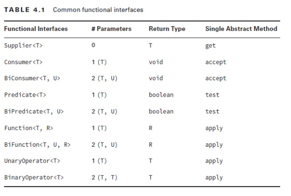
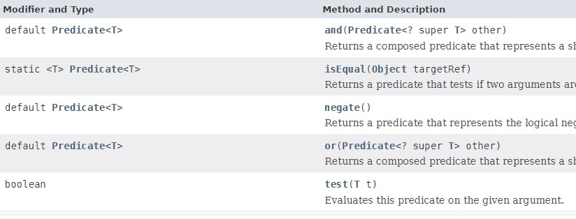
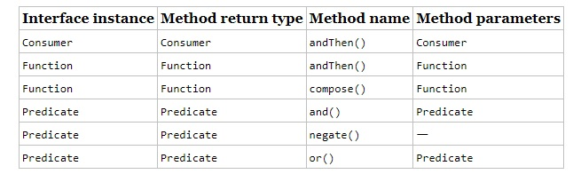
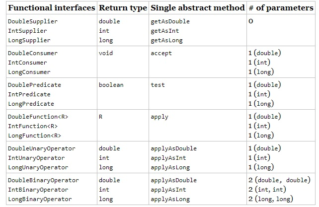
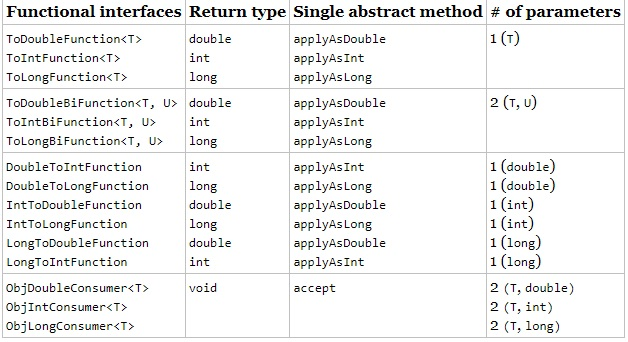

## 	Trabajando con interfaces funcionales preconstruidas.

Vienen del paquete `java.util.function`

Este paquete contiene interfaces funcionales que proveen objetivos para usar lambda expresions y method references

Una interfaz funcional puede tener multiples `default methods` pero solo uno abstracto.



## Function

Una `Function` es la base de las interfaces funcionales la declaracion es:

```java
    /**
     * Applies this function to the given argument.
     *
     * @param t Argumento de entrada
     * @return argumento de salidad
     */
    R apply(T t);

```

Ejemplo:


```java
public class _Funcion {

	public static void main(String[] args) {

		
		// 1)  Llamada a un método.
		int increment = increment(1);
		System.out.println(increment);
		
		// 2) Llamada a una función.
		int increment2 = incrementByOneFunction.apply(1);
		System.out.println(increment2);
		
		// 3) Llamada a una segunda función.
		int multiply = multiplyBy10Function.apply(increment2);
		System.out.println(multiply);
		
		// Encadenando funciones con andThen que es un default method
		Function<Integer, Integer> addByOneAndThenMultiplyBy10 = incrementByOneFunction.andThen(multiplyBy10Function);
		System.out.println(addByOneAndThenMultiplyBy10.apply(5));
		
	}

    static int increment(int number) {
		return number + 1;
	}

	static Function<Integer, Integer> incrementByOneFunction = 
			n -> n + 1;
			
	static Function<Integer, Integer> multiplyBy10Function =
			n -> n * 10;

	

}
```
En este ejemplo podemos ver la igualdad entre llamar a un metodo y llamar a una funcion, devolviendo en este caso una funcíon.


## BiFunction

Una `BiFunction` es una `Function` que coge dos parametros como argumento de entrada.

```java
   /**
     * Applies this function to the given arguments.
     *
     * @param t the first function argument
     * @param u the second function argument
     * @return the function result
     */
    R apply(T t, U u);
```

```java
BiFunction<String, String, String> b1 = String::concat;
BiFunction<String, String, String> b2 =
   (string, toAdd) -> string.concat(toAdd);
 
System.out.println(b1.apply("baby ", "chick")); // baby chick
System.out.println(b2.apply("baby ", "chick")); // baby chick
```

## Predicate y BiPredicate



Esta interfaz funcional coge un parametros de cualquier tipo y devuelve un condicional.

Dispone de tres métodos default `and`, `negate`, or y uno static `isEqual` para comparar con otro elmento

```java
    /**
    * DECLARATIVE APROACH 
    */
    Predicate<? super Person> predicate = p -> p.gender.equals(FEMALE);

    List<Person> female2 = persons.stream()
        .filter(predicate)
        .collect(Collectors.toList());

    System.out.println(female2);
```

Esto es el equivalente a:

```java
    List<Person> female2 = persons.stream()
    .filter( p.gender.equals(FEMALE);)
    .collect(Collectors.toList());
```
Ejemplo usando `BiPredicate`

```java
    /**
    **                    BiPredicate
    */
    BiPredicate<String, String> b1 = String::startsWith;
    BiPredicate<String, String> b2 = (string, prefix) -> string.startsWith(prefix);
    
    System.out.println(b1.test("chicken", "chick")); // true
    System.out.println(b2.test("chicken", "chick")); // true
```

## Implementado Consumer

Un Consumer serepresenta un argumento simple y no retorna nada, simplemente consume el resultado.

El metodo de la interfaz es:

```java
    void accept(T t)
```
Ejemplo

```java
public static void  main (String ...args) {
		
		Customer juan = new Customer("Juan", "66655544");
		
		greet(juan);
		greetConsumer.accept(juan);
		
	}
	
	static Consumer<Customer> greetConsumer = c -> 	System.out.println("Hello"+ c.name
			+" phone "+ c.phone);
	
	static void greet(Customer customer) {
		System.out.println("Hello"+ customer.name
				+" phone "+ customer.phone);
	}
```
tiene un metodo por defecto

```java
    default Consumer<T> andThen(Consumer<? super T> after) 
```
Ejemplo con `andThen` con el que podemos concatenar consumers

```java
    Consumer<String> first = x -> System.out.println(x.toLowerCase());
    Consumer<String> second = y -> System.out.println("aaa " + y);

    Consumer<String> result = first.andThen(second);
```


## Implementing Supplier

Un `Supplier` se utiliza cuando desea generar o suministrar valores sin tener datos de entrada. 

```java
    @FunctionalInterface
    public interface Supplier<T> {
        T get();
    }
```
You can create a LocalDate object using the factory method `now()`. This example shows how to use a Supplier to call this factory:

```java
    Supplier<LocalDate> s1 = LocalDate::now;
    Supplier<LocalDate> s2 = () -> LocalDate.now();
    
    LocalDate d1 = s1.get();
    LocalDate d2 = s2.get();
    System.out.println(d1);  // 2022-02-20
    System.out.println(d2);  // 2022-02-20
```
 

Este ejemplo imprime una fecha dos veces. También es una buena oportunidad para revisar las referencias de métodos estáticos. La referencia del método ``LocalDate::now`` se utiliza para crear un `Supplier` para asignar a una variable intermedia s1. Un `Supplier` se usa a menudo cuando se construyen nuevos objetos. Por ejemplo, podemos imprimir dos objetos `StringBuilder` vacíos:

```java
    Supplier<StringBuilder> s1 = StringBuilder::new;
    Supplier<StringBuilder> s2 = () -> new StringBuilder();
    
    System.out.println(s1.get()); // Empty string
    System.out.println(s2.get()); // Empty string

```
Esta vez, usamos una referencia de constructor para crear el objeto. Hemos estado usando genéricos para declarar qué tipo de `Supplier` estamos usando. Esto puede ser un poco largo para leer. ¿Puedes averiguar qué hace lo siguiente? Simplemente dé un paso a la vez:

```java
    Supplier<ArrayList<String>> s3 = ArrayList::new;
    ArrayList<String> a1 = s3.get();
    System.out.println(a1);  // []
```

Tenemos un `Supplier` de cierto tipo. Ese tipo resulta ser `ArrayList<String>`. Luego, llamar a get() crea una nueva instancia de `ArrayList<String>`, que es el tipo genérico del Proveedor; en otras palabras, un genérico que contiene otro genérico. Asegúrese de mirar el código cuidadosamente cuando surja este tipo de cosas.

Observe cómo llamamos a get() en la interfaz funcional. ¿Qué pasaría si tratáramos de imprimir el `s3` mismo?

```java
    System.out.println(s3);
```
Que se imprime algo como esto:


```console
functionalinterface.BuiltIns$$Lambda$1/0x0000000800066840@4909b8da
```
Ese es el resultado de llamar a `toString()` en una lambda. Qué asco. Esto realmente significa algo. Nuestra clase de prueba se llama BuiltIns y está en un paquete que creamos con el nombre de *functionalinterface*. Luego viene *$$*, lo que significa que la clase no existe como `.class` en el sistema de archivos. Sólo existe en la memoria. No tienes que preocuparte por el resto.


## Implementing UnaryOperator and BinaryOperator

`UnaryOperator` y `BinaryOperator` son casos especiales de una función. Requieren que todos los parámetros de tipo sean del mismo tipo. Un `UnaryOperator` transforma su valor en uno del mismo tipo. Por ejemplo, incrementar en uno es una operación unaria. De hecho, `UnaryOperator` extiende `Function`. Un `BinaryOperator` fusiona dos valores en uno del mismo tipo. Sumar dos números es una operación binaria. Del mismo modo, `BinaryOperator` amplía `BiFunction`. Las interfaces se definen de la siguiente manera:

```java
@FunctionalInterface
public interface UnaryOperator<T> extends Function<T, T> { 
   // omitted static method
}
 
@FunctionalInterface
public interface BinaryOperator<T> extends BiFunction<T, T, T> {
   // omitted static methods 
}
```
Esto significa que las firmas del método se ven así:

```java
    T apply (T t); // Operador Unario
    
    T apply (T t1, T t2); // Operador Binario
```

En el Javadoc, notará que estos métodos se heredan de la superclase Function/BiFunction. Las declaraciones genéricas en la subclase son las que obligan a que el tipo sea el mismo. Para el ejemplo unario, observe cómo el tipo de devolución es el mismo tipo que el parámetro.

```java
    UnaryOperator<String> u1 = String::toUpperCase;
    UnaryOperator<String> u2 = x -> x.toUpperCase();
    
    System.out.println(u1.apply("chirp")); // CHIRP
    System.out.println(u2.apply("chirp")); // CHIRP
```

Esto imprime CHIRP dos veces. No necesitamos especificar el tipo de devolución en los genéricos porque `UnaryOperator` requiere que sea el mismo que el parámetro. Y ahora aquí está el ejemplo binario:

```java
    BinaryOperator<String> b1 = String::concat;
    BinaryOperator<String> b2 = (string, toAdd) -> string.concat(toAdd);
    
    System.out.println(b1.apply("bebé", "pollito")); // bebe pollito
    System.out.println(b2.apply("bebé", "pollito")); // bebe pollito
```
## Using Convenience Methods on Functional Interfaces

Hay una serie de métodos que son convenientes:



Mira este codigo

```java

// El código funciona, pero no es muy limpio

Predicate<String> brownEggs = s -> s.contains("egg") && s.contains("brown");
Predicate<String> otherEggs = s -> s.contains("egg") && !s.contains("brown");
```

Podemos usar los métodos *default* de predicate.


```java

// Clean code

Predicate<String> brownEggs = egg.and(brown);
Predicate<String> otherEggs = egg.and(brown.negate());
```

En  `Consumer`, echa un vistazo a `andThen()` method, Que hace correr dos interfaces funcionales en secuencia.

```java
`
Consumer<String> c1 = x -> System.out.print("1: " + x);
Consumer<String> c2 = x -> System.out.print(",2: " + x);
 

Consumer<String> combined = c1.andThen(c2);
combined.accept("Annie");  // 1: Annie,2: Annie
```

## Functional Interfaces for Primitives

Hay una tabla BooleanSupplier es un caso especial

## Functional Interfaces for boolean

BooleanSupplier es un tipo separado. Tiene un método para implementar:

```java
@FunctionalInterface
public interface BooleanSupplier {
   boolean getAsBoolean();
}
```


```java

12: BooleanSupplier b1 = () -> true;
13: BooleanSupplier b2 = () -> Math.random()> .5;
14: System.out.println(b1.getAsBoolean()); // true
15: System.out.println(b2.getAsBoolean()); // false

```
Las líneas 12 y 13 crean cada una un BooleanSupplier, que es la única interfaz funcional para boolean. La línea 14 se imprime verdadera, ya que es el resultado de b1. La línea 15 imprime verdadero o falso, según el valor aleatorio generado.

### Estudiar tabla Funcional interfaces for primitives.



## Trabajar con variables en Lambdas

Ahora que hemos aprendido acerca de las interfaces funcionales, las usaremos para mostrar diferentes enfoques para las variables. 

Pueden aparecer en tres lugares con respecto a las lambdas: la lista de parámetros, las variables locales declaradas dentro del cuerpo de lambda y las variables a las que se hace referencia desde el cuerpo de lambda. Las tres son oportunidades para que el examen te engañe. ¡Exploramos cada uno para que estés alerta cuando aparezcan trucos!



### Lambda Expressions vs. implementaciones Anonymous Interface

- Diferencia una implementación de interfaz anónima puede tener estado (variables miembro) la expresión lambda no.


```java
// Esto compila ya que: 
//Lambda variables and method names are allowed to be the same. The x lambda parameter is scoped to within each lambda, so it is allowed to be reused. The type is inferred by the method it calls. The first lambda maps x to a String and the second to a Boolean.
public void method() {
   x((var x) -> {}, (var x, var y) -> false);
}

public void x(Consumer<String> x, BinaryOperator<Boolean> y) {}
```

```java
// Estas expresiones son equivalentes ya que:
// The question starts with a UnaryOperator<Integer>, which takes one parameter and returns a value of the same type. 
// La funcion hace lo mismo pero coge dos parametros el primero es la salida y el otro la entrada
UnaryOperator<Integer> u = x -> x * x;
Function<Integer, Integer> f = x -> x*x;

/*
* @since 1.8
 */
@FunctionalInterface
public interface UnaryOperator<T> extends Function<T, T> {

    /**
     * Returns a unary operator that always returns its input argument.
     *
     * @param <T> the type of the input and output of the operator
     * @return a unary operator that always returns its input argument
     */
    static <T> UnaryOperator<T> identity() {
        return t -> t;
    }
}

```

```java

    // El codigo no compila porque la expresion lambda esta asignada a un var y el compilador no tiene informacion suficionte para determinar si compila.
  public static void scary(String animal) {
      var dino = s -> "dino".equals(animal);
      var dragon = s -> "dragon".equals(animal);
      var combined = dino.or(dragon);
      System.out.println(combined.test(animal));
   }
```