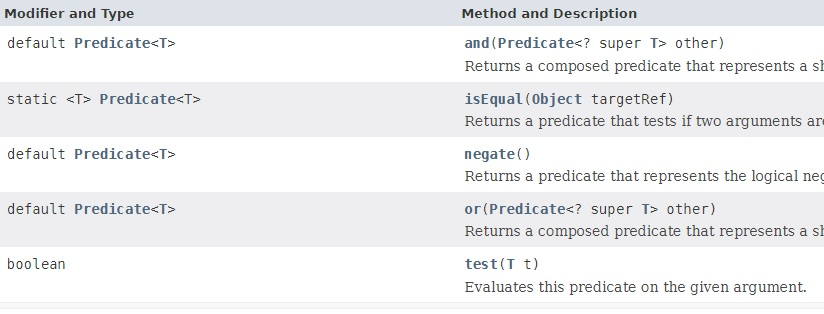
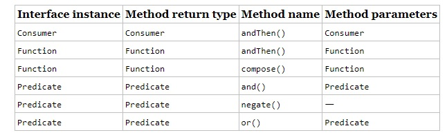

Tabla de contenidos:

    // TODO reubicar la clase record

## Nuevas clases record

Es un tipo especial de clase con unas caracteristicas determinadas, que se hace para simplificar.
Un `record` especifica es su cabecera la descripcion de su contenido(campos). A partir de estos simplemente se generan los getters y setters automaticamente. Viene hacer lo que hace loombook pero con restricciones.

Aqui un ejemplo de `record`

```java 
    record Rectangle(double length, double width) { }
```

Esto es equivalente a la siguiente clase normal

```java 
public final class Rectangle {
    private final double length;
    private final double width;

    public Rectangle(double length, double width) {
        this.length = length;
        this.width = width;
    }

    double length() { return this.length; }
    double width()  { return this.width; }

    // Implementation of equals() and hashCode(), which specify
    // that two record objects are equal if they
    // are of the same type and contain equal field values.
    public boolean equals...
    public int hashCode...

    // An implementation of toString() that returns a string
    // representation of all the record class's fields,
    // including their names.
    public String toString() {...}
}
```

Como vemos se han generado los accessors, constructor, equals, hashCode, y toString con una pequeña diferencia
no exite el set. Esto es entre otras cosas porque un record tiene las siguientes caracteristicas

Una clase `record` declara los siguientes miembros automáticamente:

- Para cada componente del encabezado, los siguientes dos miembros:
    - atributos `private final` con el mismo nombre y tipo declarado que el componente de `record`. 
    - Un método public con el mismo nombre y tipo; en el `record` *Rectangle*, estos métodos son `Rectangle::length()` y `Rectangle::width()`.

- Un constructor canónico cuya firma es la misma que la del encabezado, que asigna los valores las propiedades.

- Implementaciones de los métodos `equals` y `hashCode`, que especifican que dos clases de registros son iguales si son del mismo tipo y contienen valores de componentes iguales.
- Una implementación del `toString` método que incluye la representación de cadena de todos los componentes de la clase de `record`, con sus nombres.
- Como las clases `record` son solo tipos especiales de clases, crea un objeto de `record` (una instancia de una clase de registro) con `new`

```java
    Rectangle r = new Rectangle(4,5);
```

## Creando nuestros propios ccontructores en un record.

Podemos hacerlo perfectamente para añadir alguna funcionalidad, como por ejemplo lanzar una excepcion

```java
record Rectangle(double length, double width) {
    public Rectangle(double length, double width) {
        if (length <= 0 || width <= 0) {
            throw new java.lang.IllegalArgumentException(
                String.format("Invalid dimensions: %f, %f", length, width));
        }
        this.length = length;
        this.width = width;
    }
}
```
Se han inventado unas cosas llamadas constructores compactos, donde podemos omitir los parametros del constructor y las asignaciones, que son siempre obligatorios.

```java
record Rectangle(double length, double width) {
    public Rectangle {
        if (length <= 0 || width <= 0) {
            throw new java.lang.IllegalArgumentException(
                String.format("Invalid dimensions: %f, %f", length, width));
        }
    }
}
```

De igual modo podemos sobreescribir el método *`get`* que se recurerda SE OMITE en el accesor, ya que no hay `set`

```java
record Rectangle(double length, double width) {
 
    // Public accessor method
    public double length() {
        System.out.println("Length is " + length);
        return length;
    }
}
```

Podemos declarar campos estáticos, inicializadores estáticos o  métodos estáticos 
```java
record Rectangle(double length, double width) {
    
    // Static field
    static double goldenRatio;

    // Static initializer
    static {
        goldenRatio = (1 + Math.sqrt(5)) / 2;
    }

    // Static method
    public static Rectangle createGoldenRectangle(double width) {
        return new Rectangle(width, width * goldenRatio);
    }
}
```

Pero NO podemos escribir campos o inicializadores estáticos
El siguiente coódigo NO compila

```java
record Rectangle(double length, double width) {

    // Field declarations must be static:
    BiFunction<Double, Double, Double> diagonal;

    // Instance initializers are not allowed in records:
    {
        diagonal = (x, y) -> Math.sqrt(x*x + y*y);
    }
}
```

Puedes declarar métodos de instancia en una clase de `record`, independientemente de si implementa sus propios métodos de acceso. También puede declarar `clases` e `interfaces` anidadas en una clase de `record`, incluidas las clases de `record` anidadas (que son implícitamente estáticas). Por ejemplo:


```java
record Rectangle(double length, double width) {

    // Nested record class
    record RotationAngle(double angle) {
        public RotationAngle {
            angle = Math.toRadians(angle);
        }
    }
    
    // Public instance method
    public Rectangle getRotatedRectangleBoundingBox(double angle) {
        RotationAngle ra = new RotationAngle(angle);
        double x = Math.abs(length * Math.cos(ra.angle())) +
                   Math.abs(width * Math.sin(ra.angle()));
        double y = Math.abs(length * Math.sin(ra.angle())) +
                   Math.abs(width * Math.cos(ra.angle()));
        return new Rectangle(x, y);
    }
}
``` 

La clase `record` es final, es decir no puede ser extendida, pero mas haya de esas restricciones si podemos extender de otras clases o implementar interfaces

-  Puede crear una clase de `record` genérica, por ejemplo:

```java
record Triangle<C extends Coordinate> (C top, C left, C right) { }
```

- Puede declarar una clase de `record` que implemente una o más interfaces, por ejemplo:

```java
record Customer(...) implements Billable { }
```
- Puede usar anotaciones en una clase de `record` y sus componentes individuales, por ejemplo:

```java
import java.lang.annotation.*;
@Retention(RetentionPolicy.RUNTIME)
@Target(ElementType.FIELD)
public @interface GreaterThanZero { }
```
```java
record Rectangle(
    @GreaterThanZero double length,
    @GreaterThanZero double width) { }
```

## Lambdas

## Lambda Expressions vs. implementaciones Anonymous Interface 

Aunque las expresiones lambda están cerca de las implementaciones de interfaz anónima, hay algunas diferencias que vale la pena señalar.

La principal diferencia es que una implementación de interfaz anónima puede tener estado (variables miembro) mientras que una expresión lambda no puede. Mira esta interfaz:

```java
public interface MyEventConsumer {

    public void consume(Object event);

}
```

Esta interfaz se puede implementar usando una implementación de interfaz anónima, como esta:

```java
MyEventConsumer consumer = new MyEventConsumer() {
    public void consume(Object event){
        System.out.println(event.toString() + " consumed");
    }
};
```

Esta implementación anónima de MyEventConsumer puede tener su propio estado. Mira este rediseño:

```java
MyEventConsumer myEventConsumer = new MyEventConsumer() {
    private int eventCount = 0;
    public void consume(Object event) {
        System.out.println(event.toString() + " consumed " + this.eventCount++ + " times.");
    }
};
```
Observe cómo la implementación anónima de MyEventConsumer ahora tiene un campo llamado eventCount.

Una expresión lambda no puede tener dichos campos. Por lo tanto, se dice que una expresión lambda no tiene estado.

## Lambda Type Inference

Antes de Java 8, tendría que especificar qué interfaz implementar, al realizar implementaciones de interfaces anónimas. Aquí está el ejemplo de implementación de la interfaz anónima:

```java
stateOwner.addStateListener(new StateChangeListener() {

    public void onStateChange(State oldState, State newState) {
        // do something with the old and new state.
    }
});
```
Con las expresiones lambda, el tipo a menudo se puede inferir del código. Por ejemplo, el tipo de interfaz del parámetro puede deducirse de la declaración de método del método addStateListener() (un único método en la interfaz StateChangeListener). Esto se llama *inferencia de tipos*. El compilador infiere el tipo de un parámetro buscando el tipo en otra parte, en este caso, la definición del método. Este es el ejemplo del principio de este texto, que muestra que la interfaz `StateChangeListener` no se menciona en la expresión lambda:

```java
stateOwner.addStateListener(
    (oldState, newState) -> System.out.println("State changed")
);
```

En la expresión lambda, los tipos de parámetros a menudo también se pueden inferir. En el ejemplo anterior, el compilador puede inferir su tipo a partir de la declaración del método onStateChange(). Por lo tanto, el tipo de los parámetros oldState y newState se deducen de la declaración del método onStateChange().

## Lambda Parameters

Since Java lambda expressions are effectively just methods, lambda expressions can take parameters just like methods. The (oldState, newState) part of the lambda expression shown earlier specifies the parameters the lambda expression takes. These parameters have to match the parameters of the method on the single method interface. In this case, these parameters have to match the parameters of the onStateChange() method of the StateChangeListener interface:

Dado que las expresiones lambda de Java son efectivamente solo métodos, las expresiones lambda pueden tomar parámetros como los métodos. La parte (oldState, newState) de la expresión lambda mostrada anteriormente especifica los parámetros que toma la expresión lambda. Estos parámetros tienen que coincidir con los parámetros del método en la interfaz de método único. En este caso, estos parámetros deben coincidir con los parámetros del método `onStateChange()` de la interfaz `StateChangeListener`:

```java
public void onStateChange(State oldState, State newState);
```
Como mínimo, la cantidad de parámetros en la expresión lambda y el método deben coincidir.

En segundo lugar, si ha especificado algún tipo de parámetro en la expresión lambda, estos tipos también deben coincidir. Todavía no le he mostrado cómo poner tipos en los parámetros de expresión lambda (se muestra más adelante), pero simplemente en muchos casos no los necesita.

### Zero Parameters

Si el método con el que estás haciendo coincidir tu expresión lambda no tiene parámetros, entonces puedes escribir la expresión lambda así:

```java
() -> System.out.println("Zero parameter lambda");
```

Cuando ponemos parentesis vacios, es señal de que el método no tiene parametros.

### One Parameter

Si el método con el que estás comparando la expresión lambda de Java tiene un parámetro, puedes escribir la expresión lambda así:

```java
(param) -> System.out.println("One parameter: " + param);
```
El parentesis

Pero cuando una `lambda expression` tiene un solo parámetro, el paréntesis lo puedes omitir.

```java
 param -> System.out.println("One parameter: " + param);
```
### Multiple Parameters


Si el método con el que hace coincidir su expresión lambda de Java tien varios parámetros, los parámetros tienen que estar entre paréntesis. 
```java
(p1, p2) -> System.out.println("Multiple parameters: " + p1 + ", " + p2);
```

RECUERDA Solo cuando el método toma un solo parámetro se pueden omitir los paréntesis.

### Parameter Types

```java
(Car car) -> System.out.println("The car is: " + car.getName());  
```

Como puede ver, el tipo (Car) del parámetro car se escribe delante del propio nombre del parámetro, tal como lo harías al declarar un parámetro en un método.


## var Parameter Types from Java 11

Desde Java 11 podemos usar la palabra clave var como tipo de parámetro. La palabra clave var se introdujo en Java 10 como inferencia de tipo de variable local. Desde Java 11 var también se puede usar para tipos de parámetros lambda. 

Este es un ejemplo del uso de la palabra clave var de Java como tipos de parámetros en una expresión lambda:

```java
Function<String, String> toLowerCase = (var input) -> input.toLowerCase();
```

## Lambda Function Body

El cuerpo de una expresión lambda y, por lo tanto, el cuerpo de la función/método que representa, se especifica a la derecha de `->` en la declaración lambda

```java
 (oldState, newState) -> System.out.println("State changed")
```

Si tu expresión lambda tiene varias líneas, *`puedes`* encerrar el cuerpo de la función lambda dentro del corchete `{ }` 

```java
 (oldState, newState) -> {
    System.out.println("Old state: " + oldState);
    System.out.println("New state: " + newState);
  }
```
## Returning a Value From a Lambda Expression

Puedes retornar valores de expresiones lambda, al igual que puede hacerlo desde un método. Simplemente agregando una declaración de retorno al cuerpo de la función lambda

```java
 (param) -> {
    System.out.println("param: " + param);
    return "return value";
  }
```

En caso de que todo lo que tu expresión lambda esté haciendo sea calcular un valor de retorno y devolverlo, puedes especificar el valor de retorno de una manera más corta. 

```java
 (a1, a2) -> { return a1 > a2; }
 ```
o así:

```java
 (a1, a2) -> a1 > a2;
```
Luego, el compilador se da cuenta de que la expresión a1 > a2 es el valor de retorno de la expresión lambda (de ahí el nombre de expresiones lambda, ya que las expresiones devuelven un valor de algún tipo).


## Lambdas como Objetos

Una expresión Java lambda es esencialmente un objeto. Puedes asignar una expresión lambda a una variable y pasarla, como lo haces con cualquier otro objeto. Ejemplo:

```java
public interface MyComparator {

    public boolean compare(int a1, int a2);

}
MyComparator myComparator = (a1, a2) -> a1 > a2;

boolean result = myComparator.compare(2, 5);
```

## Valid lambdas?

Las siguientes son expresiones lambda validas

```java
    () -> true;
    x -> x.startswith("eco");
    (String x) -> x.startswith("eco");
    (x, y) -> {return x.startWith("eco");}
    (String x, String y) -> return x.startWith("eco");
``` 

Todos estos valores retornan un boolean, el 1 coge cero parámetros y devuelve boolean. El 2 coge uno y devuelve el resultado de la expresion. El tercero hace lo mismo pero define explicitamente el tipo.
El cuarto coge dos y solo usa uno, lo que es perfectamente valido y el quinto hace lo mismo definiendo los tipos entre parentesis.


```java 
1:  x, y -> x.startWith("perro") // Faltan parentesis a la izquierda.
2:  x -> {x.startWith("gato");} // Falta el return
3:  x -> {return x.startWith("gato")} // Falta el ;
4:  String x -> x.startWith("gato")  // Faltan parentesis a la izquierda.
```
- 1 y 4 Los parentesis son opcionales solo cuando hay un parametro y no tiene un tipo declarado.

```java
var invalid = (Animal a) -> a.canHoop(); // DOES NOT COMPILE 
```

- Recuerda que cuando hablamos de Java inferiedo informacion de Java por el contexto, pues bien aquí no hay contexto suficiente y por tanto java no puede determinar el tipo por lo que no compilará.

## Escribir expresiones lambda

Sintaxis lambda normal

```java
a -> a.canHop()
```

Sintaxis lambda completa

```java
(Animal a) -> { return a.canHop(); }
```

Los paréntesis se pueden omitir, solo si hay un solo parámetro y su tipo no se indica explícitamente. También podemos omitir las llaves cuando solo tenemos una declaración. Java no requiere que escriba `return` use un `;` cuando no se usan llaves.

Todas las siguientes son expresiones lambda válidas, suponiendo que haya interfaces funcionales que puedan consumirlas.

```java
() -> new Duck();
d -> { return d.quack(); }
(Duck d) -> d.quack()
(Animal a, Duck d) -> d.quack()
```

- El primero puede ser utilizado por una interfaz que contiene un método que no acepta argumentos y devuelve un Duck.
- El segundo y el tercero, ambos pueden ser utilizados por una interfaz que toma Duck como entrada y devuelve cualquiera que sea el tipo quack().
- El último puede ser utilizado por una interfaz que toma como entrada Animaly Duckobjetos y devuelve el tipo de quack().

Ahora vamos a comprobar si hay una sintaxis no válida.

```java
a, b -> a.startsWith("test");        // DOES NOT COMPILE
Duck d -> d.canQuack();              // DOES NOT COMPILE
a -> { a.startsWith("test"); }       // DOES NOT COMPILE
a -> { return a.startsWith("test") } // DOES NOT COMPILE
(Swan s, t) -> s.compareTo(t) != 0   // DOES NOT COMPILE
```

- Las líneas 1 y 2 requieren cada paréntesis alrededor de cada lista de parámetros. Los parámetros son opcionales solo cuando hay un parámetro y no tiene un tipo declarado.
- A la línea 3 le falta la `return` palabra clave, que es obligatoria ya que dijimos que la lambda debe devolver un `boolean`.
- A la línea 4 le falta el punto y coma `;` dentro de las llaves.
- A la línea 5 le falta el tipo de parámetro para t. Si el tipo de parámetro se especifica para un parámetro, debe especificarse para todos ellos.

## Trabajar con variables lambda

Lista de parámetros
Especificar el tipo de parámetros es opcional. Ahora varse puede usar en una lista de parámetros lambda. Esto significa que todos estos 3 son válidos.

```java
Predicate<String> p = x -> true;
Predicate<String> p = (var x) -> true;
Predicate<String> p = (String x) -> true;

```

### Restricciones sobre el uso de var en la lista de parámetros

Si `var` se usa para uno de los tipos en la lista de parámetros, entonces debe usarse para todos los parámetros en la lista.

```java
(var num) -> 1
(var a, var b) -> "Hello"
(var b, var k, var m) -> 3.14159
```

```java
6:  var w -> 99 // DOES NOT COMPILE
7:  (var a, Integer b) -> true // DOES NOT COMPILE
8:  (String x, var y, Integer z) -> true // DOES NOT COMPILE
```

- La línea 6 no se compila porque se requieren paréntesis cuando se usa el nombre del parámetro. 
- Las líneas 7 y 8 no se compilan porque los tipos de parámetros incluyen una combinación de vary nombres de tipos.

### Variables locales dentro del cuerpo Lambda

Es legal definir una lambda como un bloque.

```java
(a, b) -> {
	int c = 0;
	return 5;
}
```
Sin embargo, no está permitido volver a declarar una variable.


```java
(a, b) -> {
	int a = 0; // DOES NOT COMPILE
	return 5;
}
```
(!) ¡ Los bloques Lambda deben terminar con un punto y coma! (!)

```java
public void variables(int a) {
	int b = 1;

	Predicate<Integer> p1 = a -> {
		int c = 0;
		return b == c; } // DOES NOT COMPILE. MISSING ;
}
```

Variables a las que se hace referencia desde el cuerpo de Lambda
Los cuerpos lambda pueden usar `static` variables, variables de instancia y variables locales si son efectivamente finales.

```java
public class Crow {
	private String color;

	public void caw(String name) {
		String volume = "loudly";
		Predicate<String> p = s -> (name+volume+color).length() == 10;
	}
}
```

(!) Si la variable local no es  efectivamente final, entonces el código no  compila. (!)

```java
public class Crow {
	private String color;

	public void caw(String name) {
		String volume = "loudly";
		color = "allowed";
		name = "not allowed";
		volume = "not allowed";

		Predicate<String> p =
			s -> (name+volume+color).length()==9; // DOES NOT COMPILE
	}
}
```
## Usando method references

Las referencias a métodos surge como una forma de hacer el código mas facil 

Una referencia de método y una lambda se comportan de la misma manera en tiempo de ejecución. Puedes fingir que el compilador convierte las referencias de su método en lambdas para tí.

Hay cuatro formatos para las referencias de métodos:

- métodos estáticos
- Métodos de instancia en un objeto en particular
- Métodos de instancia en un parámetro que se determinará en tiempo de ejecución
- Constructores


## static Methods
For the first example, we use a functional interface that converts a `double` to a `long`:

```java
interface Converter { 
   long round(double num);
}
```

Podemos implementar esta interfaz con el método `round()` en `Math`. Aquí asignamos una referencia de método y una lambda a esta interfaz funcional:

```java
14: Converter methodRef = Math::round;
15: Converter lambda = x -> Math.round(x);
16:
17: System.out.println(methodRef.round(100.1));  // 100
```

En la línea 14, hacemos referencia a un método con un parámetro y Java sabe que es como una lambda con un parámetro. Además, Java sabe pasar ese parámetro al método.

Espera un minuto. Es posible que sepa que el método `round()` está sobrecargado: puede tomar un `double` o un `float`. ¿Cómo sabe Java que queremos llamar a la versión con un doble? Con  ambos, referencias a métodos y lambdas, Java infiere información del contexto. En este caso, dijimos que estábamos declarando un convertidor, que tiene un método que toma un parámetro doble. Java busca un método que coincida con esa descripción. Si no puede encontrarlo o encuentra varias coincidencias, el compilador informará un error. Este último a veces se denomina error de tipo *ambigous*.

## Métodos de instancia en un objeto en particular

Para este ejemplo, nuestra interfaz funcional verifica si una cadena comienza con un valor específico:

```java
    interface StringStart {
    boolean beginningCheck(String prefix);
    }
```
Convenientemente, la clase `String` tiene un método `beginWith()` que toma un parámetro y devuelve un valor `boolean`. Veamos cómo usar referencias de métodos con este código:

```java
    18: var str = "Zoo";
    19: StringStart methodRef = str::startsWith;
    20: StringStart lambda = s -> str.startsWith(s);
    21:
    22: System.out.println(methodRef.beginningCheck("A"));  // false
```
- La linea 19 muestra que queremos llamar a str.startsWith() y pasar un solo parámetro para que se suministre en tiempo de ejecución. Esta sería una buena manera de filtrar los datos en una lista.

Una referencia de método no tiene que tomar ningún parámetro. En este ejemplo, creamos una interfaz funcional con un método que no toma ningún parámetro pero devuelve un valor:

```java
    interface StringChecker {
        boolean check();
    }
```
Lo implementamos preguntando si está vacio

```java
    18: var str = "";
    19: StringChecker methodRef = str::isEmpty;
    20: StringChecker lambda = () -> str.isEmpty();
    21:
    22: System.out.print(methodRef.check());  // true
```
- Dado que el método en String es un método de instancia, llamamos a la referencia del método en una instancia de la clase String.

- Si bien todas los method references se pueden convertir en lambdas, lo contrario no siempre es cierto. Por ejemplo, considere este código:

```java
    var str = "";
    StringChecker lambda = () -> str.startsWith("Zoo");

```
¿Cómo podríamos escribir esto como una referencia de método? Puede intentar uno de los siguientes:

```java
    StringChecker methodReference = str::startsWith;         // DOES NOT COMPILE
    StringChecker methodReference = str::startsWith("Zoo");  // DOES NOT COMPILE
```
¡Ninguno de estos funciona! Si bien podemos pasar el str como parte de la referencia del método, no hay forma de pasar el parámetro "Zoo" con él. Por lo tanto, no es posible escribir esta lambda como referencia de método.

## Calling Instance Methods on a Parameter

Esta vez, vamos a llamar al mismo método de instancia que no toma ningún parámetro. El truco es que lo haremos sin conocer la instancia de antemano. Esta vez necesitamos una interfaz funcional diferente, ya que necesita conocer la `String`:

```java
interface StringParameterChecker {
   boolean check(String text);
}
```

Podemos implementar la interfaz funcional así:
```java

    23: StringParameterChecker methodRef = String::isEmpty;
    24: StringParameterChecker lambda = s -> s.isEmpty();
    25:
    26: System.out.println(methodRef.check("Zoo"));  // false
```

- La línea 23 dice que el método que queremos llamar está declarado en `String`. Parece un método estático, pero no lo es. En cambio, Java sabe que `isEmpty()` es un método de instancia que no toma ningún parámetro. Java utiliza el parámetro proporcionado en tiempo de ejecución como la instancia en la que se llama al método.

Compare las líneas 23 y 24 con las líneas 19 y 20 de nuestro ejemplo de instancia. Parecen similares, aunque uno hace referencia a una variable local llamada str, mientras que el otro solo hace referencia a los parámetros de la interfaz funcional.

Incluso puedemos combinar los dos tipos de referencias de métodos de instancia. Nuevamente, necesitamos una nueva interfaz funcional que tome dos parámetros:

```java
    interface StringTwoParameterChecker {
         boolean check(String text, String prefix);
    }
```

Pon atencion al orden de los parámetros cuando leemos la implementacion:

```java
    26: StringTwoParameterChecker methodRef = String::startsWith;
    27: StringTwoParameterChecker lambda = (s, p) -> s.startsWith(p);
    28:
    29: System.out.println(methodRef.check("Zoo", "A"));  // false
```
Dado que la interfaz funcional toma dos parámetros, Java tiene que averiguar qué representan. La primera siempre será la instancia del objeto para los métodos de instancia. Cualquier otro debe ser un parámetro de método.

Recuerde que la línea 26 puede parecer un método estático, pero en realidad es una referencia de método que declara que la instancia del objeto se especificará más adelante. La línea 27 muestra parte del poder de una referencia de método. Pudimos reemplazar dos parámetros lambda esta vez.

## Llamando a constructores

Una referencia de constructor es un tipo especial de referencia de método que usa `new` en lugar de un método, e instancia un objeto. Para este ejemplo, nuestra interfaz funcional no tomará ningún parámetro pero devolverá una `String`:

```java
    interface EmptyStringCreator {
         String create();
    }
```

Para llamar a esto, usamos `new` como si fuera el nombre de un método:

```java
    30: EmptyStringCreator methodRef = String::new;
    31: EmptyStringCreator lambda = () -> new String();
    32:
    33: var myString = methodRef.create();
    34: System.out.println(myString.equals("Snake"));  // false 
```

Se expande como las referencias de métodos que has visto hasta ahora. En el ejemplo anterior, la lambda no tiene ningún parámetro.

Las referencias a métodos pueden ser complicadas. Esta vez creamos una interfaz funcional que toma un parámetro y devuelve un resultado:

```java
    interface StringCopier {
        String copy(String value);
    }
```
En la implementación, observe que la línea 32 en el siguiente ejemplo tiene la misma referencia de método que la línea 30 en el ejemplo anterior:

```java
    32: StringCopier methodRef = String::new;
    33: StringCopier lambda = x -> new String(x);
    34:
    35: var myString = methodRef.copy("Zebra");
    36: System.out.println(myString.equals("Zebra"));  // true
```

Esto significa que no siempre puede determinar a qué método se puede llamar mirando la referencia del método. En cambio, debe mirar el contexto para ver qué parámetros se usan y si hay un tipo de devolución. En este ejemplo, Java ve que estamos pasando un parámetro String y llama al constructor de String que toma dicho parámetro.

|  Type |   Before colon|  After colon	 |   Example|   
|---|---|---|---|
| static methods  |  Method name |  Method name |   Math::random|   
|  Instance methods on a particular object|  variable name |  Method name	 |  str::startsWith |   
| Instance methods on a parameter  | Class name  |  Method name	 |   	String::isEmpty|   
| Constructor  |   Class name| new  | String::new  |   


## Interfaces funcionales.

Una interfaz funcional es una interfaz que contiene un solo método abstracto (SAM)

```java 
@FunctionalInterface
public interface Spring {
	public void sprint(int speed);
}

public class Tiger implements Sprint {
	public void sprint(int speed) {
		...
	}
}
```
Es una interfaz funcional

```java 
public interface Dash extends Sprint {}
```

Esta es una interfaz funcional, porque contiene exactamente un método abstracto heredado.

```java 
public interface Skip extends Sprint {
	void skip();
}
```
Esto no se debe a que tenga dos métodos abstractos. El heredado y skip()

```java 
public interface Sleep {
	private void snore() {}
	default int getZZZ() { return 1; }
}
```
Esto no es así porque ningún método coincide con los criterios.

```java 
public interface Climb {
	void reach();
	default void fall() {}
	static int getBackUp() { return 100; }
	private static boolean checkHeight() { return true; }
}
```

Esta es una interfaz funcional. A pesar de definir una gran cantidad de métodos, contiene un método abstracto: reach().

Todas las clases heredan ciertos métodos de Object. Para el examen debe estar familiarizado con

```java
String toString();

boolean equals(Object);

int hashCode();
```

Hay una excepción a la regla del método abstracto único. Si una interfaz funcional incluye un método abstracto con la misma firma que un publicmétodo que se encuentra en Object, esos métodos no cuentan para el método abstracto único.

```java
public interface Soar {
	abstract String toString();
}
```
Esta no es una interfaz funcional, ya que` toString()`es un método `public` implementado dentro de `Object`.

Por otro lado, esta es una interfaz funcional.


```java
public interface Dive {
	String toString();
	public boolean equals(Object o);
	public abstract int hashCode();
	public void dive();
}
```

(!) Ten cuidado con los ejemplos que se parecen a los métodos de la clase `Object` . (!)

```java
public interface Hibernate {
	String toString();
	public boolean equals(Hibernate o);
	public abstract int hashCode();
	public void rest();
}
```
Hibernate no es una interfaz válida.

## Capturar o usar variables externas

## 1.1	  Una clase ‘effectively final’
En una clase singleton al marcar los constructores como privados, hemos marcado implícitamente la clase como final ''effectively final’’. 

Si se declaran todos los constructores privados en la clase singleton, entonces es imposible crear una subclase con un constructor; por lo tanto, la clase singleton es efectivamente final ''effectively final’’.

## 1.2 	‘Using Variables in Lambdas’

Las Lambda expressions pueden acceder a 
- static variables 
- instance variables
- parámetros en métodos effectively final  
- effectively final variables locales.
- lambda variables

Las expresiones Lambda pueden acceder a variables estáticas, variables de instancia, parámetros de método finales efectivos y variables locales finales efectivas. ¿Cuántos de esos puedes encontrar en este ejemplo?

```java
1: interface Gorilla { String move(); }
2: class GorillaFamily {
3:     String walk = "walk";
4:     void everyonePlay(boolean baby) {
5:         String approach = "amble";
6:         //approach = "run";
7:
8:         play(() -> walk); // instance variable
9:         play(() -> baby ? "hitch a ride": "run"); // parameter var
10:        play(() -> approach); // local variable
11:    }
12:    void play(Gorilla g) {
13:        System.out.println(g.move());
14:    }
15: }
```

- La línea 8 usa una variable de instancia en lambda. 
- La línea 9 usa un parámetro de método. Sabemos que es efectivamente final ya que no hay reasignaciones a esa variable. 
- La línea 10 utiliza una variable local efectivamente final. Si descomentamos la línea 6, habrá una reasignación y la variable ya no será efectivamente final. Esto provocaría un error del compilador en la línea 10 cuando intenta acceder a una variable final no efectiva.

## Interfaces funcionales

La unica regla que tiene que tener una interfaz funcional es que no puede tener mas que método public abstract.

La anotacion `@FunctionalInterfaz` es una interfaz de marcado explicitamente, cuya unica labor es informativa y preventiva, por lo tanto si nos saltamos la regla nos avisa con error de compilación.

```java 
@FunctionalInterface
public interface Dance { // NO COMPILA
    void  one();
    void two();
}
```

Considerando Sprint una interface funcional. Cual de las siguientes son interfaces funcionales?


## 1.3	Trabajando con interfaces funcionales preconstruidas.

vienen del paquete `java.util.function`

Este paquete contiene interfaces funcionales que proveen objetivos para usar lambda expresions y method reference

Una interfaz funcional puede tener multiples `default methods` pero solo uno abstracto.


## Function

Una `Function` es la base de las interfaces funcionales la declaracion es:

```java
    /**
     * Applies this function to the given argument.
     *
     * @param t Argumento de entrada
     * @return argumento de salidad
     */
    R apply(T t);
´´´ 


```java
public class _Funcion {

	public static void main(String[] args) {

		
		// 1)  Llamada a un método.
		int increment = increment(1);
		System.out.println(increment);
		
		// 2) Llamada a una función.
		int increment2 = incrementByOneFunction.apply(1);
		System.out.println(increment2);
		
		// 3) Llamada a una segunda función.
		int multiply = multiplyBy10Function.apply(increment2);
		System.out.println(multiply);
		
		// Encadenando funciones con andThen que es un default method
		Function<Integer, Integer> addByOneAndThenMultiplyBy10 = incrementByOneFunction.andThen(multiplyBy10Function);
		System.out.println(addByOneAndThenMultiplyBy10.apply(5));
		
	}

    static int increment(int number) {
		return number + 1;
	}

	static Function<Integer, Integer> incrementByOneFunction = 
			n -> n + 1;
			
	static Function<Integer, Integer> multiplyBy10Function =
			n -> n * 10;

	

}
```
En este ejemplo podemos ver la igualdad entre llamar a un metodo y llamar a una funcion, devolviendo en este caso una funcíon.


## BiFunction

Una BiFunction es una Function que coge dos parametros como argumento de entrada.

```java
BiFunction<String, String, String> b1 = String::concat;
BiFunction<String, String, String> b2 =
   (string, toAdd) -> string.concat(toAdd);
 
System.out.println(b1.apply("baby ", "chick")); // baby chick
System.out.println(b2.apply("baby ", "chick")); // baby chick
```

## Predicate 



Esta interfaz funcional coge un parametros de cualquier tipo y devuelve un condicional.

Dispone de tres métodos default and, negate, or y uno static isEqual para comparar con otro elmento

```java
/**
    * DECLARATIVE APROACH
    */
System.out.println("//2) Declarative aproach");
Predicate<? super Person> predicate = p -> p.gender.equals(FEMALE);

List<Person> female2 = persons.stream()
    .filter(predicate)
    .collect(Collectors.toList());

System.out.println(female2);
```

Esto es el equivalente a

```java
List<Person> female2 = persons.stream()interfaz`    .filter( p.gender.equals(FEMALE);)
    .collect(Collectors.toList());
```

```java
/**
**                    BiPredicate
*/
BiPredicate<String, String> b1 = String::startsWith;
BiPredicate<String, String> b2 =
   (string, prefix) -> string.startsWith(prefix);
 
System.out.println(b1.test("chicken", "chick")); // true
System.out.println(b2.test("chicken", "chick")); // true
```

## Implementing Consumer

Un Consumer serepresenta un argumento simple y no retorna  resultado. Simplemente consume el resultado.

El metodo de la einterfaz es

```java
    void accept(T t)
```


```java
public static void  main (String ...args) {
		
		Customer juan = new Customer("Juan", "66655544");
		
		greet(juan);
		greetConsumer.accept(juan);
		
	}
	
	static Consumer<Customer> greetConsumer = c -> 	System.out.println("Hello"+ c.name
			+" phone "+ c.phone);
	
	static void greet(Customer customer) {
		System.out.println("Hello"+ customer.name
				+" phone "+ customer.phone);
	}
```
tiene un metodo por defecto
```java

default Consumer<T> andThen(Consumer<? super T> after) 
```

Ejemplo con andThen

```java
   Consumer<String> first = x -> System.out.println(x.toLowerCase());
    Consumer<String> second = y -> System.out.println("aaa " + y);

    Consumer<String> result = first.andThen(second);
```


## Implementing Supplier

Un `Supplier` se utiliza cuando desea generar o suministrar valores sin tener datos de entrada. 

```java
    @FunctionalInterface
    public interface Supplier<T> {
        T get();
    }
```
You can create a LocalDate object using the factory method `now()`. This example shows how to use a Supplier to call this factory:

```java
    Supplier<LocalDate> s1 = LocalDate::now;
    Supplier<LocalDate> s2 = () -> LocalDate.now();
    
    LocalDate d1 = s1.get();
    LocalDate d2 = s2.get();
    System.out.println(d1);  // 2022-02-20
    System.out.println(d2);  // 2022-02-20
```
 

Este ejemplo imprime una fecha dos veces. También es una buena oportunidad para revisar las referencias de métodos estáticos. La referencia del método ``LocalDate::now`` se utiliza para crear un `Supplier` para asignar a una variable intermedia s1. Un `Supplier` se usa a menudo cuando se construyen nuevos objetos. Por ejemplo, podemos imprimir dos objetos `StringBuilder` vacíos:

```java
    Supplier<StringBuilder> s1 = StringBuilder::new;
    Supplier<StringBuilder> s2 = () -> new StringBuilder();
    
    System.out.println(s1.get()); // Empty string
    System.out.println(s2.get()); // Empty string

```
Esta vez, usamos una referencia de constructor para crear el objeto. Hemos estado usando genéricos para declarar qué tipo de `Supplier` estamos usando. Esto puede ser un poco largo para leer. ¿Puedes averiguar qué hace lo siguiente? Simplemente dé un paso a la vez:

```java
    Supplier<ArrayList<String>> s3 = ArrayList::new;
    ArrayList<String> a1 = s3.get();
    System.out.println(a1);  // []
```

Tenemos un `Supplier` de cierto tipo. Ese tipo resulta ser `ArrayList<String>`. Luego, llamar a get() crea una nueva instancia de `ArrayList<String>`, que es el tipo genérico del Proveedor; en otras palabras, un genérico que contiene otro genérico. Asegúrese de mirar el código cuidadosamente cuando surja este tipo de cosas.

Observe cómo llamamos a get() en la interfaz funcional. ¿Qué pasaría si tratáramos de imprimir el `s3` mismo?

```java
    System.out.println(s3);
```
Que se imprime algo como esto:


```console
functionalinterface.BuiltIns$$Lambda$1/0x0000000800066840@4909b8da
```
Ese es el resultado de llamar a `toString()` en una lambda. Qué asco. Esto realmente significa algo. Nuestra clase de prueba se llama BuiltIns y está en un paquete que creamos con el nombre de *functionalinterface*. Luego viene *$$*, lo que significa que la clase no existe como `.class` en el sistema de archivos. Sólo existe en la memoria. No tienes que preocuparte por el resto.


## Implementing UnaryOperator and BinaryOperator

`UnaryOperator` y `BinaryOperator` son casos especiales de una función. Requieren que todos los parámetros de tipo sean del mismo tipo. Un `UnaryOperator` transforma su valor en uno del mismo tipo. Por ejemplo, incrementar en uno es una operación unaria. De hecho, `UnaryOperator` extiende `Function`. Un `BinaryOperator` fusiona dos valores en uno del mismo tipo. Sumar dos números es una operación binaria. Del mismo modo, `BinaryOperator` amplía `BiFunction`. Las interfaces se definen de la siguiente manera:

```java
@FunctionalInterface
public interface UnaryOperator<T> extends Function<T, T> { 
   // omitted static method
}
 
@FunctionalInterface
public interface BinaryOperator<T> extends BiFunction<T, T, T> {
   // omitted static methods 
}
```
Esto significa que las firmas del método se ven así:

```java
    T apply (T t); // Operador Unario
    
    T apply (T t1, T t2); // Operador Binario
```

En el Javadoc, notará que estos métodos se heredan de la superclase Function/BiFunction. Las declaraciones genéricas en la subclase son las que obligan a que el tipo sea el mismo. Para el ejemplo unario, observe cómo el tipo de devolución es el mismo tipo que el parámetro.

```java
    UnaryOperator<String> u1 = String::toUpperCase;
    UnaryOperator<String> u2 = x -> x.toUpperCase();
    
    System.out.println(u1.apply("chirp")); // CHIRP
    System.out.println(u2.apply("chirp")); // CHIRP
```

Esto imprime CHIRP dos veces. No necesitamos especificar el tipo de devolución en los genéricos porque `UnaryOperator` requiere que sea el mismo que el parámetro. Y ahora aquí está el ejemplo binario:

```java
    BinaryOperator<String> b1 = String::concat;
    BinaryOperator<String> b2 = (string, toAdd) -> string.concat(toAdd);
    
    System.out.println(b1.apply("bebé", "pollito")); // bebe pollito
    System.out.println(b2.apply("bebé", "pollito")); // bebe pollito
```
## Using Convenience Methods on Functional Interfaces

Hay una serie de métodos que son convenientes:



Mira este codigo

```java

// El código funciona, pero no es muy limpio

Predicate<String> brownEggs = s -> s.contains("egg") && s.contains("brown");
Predicate<String> otherEggs = s -> s.contains("egg") && !s.contains("brown");
```

Podemos usar los métodos *default* de predicate.


```java

// Clean code

Predicate<String> brownEggs = egg.and(brown);
Predicate<String> otherEggs = egg.and(brown.negate());
```

En  `Consumer`, echa un vistazo a `andThen()` method, Que hace correr dos interfaces funcionales en secuencia.

```java
`
Consumer<String> c1 = x -> System.out.print("1: " + x);
Consumer<String> c2 = x -> System.out.print(",2: " + x);
 

Consumer<String> combined = c1.andThen(c2);
combined.accept("Annie");  // 1: Annie,2: Annie
```