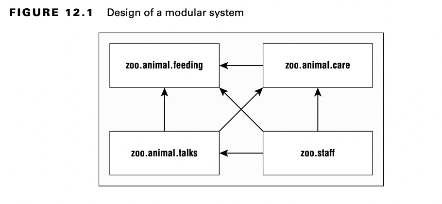
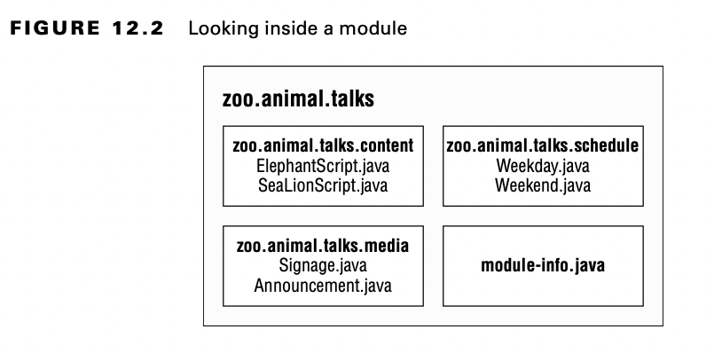

# Introduction Modules

Modules es la forma que tiene Java SE de gestionar las librerias de terceros sin necesidad de herramientas como Maven.
Viene a suplir ese defecto de versiones anteriores para no verse en problemas como una complejar cadena de dependecias, normalmete referido como ***Jar Hell***. Y el infierno es una excelente forma de encontrarse con la carga de una version incorrecta de una clase 
o incluso la excepcion ClassNotFoundException.

La Java Platform Module System (JPMS) arupa codigo a alto nivel. El objetivo fundamenteal de un modulo es prover grupos de paquetes relacionados que desarrollan otros paea un conjunto particular de funcionalidaddes

Es como un fichero JAR, con la excepcion de que el desarrollador elige que paquetes son accesible fuera del modulo.

It’s like a JAR file, except a developer chooses which packages are accessible outside the module. 

La Java Platform Module System includes lo following:

- un formato para los ficheros module JAR.
- Particion de la JDK en modulos
- Opciones linea de comando adicionales para las Java tools.

## Explorando un Module

Un modulo es un grupo de uno o mas paquetes y ademas un fichero especial llamado module-info.java. El contenido de este fichero es la declaracion del modulo-

Ahora profundicemos en uno de estos módulos.

## Beneficios de Modules

Los módulos  otra capa de cosas que necesitas saber para programar. Si bien el uso de módulos es opcional, es importante entender los problemas que están diseñados para resolver:

**Mejor access control**

Además de los niveles de control de acceso, puede tener paquetes que solo son accesibles por otros paquetes del modulo.

**Mejor dependency management**

Dado que los módulos especifican en qué se basan, Java puede quejarse de que falta un JAR al iniciar el programa en lugar de la primera vez que se acceden a ellos en tiempo de ejecución

**Custom Java builds**
Podemos crear un JRE que solo tega partes de la JDK que tu necesita tu programa en vez de la JRE completa que ocupa unos 

**Mejora de la seguridad**

Lo anterior deriva en una mejora de la seguridad, ya que si nosotros tenemos una JRE custom, no nos tenemos que preocupar de las vulnerabilidades que no esten en partes que no usemos.
**Mejora el rendimiento**

Si tenemos un paquete java menor el tiempo de arranque se mejora y se necesita menos memoria

**Unique package enforcement**

Como los modulos especificamente exponen paquetes. Jaba se puede cercionar de que cada paqute viene de un unico modulo y evitar la confusion acerca de que esta corriendo.

