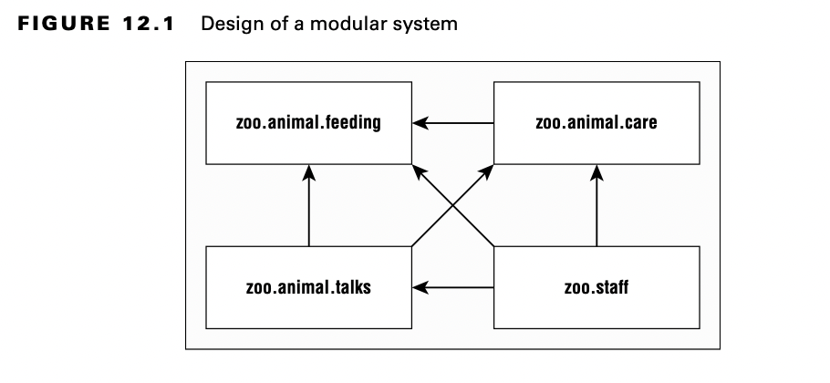
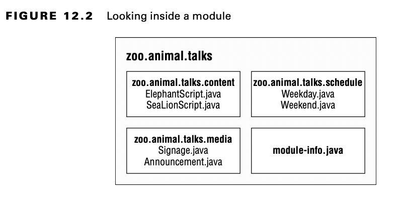

# Introducción a Modules

Modules es la forma que tiene Java SE de gestionar las librerías de terceros sin necesidad de herramientas como Maven.
Viene a suplir ese defecto de versiones anteriores para no verse en problemas como una compleja cadena de dependencias, vulgarmente referido como ***Jar Hell***. 
Y el infierno es una excelente forma de definir el trabajo que implica, encontrar el `load` de una versión incorrecta de una clase, o incluso lidiar con excepción `ClassNotFoundException`.

La Java Platform Module System (JPMS) agrupa código a alto nivel. 

El objetivo fundamental de un *module* es proveer grupos de paquetes relacionados que desarrollan otros, para un conjunto particular de funcionalidades.

Es como un fichero JAR, con la excepción de que el desarrollador elige que paquetes son accesible fuera del módulo.

La Java Platform Module System incluye los siguientes beneficios:

- Un formato para los ficheros *module JAR*.
- Partición de la JDK en *modules*
- Opciones en consola y comandos para las *Java tools*.

## Explorando un *Module*

Un módulo es un grupo de uno o más paquetes y además un fichero especial llamado `module-info.java`. 
El contenido de este fichero esta declaración del módulo.

Ahora profundicemos en uno de estos módulos.

## Beneficios de Modules

Los módulos otra capa de cosas que necesitas saber para programar. Si bien el uso de módulos es opcional, es importante entender los problemas para los que fueron diseñados estas mejoras:

1. **Mejorado _Access control_**

-   Además de los niveles de control de acceso, puede tener paquetes que solo son accesibles por otros paquetes del módulo.

2. **Mejorada _dependency management_**

- Dado que los módulos especifican en qué se basan, Java puede quejarse de que falta un *JAR* al iniciar el programa, en lugar de la primera vez que se acceden a ellos en tiempo de ejecución.

3. **Custom Java builds**

- Podemos crear un *JRE* que solo tenga partes de la JDK que necesita tu programa en vez de la *JRE completa* que ocupa unos 150 Mb.

4. **Mejora de la seguridad**

- Lo anterior deriva en una mejora de la seguridad, ya que si nosotros tenemos una *JRE custom*, no nos tenemos que preocupar de las vulnerabilidades que no estén en partes que no usamos.

5. **Mejora el rendimiento**

- Si tenemos un paquete Java más pequeño, es menor el tiempo de arranque y se ocupará menos memoria

6. **Unique package enforcement**

- Como los módulos específicamente exponen paquetes. Java se puede cercionar de que cada paquete viene de un único módulo y evitar la confusión acerca de, que clase y de que versión, está corriendo en *Runtime*.

