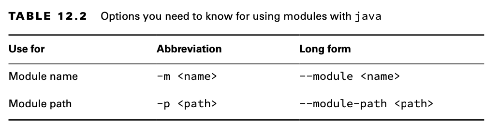
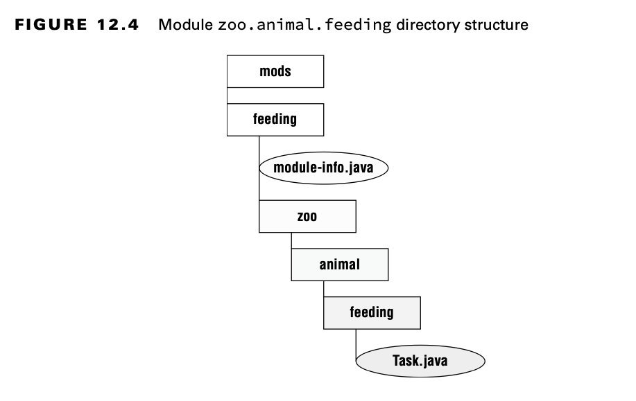
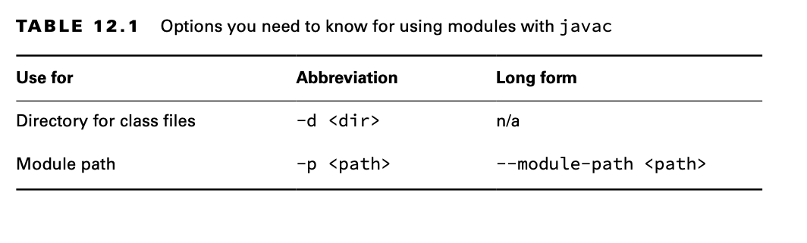
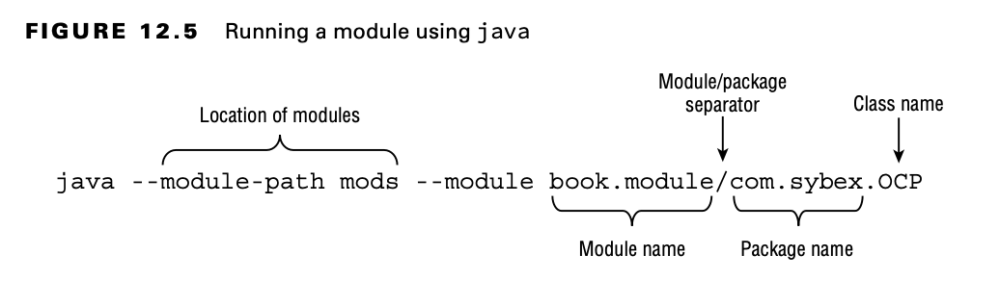

# Creando y ejecutando un programa modular

## Crear los ficheros

Creamos una clase simple


```java
package zoo.animal.feeding;

public class Task {
    public static void main(String... args) {
        System.out.println("All fed!"); 
    }
}
```
Después viene el `module-info.java` , Este es el mas simple posible.

```java
    module zoo.animal.feeding {
    }
```

Hay algunas diferencias clave entre una declaración de módulo y una declaración de clase Java normal:

- El fichero `module-info.java`  debe ir en el root del módulo. 
- Las clases Java deben ir en paquetes.
- El módulo tiene que tener la palabra clave  *`module`*.
- El nombre del módulo sigue las reglas de nomenclatura para nombres de paquetes. A menudo incluye puntos (.) en su nombre. Los nombres regulares de clases y paquetes no pueden tener guiones (-). Los nombres de los módulos siguen la misma regla.


El siguiente paso es asegurarse de que los archivos estén en la estructura de directorios correcta. La figura muestra la estructura de directorio esperada.



En particular, *feeding* es el directorio del módulo y el archivo `module-info.java` está directamente debajo de él. Al igual que con un archivo *JAR* normal, también tenemos el paquete *zoo.animal.feeding* con una subcarpeta. La clase Task está en la subcarpeta adecuada para su paquete.


## Compilando nuestro primer *`Module`*

Antes de que podamos ejecutar el código modular, debemos compilarlo. Aparte de la opción de ruta del módulo


```console
    javac --module-path mods -d feeding feeding/zoo/animal/feeding/*.java feeding/module-info.java 
```

 

Como revisión, la opción `-d` especifica el directorio donde está la clase. El final del comando es una lista de los ficheros .java para compilar. Puedes listar los ficheros individualmente o usar un *wildcard* para todos los ficheros .java del subdirectorio.

La nueva parte es `module-path`. Esta opción indica la ubicación de cualquier fichero `module` personalizado. En este ejemplo, la ruta del módulo podría haberse omitido, ya que no hay dependencias. Puede pensar en `module-path` como un reemplazo de la opción *classpath* cuando está trabajando en un programa modular.



**Y ... ¿Ahora que pasa con el classpath?**


La opción `classpath` tiene tres posibles formas: 
- `-cp`, `--class-path`, and `-classpath`. Aún puedes usar estas opciones.

Al igual que `classpath`, puede usar una abreviatura en el comando. La sintaxis `--module-path` y `-p` son equivalentes. Eso significa que podríamos haber escrito muchos otros comandos en lugar del comando anterior.

 ```console
    javac -p mods -d feeding feeding/zoo/animal/feeding/*.java feeding/*.java

    javac -p mods -d feeding feeding/zoo/animal/feeding/*.java feeding/module-info.java 

    javac -p mods -d feeding feeding/zoo/animal/feeding/Task.java feeding/module-info.java 

    javac -p mods -d feeding feeding/zoo/animal/feeding/Task.java feeding/*.java
 ```


**Construyendo Modules(Build)**

Incluso sin módulos, es raro ejecutar comandos `javac` y java manualmente en un proyecto real. Se vuelven largos y complicados muy rápidamente. La mayoría de los desarrolladores usan una herramienta de compilación como Maven o Gradle. Estas herramientas de compilación sugieren directorios en los que colocar los archivos de clase, como target/classes.

Es probable que la única vez que necesite conocer la sintaxis de estos comandos sea cuando realice el examen. Los conceptos en sí son útiles, independientemente.

Asegúrese de memorizar la sintaxis del comando del módulo. Se le evaluará en el examen. Le damos muchas preguntas de práctica sobre la sintaxis para reforzarla.

## Ejecutar nuestro primer Module

Antes de empaquetar nuestro módulo, debemos asegurarnos de que funciona ejecutándolo. Para hacer eso, necesitamos aprender la sintaxis completa. 

Supongamos que hay un módulo llamado book.module. Dentro de ese módulo hay un paquete llamado com.sybex, que tiene una clase llamada OCP con un método main().

Preste especial atención a la parte book.module/com.sybex.OCP. Es importante recordar que especifica el nombre del módulo seguido de una barra inclinada (/) y seguido del nombre de clase cualificado.



Ahora que hemos visto la sintaxis, podemos escribir el comando para ejecutar la clase Task en el paquete zoo.animal.feeding. En el siguiente ejemplo, el nombre del paquete y el nombre del módulo son los mismos. Es común que el nombre del módulo coincida con el nombre completo del paquete o con el comienzo del mismo.
 ```console
    java --module-path feeding  --module zoo.animal.feeding/zoo.animal.feeding.Task
```
Como ya viste que --module-path usa la forma abreviada de -p, apostamos a que no te sorprenderá saber que también hay una forma abreviada de --module. La opción corta es -m. Eso significa que el siguiente comando es equivalente:
 ```console
    java -p feeding -m zoo.animal.feeding/zoo.animal.feeding.Task
```
En estos ejemplos, usamos feeding como la ruta del módulo porque ahí es donde compilamos el código. Esto cambiará una vez que empaquetemos el módulo y lo ejecutemos.

## Empaquetar el primer Module

Un módulo no sirve de mucho si solo podemos ejecutarlo en la carpeta en la que se creó. Nuestro siguiente paso es empaquetarlo. Asegúrese de crear un directorio de mods antes de ejecutar este comando:
 ```console
    jar -cvf mods/zoo.animal.feeding.jar -C feeding/ .
```
No hay nada específico del módulo aquí. Estamos empaquetando todo en el directorio de feeding y almacenándolo en un archivo JAR llamado zoo.animal.feeding.jar en la carpeta mods. Esto representa cómo se verá el módulo JAR para otro código que quiera usarlo. Ahora ejecutemos el programa nuevamente, pero esta vez usando el directorio mods en lugar de las clases sueltas:

 ```console
   java -p mods  -m zoo.animal.feeding/zoo.animal.feeding.Task
```

Puede notar que este comando se ve idéntico al de la sección anterior excepto por el directorio. En el ejemplo anterior, se estaba alimentando. En este, es la ruta del módulo de mods. Dado que se utiliza la ruta del módulo, se está ejecutando un JAR de módulo.