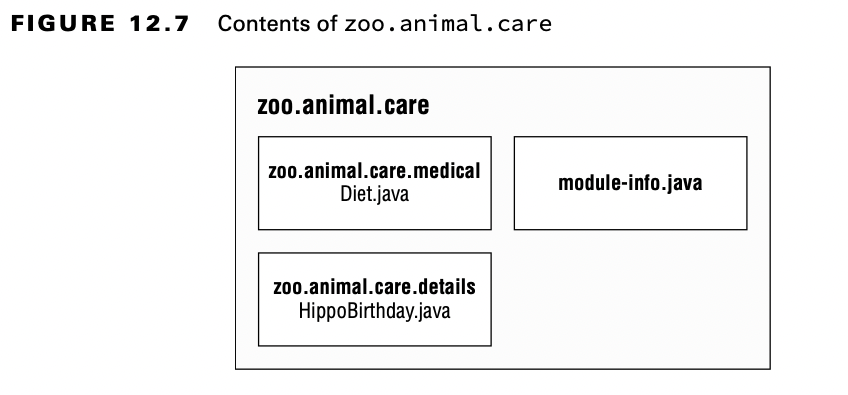
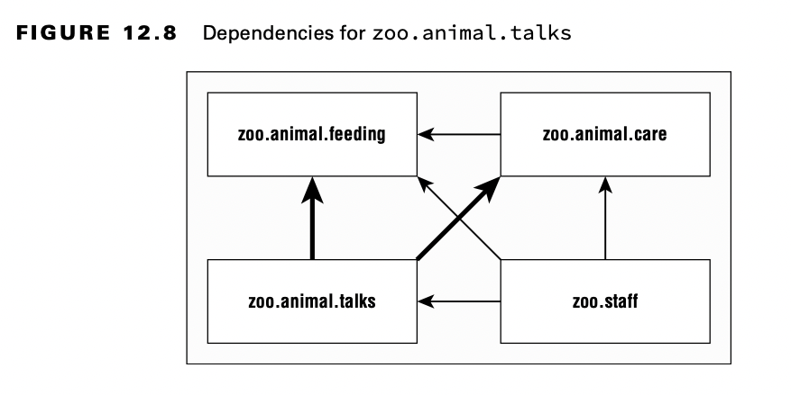
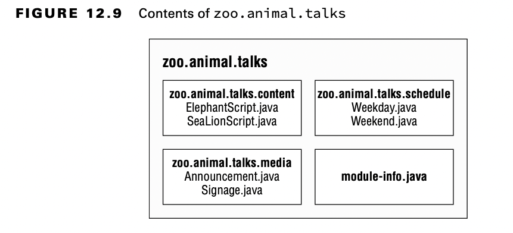
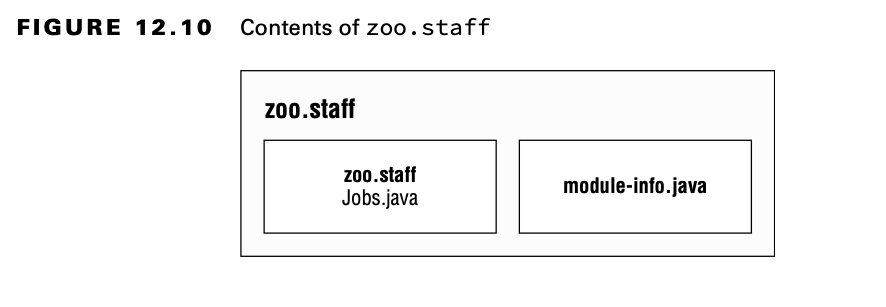
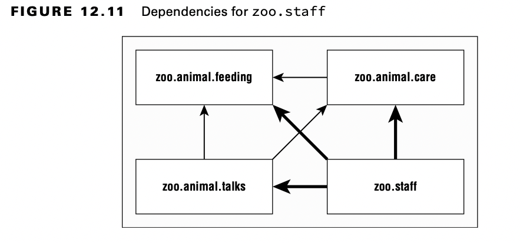

# ¡Actualizando nuestro ejemplo para múltiples `module`!

## Actualizando el módulo *feeding*

Dado que nuestros otros módulos tendrán que llamar al código en el paquete *zoo.animal.feeding*, debemos declarar esta intención en la declaración del módulo.

La directiva `export` se usa para indicar que un módulo quiere que el paquete indicado pueda ser ejecutado y visible desde fuera. Sin una directiva de `export`, el módulo solo está disponible para ejecutarse desde línea de comandos.

```java
    module zoo.animal.feeding { 
        exports zoo.animal.feeding;
    }
```

Recompilar y volver a empaquetar el módulo actualizará `module-info.class` dentro de nuestro archivo *zoo.animal.feeding.jar*. Lo hacemos con los mismos comandos `javac` y `jar` que ejecutamos anteriormente.

```console
    javac -p mods -d feeding feeding/zoo/animal/feeding/*.java feeding/module-info.java
    jar -cvf mods/zoo.animal.feeding.jar -C feeding/ .
```

## Creación de un módulo de atención

Creemos un nuevo módulo de atención médica, con las siguientes partes:

- Un paquete *zoo.animal.care.medical*, que tendrá las clases y los métodos destinados a ser visibles otros módulos.
- Otro paquete específico *zoo.animal.care.details*, pero este solo será visible desde el módulo. Pensamos en que queremos ocultar por privacidad determinados datos de los animales ... ;-)



- El módulo contiene dos paquetes y clases básicos además del fichero `module-info.java`:

```java
    package zoo.animal.care.details; 
    import zoo.animal.feeding.*; 
    public class HippoBirthday {
        private Task task; 
    }

    package zoo.animal.care.medical; 
    public class Diet { }

    module zoo.animal.care {
        exports zoo.animal.care.medical; 
        requires zoo.animal.feeding;
    }
```

La instrucción `requires` especifica que se necesita un módulo. El módulo *zoo.animal.care* ***depende de*** *zoo.animal.feeding*.

```console
    javac -p mods -d care care/zoo/animal/care/details/*.java care/zoo/animal/care/medical/*.java care/module-info.java
```

Compilamos ambos paquetes y el fichero `module-info.java`. En el mundo real, usará una herramienta de compilación en lugar de hacerlo a mano. Para el examen, simplemente enumera todos los paquetes y/o archivos que quieres compilar.

Ahora que hemos compilado el código, es hora de crear el módulo JAR:

## Crear el Módulo Talks

Y creemos un módulo más.

Hasta ahora, hemos usado solo una declaración `exports` y `requires` en un módulo. Ahora aprenderemos a gestionar la exportación de varios paquetes o la necesidad de varios módulos.



Vamos a exportar los tres paquetes en este módulo.



Primero, veamos el archivo `module-info.java` para *zoo.animal.talks*:

```java
    module zoo.animal.talks {
        exports zoo.animal.talks.content;
        exports zoo.animal.talks.media;
        exports zoo.animal.talks.schedule;
        requires zoo.animal.feeding;
        requires zoo.animal.care;
    }
```

Luego tenemos las seis clases, como se muestra aquí:

```java
    // 1 Content
    package zoo.animal.talks.content;
        public class ElephantScript {}

    package zoo.animal.talks.content;
        public class SeaLionScript {}

    // 2 Media
    package zoo.animal.talks.media;
    public class Announcement {
        public static void main(String[] args) {
            System.out.println("We will be having talks");
        }
    }

    package zoo.animal.talks.media;
        public class Signage {}

    // 3 Schedule

    package zoo.animal.talks.schedule;
    public class Weekday {}

    package zoo.animal.talks.schedule;
    public class Weekend {}

```
Compilamos y empaquetamos el modulos

```console
    javac -p mods -d talks talks/zoo/animal/talks/content/*.java talks/zoo/animal/talks/media/*.java talks/zoo/animal/talks/schedule/*.java talks/module-info.java

    jar -cvf mods/zoo.animal.talks.jar -C talks/ .
```

## Creación del módulo de Personal

Y otro módulo más

Nuestro módulo final es *zoo.staff*. La figura 12.10 muestra que solo hay un paquete adentro. No exportaremos este paquete fuera del módulo.





Hay tres flechas en la Figura 12.11 que apuntan desde *zoo.staff* a otros módulos. Estos representan los tres módulos que se requieren. 

```java
    module zoo.staff {
        requires zoo.animal.feeding; 
        requires zoo.animal.care; 
        requires zoo.animal.talks;
    }
```

En este módulo, tenemos una sola clase, Jobs.java.

```java
    package zoo.staff;
    public class Jobs { }
```

Para los que a estas alturas sigan aún con este ejercicio, ánimo!. 

Los siguientes son los comandos para compilar y construir el módulo:

```console
    javac -p mods -d staff  staff/zoo/staff/*.java staff/module-info.java

    jar -cvf mods/zoo.staff.jar -C staff/ .
```