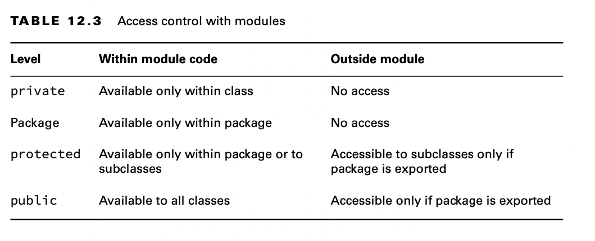
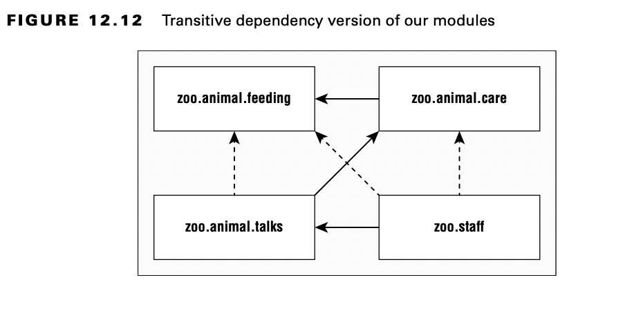

# Diving into the Module Declaration

## Exporting a Package

Ya hemos visto cómo `export packageName` exporta un paquete a otros módulos. También es posible exportar un paquete a un módulo específico. Supongamos que el zoológico decide que solo los miembros del personal deben tener acceso a las charlas. Podríamos actualizar la declaración del módulo de la siguiente manera:

    module zoo.animal.talks {
        exports zoo.animal.talks.content to zoo.staff;
        exports zoo.animal.talks.media;
        exports zoo.animal.talks.schedule;
        requires zoo.animal.feeding;
        requires zoo.animal.care;
    }

**Exported Types**

Hemos estado hablando de exportar un paquete. Pero, ¿qué significa eso, exactamente? Se exportan todas las clases, interfaces, enumeraciones y registros públicos. Además, todos los campos y métodos públicos y protegidos de esos archivos son visibles.

Los campos y métodos que son privados no son visibles porque no se puede acceder a ellos fuera de la clase. De manera similar, los campos y métodos del paquete no son visibles porque no se puede acceder a ellos fuera del paquete.



## Requiring a Module Transitively

Como vio anteriormente en este capítulo, ***require moduleName*** especifica que el módulo actual depende de ***moduleName***. También hay ***requires transitive moduleName***, lo que significa que cualquier módulo que requiera este módulo también dependerá de ***moduleName***.



or ejemplo, zoo.animal.talks depende de zoo.animal.care, que depende de zoo.animal.feeding. Eso significa que la flecha entre zoo.animal.talks y zoo.animal.feeding ya no aparece en la figura 12.12.

Ahora veamos las declaraciones de los cuatro módulos. El primer módulo permanece sin cambios. Estamos exportando un paquete a cualquier paquete que use el módulo.

```java
    module zoo.animal.feeding { 
        exports zoo.animal.feeding;
    }
```

El módulo zoo.animal.care es la primera oportunidad para mejorar las cosas. En lugar de obligar a todos los módulos restantes a especificar explícitamente zoo.animal.feeding, el código utiliza `require transitive`.
```java

    module zoo.animal.care {
        exports zoo.animal.care.medical;
        requires transitive zoo.animal.feeding;
    }
```

En el módulo zoo.animal.talks, hacemos un cambio similar y no obligamos a otros módulos a especificar zoo.animal.care. Ya no necesitamos especificar zoo.animal.feeding, por lo que esa línea está comentada.

```java
    module zoo.animal.talks {
        exports zoo.animal.talks.content to zoo.staff; 
        exports zoo.animal.talks.media;
        exports zoo.animal.talks.schedule;
        // no longer needed requires zoo.animal.feeding;
        // no longer needed requires zoo.animal.care;
        requires transitive zoo.animal.care;
    }
```

Finalmente, en el módulo zoo.staff, podemos deshacernos de dos instrucciones require.

    module zoo.staff {
    // no longer needed requires zoo.animal.feeding;
    // no longer needed requires zoo.animal.care;
    requires zoo.animal.talks;
    }

Cuantos más módulos tenga, mayores serán los beneficios del compuesto`require transitive`. También es más conveniente para la persona que llama. Si estuviera tratando de trabajar con este zoológico, podría simplemente requerir zoo.staff y hacer que las dependencias restantes se deduzcan automáticamente.

### Effects of requires transitive

Dadas las declaraciones de nuestro nuevo módulo, y usando la Figura 12.12, ¿cuál es el efecto de aplicar el modificador ***require transitive*** en nuestro módulo zoo.animal.care?. 

La aplicación de modificadores transitivos tiene los siguientes efectos:

- El módulo zoo.animal.talks puede declarar opcionalmente `require` en el módulo zoo.animal.feeding, pero no es obligatorio.
- El módulo zoo.animal.care no se puede compilar ni ejecutar sin acceso al módulo zoo.animal.feeding.
- El módulo zoo.animal.talks no se puede compilar ni ejecutar sin acceso al módulo zoo.animal.feeding.
- 
Estas reglas se mantienen incluso si los módulos zoo.animal.care y zoo.animal.talks no hacen referencia explícita a ningún paquete en el módulo zoo.animal.feeding. Por otro lado, sin el modificador transitivo en nuestra declaración de módulo de zoo.animal.care, los otros módulos tendrían que usar explícitamente require para hacer referencia a cualquier paquete en el módulo zoo.animal.feeding.

### Duplicate requires Statements

Un lugar en el que el examen podría intentar engañarlo es la mezcla de requisitos y requisitos transitivos. ¿Puedes pensar en una razón por la que este código no compila?

    module bad.module {
        requires zoo.animal.talks;
        requires transitive zoo.animal.talks;
    }

Java no le permite repetir el mismo módulo en una cláusula requiere . Es redundante y lo más probable es que se trate de un error de codificación. Tenga en cuenta que requiere transitiva es como requiere más un comportamiento adicional.

## Abrir un paquete con open

Java permite a las personas que llaman inspeccionar y llamar al código en tiempo de ejecución con una técnica llamada reflexión. Este es un enfoque poderoso que permite llamar a código que podría no estar disponible en tiempo de compilación. ¡Incluso se puede usar para subvertir el control de acceso! No se preocupe, no necesita saber cómo escribir código usando la reflexión para el examen.

La directiva `opens` se utiliza para permitir la reflexión de un paquete dentro de un módulo. Solo debe tener en cuenta que existe la directiva de apertura en lugar de comprenderla en detalle para el examen.

Dado que la reflexión puede ser peligrosa, el sistema de módulos requiere que los desarrolladores permitan explícitamente la reflexión en la declaración del módulo si quieren que los módulos de llamada puedan usarlo. A continuación se muestra cómo habilitar la reflexión para dos paquetes en el módulo zoo.animal.talks:

```java
    module zoo.animal.talks {
        opens zoo.animal.talks.schedule;
        opens zoo.animal.talks.media to zoo.staff;
    }
```

El primer ejemplo permite que cualquier módulo que use este use reflexión. El segundo ejemplo solo otorga ese privilegio al módulo zoo.staff. Hay dos directivas más que debe conocer para el examen: proporciona y utiliza, que se tratan en la siguiente sección.

**Apertura de un módulo completo**

En el ejemplo anterior, abrimos dos paquetes en el módulo zoo.animal.talks, pero supongamos que, en cambio, quisiéramos abrir todos los paquetes para la reflexión. No hay problema. Podemos usar el modificador de módulo abierto, en lugar de la directiva de apertura (observa la diferencia):

```java
    open module zoo.animal.talks {
    }

```
Con este modificador de módulo, Java sabe que queremos que todos los paquetes del módulo estén abiertos. ¿Qué pasa si aplicas los dos juntos?

  ```java
  open module zoo.animal.talks {
        opens zoo.animal.talks.schedule; // DOES NOT COMPILE
    }
```

Esto no se compila porque un modificador que usa el modificador abierto no puede usar la directiva de apertura. ¡Después de todo, los paquetes ya están abiertos!