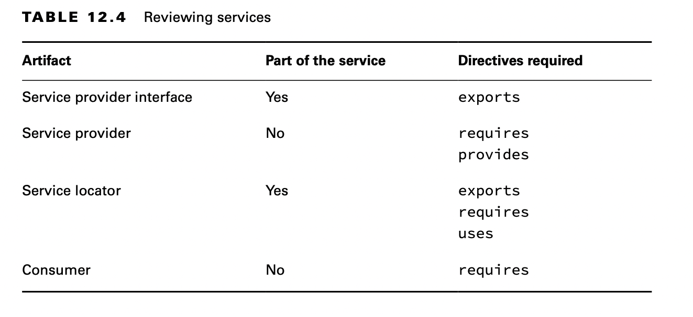

# Crear un servicio

Un servicio se compone de una interfaz, cualquier clase a la que haga referencia la interfaz y una forma de buscar implementaciones de la interfaz. Las implementaciones no son parte del servicio.


No es necesario que tenga cuatro módulos separados. Lo hacemos para ilustrar los conceptos. Por ejemplo, la interfaz del `service provider` y el localizador de servicios podrían estar en el mismo módulo.

## Declarando la interfaz `Service Provider`

Primero, el módulo *zoo.tours.api* define un objeto Java llamado *Souvenir*.  Se considera parte del servicio porque será referenciado por la interfaz.

```java
    // Souvenir.java
    package zoo.tours.api;

    public record Souvenir(String description) { }
```

A continuación, programamos. A esta interfaz se la denomina `service provider` y especifica qué comportamiento tendrá el servicio. 

```java
    // Tour.java
    package zoo.tours.api;

    public interface Tour { 
        String name();
        int length();
        Souvenir getSouvenir();
    }
```


Como estamos trabajando con módulos, necesitamos crear un archivo `module-info.java` para nuestra definición de módulo. Queremos exponer nuestra interfaz al exterior, con lo que es necesario usar `exports` sobre el paquete. 
```java
 
    // module-info.java
    module zoo.tours.api { 
        exports zoo.tours.api;
    }
```

Una vez tenemos todas las clases de nuestro módulo, compilamos y empaquetamos. 

```console
    javac -d serviceProviderInterfaceModule serviceProviderInterfaceModule/zoo/tours/api/*.java serviceProviderInterfaceModule/module-info.java

    jar -cvf mods/zoo.tours.api.jar -C serviceProviderInterfaceModule/ .
```

## Crear el `Service Locator`

Para completar nuestro servicio, necesitamos un localizador de servicios o `Service Locator`. 

- Un `Service Locator` puede encontrar cualquier clase que implemente una interfaz de `service provider`.

Afortunadamente, Java proporciona una clase `ServiceLoader` para ayudar con esta tarea. Pasa el tipo de interfaz del `service provider` a su método `load()` y Java devolverá cualquier implementación del servicio que pueda encontrar. 

La siguiente clase lo muestra en acción:

```java

    package zoo.tours.reservations;

    import java.util.*;
    
    import zoo.tours.api.*;
    
    public class TourFinder {
        public static Tour findSingleTour() {
            ServiceLoader<Tour> loader = ServiceLoader.load(Tour.class);
            for (Tour tour : loader) 
                return tour;
            return null;
        }
    
        public static List<Tour> findAllTours() {
            List<Tour> tours = new ArrayList<>();
            ServiceLoader<Tour> loader = ServiceLoader.load(Tour.class);
            for (Tour tour : loader)
                tours.add(tour);
            return tours;
        }
    }
```
La llamada de `ServiceLoader` es relativamente costosa. Si estás escribiendo una aplicación real, considera almacenar en caché el resultado.

Vamos con el módulo.

- Nuestra definición de módulo exporta el paquete con el `service locator`
- Tenemos una dependencia de la API `service provider`, Nuestro service locator no puede funcionar sin ella, es decir, *la requerimos*
- También tiene la directiva `uses`, ya que buscará un servicio.

```java
    // module-info.java
    module zoo.tours.reservations { 
        exports zoo.tours.reservations; 
        requires zoo.tours.api;
        uses zoo.tours.api.Tour;
    }
```

Recuerda que tanto  `require` como `uses`  son necesarios, uno para compilar y otro para buscar. 

Finalmente, compilamos y empaquetamos el módulo.

```console
 javac -p mods -d serviceLocatorModule serviceLocatorModule/zoo/tours/reservations/*.java serviceLocatorModule/module-info.java

    jar -cvf mods/zoo.tours.reservations.jar -C serviceLocatorModule/ .
```

Ahora que tenemos la interfaz y la lógica de búsqueda, hemos completado nuestro servicio.

**Usando ServiceLoader**

Hay dos métodos en `ServiceLoader` que necesitamos conocer para el examen.

```java
    public final class ServiceLoader<S> implements Iterable<S> {
        public static <S> ServiceLoader<S> load(Class<S> service) { ... }
        public Stream<Provider<S>> stream() { ... }
        // Additional methods 
    }
```

Como ya vimos, llamar a `ServiceLoader.load()` devuelve un objeto que puede recorrer normalmente. Sin embargo, solicitar un `Stream` te brinda un tipo diferente. La razón de esto es que un Stream controla cuándo se evalúan los elementos. Por lo tanto, un ServiceLoader devuelve un Stream del `service provider`. 

Debes llamar a get() para recuperar el valor que desea de cada Proveedor, como en este ejemplo:

```java
    ServiceLoader.load(Tour.class) 
        .stream()
        .map(Provider::get) 
        .mapToInt(Tour::length)
        .max() 
        .ifPresent(System.out::println);
```

## Invocando desde un `Consumer`

El siguiente paso es llamar al `service locator` por parte de un consumidor. Un consumidor (o cliente) se refiere a un módulo que obtiene y utiliza un servicio. Una vez que el consumidor ha adquirido un servicio a través del `service locator`, puede invocar los métodos proporcionados por la interfaz del `service provider`.

```java
    package zoo.visitor;

    import java.util.*;
    
    import zoo.tours.api.*;
    import zoo.tours.reservations.*;
    
    public class Tourist {
        public static void main(String[] args) {
            Tour tour = TourFinder.findSingleTour();
            System.out.println("Single tour: " + tour);
            List<Tour> tours = TourFinder.findAllTours();
            System.out.println("# tours: " + tours.size());
        }
    }
```

Nuestro `module` no necesita saber nada acerca de las implementaciones, ya que el módulo *zoo.tours.reservations* está gestionando la búsqueda.

```java
    module zoo.visitor {
        requires zoo.tours.api;
        requires zoo.tours.reservations;
    }
```

Esta vez, podemos ejecutar un programa después de compilarlo y empaquetarlo.

```console
    javac -p mods -d consumerModule consumerModule/zoo/visitor/*.java consumerModule/module-info.java

    jar -cvf mods/zoo.visitor.jar -C consumerModule/ .

    java -p mods -m zoo.visitor/zoo.visitor.Tourist
```

## Añadir el Service Provider

Un `service provider` es la implementación de una interfaz de `service`. Como dijimos anteriormente, en tiempo de ejecución es posible tener múltiples clases o módulos de implementación. Nos ceñiremos a uno por simplicidad.

```python
    package zoo.tours.agency;
    import zoo.tours.api.*;
        
    public class TourImpl implements Tour {
        public String name() {
            return "Behind the Scenes";
        }
    
        public int length() {
            return 120;
        }
    
        public Souvenir getSouvenir() {
            return new Souvenir("stuffed animal");
        }
    }
```
El `module-info.java`

```java

    module zoo.tours.agency {
        requires zoo.tours.api;
        provides zoo.tours.api.Tour with zoo.tours.agency.TourImpl;
    }
```
En este caso, en la declaración del módulo *requerimos* obviamente la API Service que queremos implementar.

Además, necesitamos indicar que somos una implementación y para esto usamos la directiva `provides with`. 

Con `provides` indicamos que somos una implementación y con `with` especificamos la clase concreta que implementa.

    provides interfaceName with className;

No hemos exportado el paquete que contiene la implementación. En su lugar, hemos puesto la implementación a disposición.

Compilamos y empaquetamos

```console
    javac -p mods -d serviceProviderModule serviceProviderModule/zoo/tours/agency/*.java 
    serviceProviderModule/module-info.java
    jar -cvf mods/zoo.tours.agency.jar -C serviceProviderModule/ .
```


Ahora viene la parte genial. Podemos ejecutar el programa Java de nuevo.

```console
    java -p mods -m zoo.visitor/zoo.visitor.Tourist
```

Observa cómo no tenemos que volver a compilar el paquete *zoo.tours.reservations o zoo.visitor*. El `service locator` pudo observar que ahora había una implementación `service provider` disponible y la encuentra. Esto es útil cuando tiene una funcionalidad que cambia independientemente del resto del código base. Por ejemplo, puede tener informes o loggers personalizados.

## Repasando Directives y Services

La tabla 12.4 resume lo que hemos cubierto en la sección sobre servicios. Recomendar aprender muy bien lo que se necesita, **cuando cada *artefacto* está en un módulo separado**. Es muy probable que eso sea lo que caiga en el examen, y de paso, te asegurarás comprender bien los conceptos. 



La tabla 12.5 enumera todas las directivas que necesita saber para el examen.

