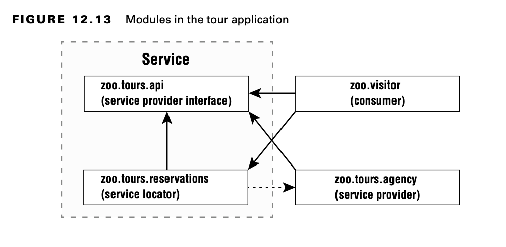

# Creando un servicio

Un servicio se compone de una interfaz, cualquier clase a la que haga referencia la interfaz y una forma de buscar implementaciones de la interfaz. Las implementaciones no son parte del servicio.



No es necesario que tenga cuatro módulos separados. Lo hacemos para ilustrar los conceptos. Por ejemplo, la interfaz del proveedor de servicios y el localizador de servicios podrían estar en el mismo módulo.

## Declaring Service Provider Interface

Primero, el módulo zoo.tours.api define un objeto Java llamado Souvenir. Se considera parte del servicio porque será referenciado por la interfaz.

```java
    // Souvenir.java
    package zoo.tours.api;

    public record Souvenir(String description) { }
```

A continuación, el módulo contiene un tipo de interfaz Java. Esta interfaz se denomina interfaz del proveedor de servicios porque especifica qué comportamiento tendrá nuestro servicio. En este caso, es una API simple con tres métodos.

```java
    // Tour.java
    package zoo.tours.api;

    public interface Tour { 
        String name();
        int length();
        Souvenir getSouvenir();
    }
```

Los tres métodos usan el modificador público implícito. Como estamos trabajando con módulos, también necesitamos crear un archivo module-info.java para que nuestra definición de módulo exporte el paquete que contiene la interfaz.
```java

    // module-info.java

    module zoo.tours.api { 
        exports zoo.tours.api;
    }
```

Ahora que tenemos ambos archivos, podemos compilar y empaquetar este módulo.

```console
    javac -d serviceProviderInterfaceModule serviceProviderInterfaceModule/zoo/tours/api/*.java serviceProviderInterfaceModule/module-info.java

    jar -cvf mods/zoo.tours.api.jar -C serviceProviderInterfaceModule/ .
```

## Creating a Service Locator

Para completar nuestro servicio, necesitamos un localizador de servicios. Un localizador de servicios puede encontrar cualquier clase que implemente una interfaz de proveedor de servicios.

Afortunadamente, Java proporciona una clase ServiceLoader para ayudar con esta tarea. Pasa el tipo de interfaz del proveedor de servicios a su método load() y Java devolverá cualquier servicio de implementación que pueda encontrar. La siguiente clase lo muestra en acción:
```java

    package zoo.tours.reservations;

    import java.util.*;
    
    import zoo.tours.api.*;
    
    public class TourFinder {
        public static Tour findSingleTour() {
        ServiceLoader<Tour> loader = ServiceLoader.load(Tour.class);
        for (Tour tour : loader) return tour;
        return null;
        }
    
        public static List<Tour> findAllTours() {
            List<Tour> tours = new ArrayList<>();
            ServiceLoader<Tour> loader = ServiceLoader.load(Tour.class);
            for (Tour tour : loader)
                tours.add(tour);
            return tours;
        }
    }
```

La llamada de ServiceLoader es relativamente costosa. Si está escribiendo una aplicación real, es mejor almacenar en caché el resultado.

Nuestra definición de módulo exporta el paquete con la clase de búsqueda TourFinder. Requiere el paquete de interfaz del proveedor de servicios. También tiene la directiva de usos ya que buscará un servicio.

```java
    // module-info.java
    module zoo.tours.reservations { 
        exports zoo.tours.reservations; 
        requires zoo.tours.api;
        uses zoo.tours.api.Tour;
    }
```

Recuerde que tanto los requisitos como los usos son necesarios, uno para compilar y otro para buscar. Finalmente, compilamos y empaquetamos el módulo.

    javac -p mods -d serviceLocatorModule serviceLocatorModule/zoo/tours/reservations/*.java serviceLocatorModule/module-info.java

    jar -cvf mods/zoo.tours.reservations.jar -C serviceLocatorModule/ .

Ahora que tenemos la interfaz y la lógica de búsqueda, hemos completado nuestro servicio.

**Using ServiceLoader**

Hay dos métodos en ServiceLoader que necesita conocer para el examen. La declaración es la siguiente, sin la implementación completa:

```java
    public final class ServiceLoader<S> implements Iterable<S> {
        public static <S> ServiceLoader<S> load(Class<S> service) { ... }
        public Stream<Provider<S>> stream() { ... }
        // Additional methods 
    }
```

Como ya vimos, llamar a ServiceLoader.load() devuelve un objeto que puede recorrer normalmente. Sin embargo, solicitar un Stream le brinda un tipo diferente. La razón de esto es que un Stream controla cuándo se evalúan los elementos. Por lo tanto, un ServiceLoader devuelve un Stream de objetos de proveedor. Debe llamar a get() para recuperar el valor que deseaba. de cada Proveedor, como en este ejemplo:

```java
    ServiceLoader.load(Tour.class) 
        .stream()
        .map(Provider::get) 
        .mapToInt(Tour::length)
        .max() 
        .ifPresent(System.out::println);
```

## Invoking from a Consumer

El siguiente paso es llamar al localizador de servicios por parte de un consumidor. Un consumidor (o cliente) se refiere a un módulo que obtiene y utiliza un servicio. Una vez que el consumidor ha adquirido un servicio a través del localizador de servicios, puede invocar los métodos proporcionados por la interfaz del proveedor de servicios.

```java
    package zoo.visitor;

    import java.util.*;
    
    import zoo.tours.api.*;
    import zoo.tours.reservations.*;
    
    public class Tourist {
        public static void main(String[] args) {
            Tour tour = TourFinder.findSingleTour();
            System.out.println("Single tour: " + tour);
            List<Tour> tours = TourFinder.findAllTours();
            System.out.println("# tours: " + tours.size());
        }
    }
```

Nuestra definición de módulo no necesita saber nada acerca de las implementaciones ya que el módulo zoo.tours.reservations está manejando la búsqueda.

```java
    module zoo.visitor {
        requires zoo.tours.api;
        requires zoo.tours.reservations;
    }
```

Esta vez, podemos ejecutar un programa después de compilarlo y empaquetarlo.

```console
    javac -p mods -d consumerModule consumerModule/zoo/visitor/*.java consumerModule/module-info.java

    jar -cvf mods/zoo.visitor.jar -C consumerModule/ .

    java -p mods -m zoo.visitor/zoo.visitor.Tourist
```

## Adding a Service Provider

Un proveedor de servicios es la implementación de una interfaz de proveedor de servicios. Como dijimos anteriormente, en tiempo de ejecución es posible tener múltiples clases o módulos de implementación. Nos ceñiremos a uno aquí por simplicidad.

```python
    package zoo.tours.agency;
    import zoo.tours.api.*;
        
    public class TourImpl implements Tour {
        public String name() {
            return "Behind the Scenes";
        }
    
        public int length() {
            return 120;
        }
    
        public Souvenir getSouvenir() {
            return new Souvenir("stuffed animal");
        }
    }


    module zoo.tours.agency {
        requires zoo.tours.api;
        provides zoo.tours.api.Tour with zoo.tours.agency.TourImpl;
    }
```

The module declaration requires the module containing the interface as a dependency. We don’t export the package that
implements the interface since we don’t want callers referring to it directly. Instead, we use the provides directive.
This allows us to specify that we provide an implementation of the interface with a specific implementation class. The
syntax looks like this:

    provides interfaceName with className;

We have not exported the package containing the implementation. Instead, we have made the implementation available to a
service provider using the interface.

Finally, we compile it and package it up.

    javac -p mods -d serviceProviderModule serviceProviderModule/zoo/tours/agency/*.java 
    serviceProviderModule/module-info.java
    jar -cvf mods/zoo.tours.agency.jar -C serviceProviderModule/ .

Now comes the cool part. We can run the Java program again.

    java -p mods -m zoo.visitor/zoo.visitor.Tourist

Notice how we didn’t recompile the zoo.tours.reservations or zoo.visitor package. The service locator was able to
observe that there was now a service provider implementation available and find it for us. This is useful when you have
functionality that changes independently of the rest of the code base. For example, you might have custom reports or
logging.

## Reviewing Directives and Services

Table 12.4 summarizes what we’ve covered in the section about services. We recommend learning really well what is needed
when each artifact is in a separate module. That is most likely what you will see on the exam and will ensure that you
understand the concepts. Table 12.5 lists all the directives you need to know for the exam.


