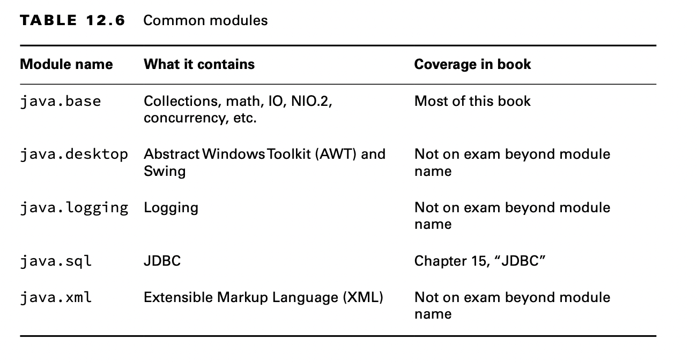
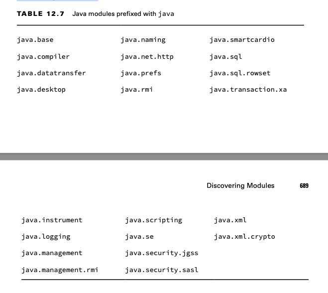
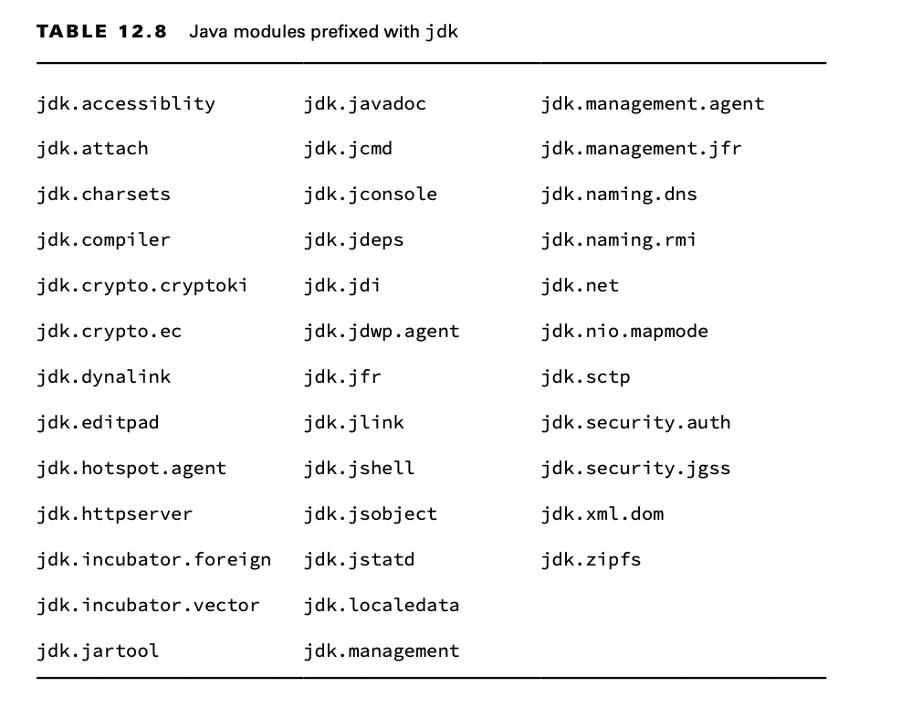
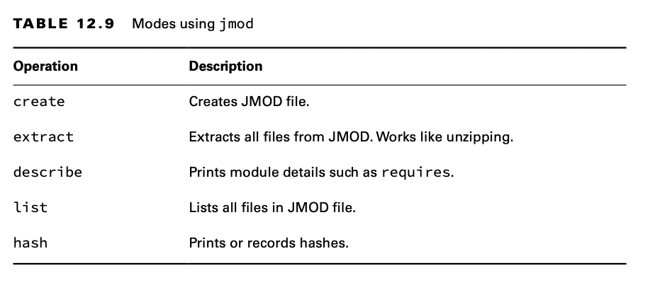
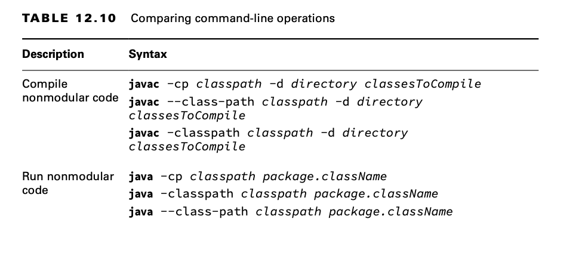
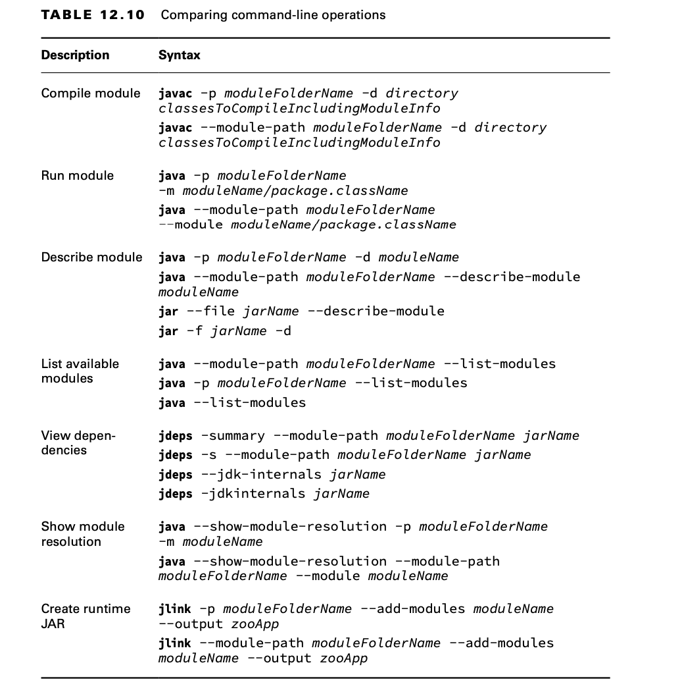
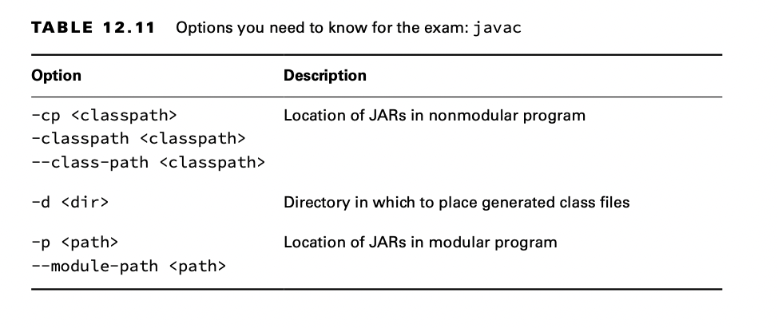
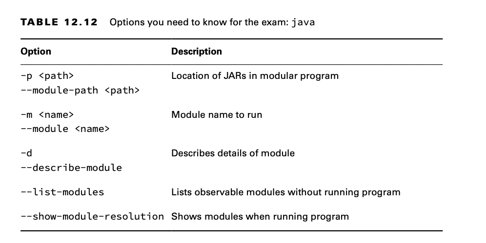
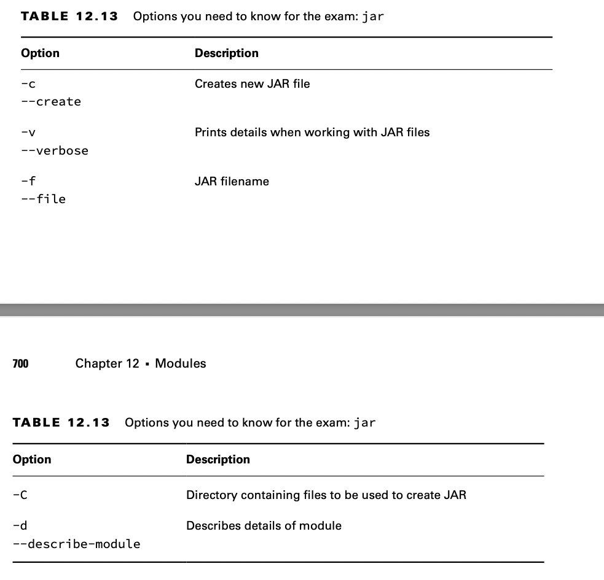
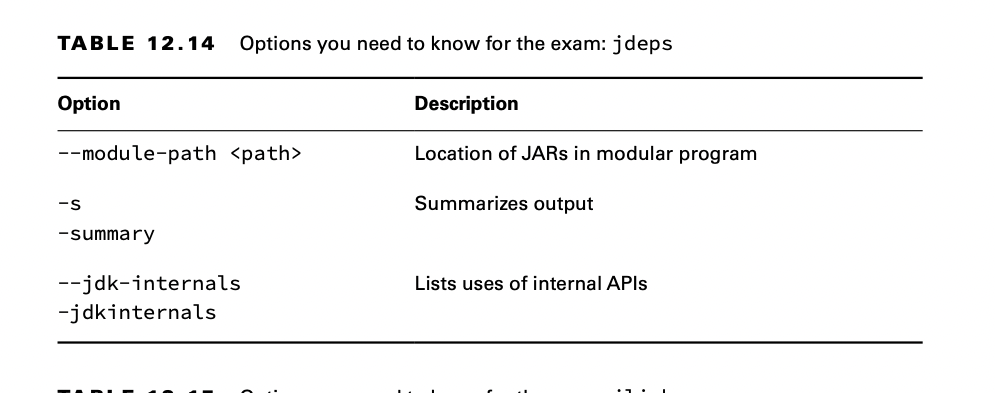

# Descubriendo Modules

Hasta ahora, hemos estado trabajando con módulos que escribimos. Incluso las clases integradas en el JDK están modularizadas. En esta sección, te mostramos cómo usar los comandos para aprender sobre los módulos.

## Identificando Built-in Modules

El módulo más importante que debe conocer es `java.base`. Contiene la mayoría de los paquetes que ha estado aprendiendo para el examen. De hecho, es tan importante que ni siquiera tiene que usar la directiva `require`; está disponible para todas las aplicaciones modulares. En tu archivo module-info.java compilará si necesita explícitamente java.base. Sin embargo, es redundante, por lo que es mejor omitirlo. La Tabla 12.6 enumera algunos módulos comunes y lo que contienen.



Los creadores del examen creen que es importante reconocer los nombres de los módulos proporcionados por el JDK. Si bien no necesitas saber los nombres de memoria, sí debe poder elegirlos de una alineación.

Para el examen, debes saber que los nombres de los módulos comienzan con java para las API que probablemente usará y con jdk para las API que son específicas de JDK. La tabla 12.7 enumera todos los módulos que comienzan con java



La Tabla 12.8 enumera todos los módulos que comienzan con jdk. Recomendamos revisar esto justo antes del examen para aumentar las posibilidades de que suenen familiares. Recuerda que no tienes que memorizarlos.



## Mostrando detalles con el comando java

El comando java tiene tres opciones relacionadas con el módulo. Uno describe un módulo, otro enumera los módulos disponibles y el tercero muestra la lógica de resolución del módulo.

También es posible agregar módulos, exportaciones y más en la línea de comando. 

### Describiendo el Module

Suponga que recibe el archivo **JAR** del módulo *zoo.animal.feeding* y desea conocer la estructura del módulo. Podrías *descomprimirlo* y abrir el fichero `module-info.java`. Esto le mostraría que el módulo exporta un paquete y no requiere explícitamente ningún módulo.

module zoo.animal.feeding { 

    module zoo.animal.feeding { 
        exports zoo.animal.feeding;
    }

Pero hay una manera más fácil. 

El comando java tiene una opción para describir un módulo. Los siguientes dos comandos son equivalentes:

```console
    java -p mods `-d` zoo.animal.feeding

    java -p mods `--describe-module` zoo.animal.feeding
```

En las clases, el paquete java.lang se importan automáticamente tanto si lo escribe como si no. El módulo `java.base` funciona de la misma manera. Está automáticamente disponible para todos los demás módulos.

**Mas acerca de describir los Modules**

Solo necesita saber cómo ejecutar `--describe-module` para el examen en lugar de interpretar el resultado. Sin embargo, es posible que encuentre algunas sorpresas al experimentar con esta función, por lo que las describimos con un poco más de detalle aquí.

Suponga que los siguientes son los contenidos de module-info.java en zoo.animal.care:

```java
    module zoo.animal.care {
        exports zoo.animal.care.medical to zoo.staff; 
        requires transitive zoo.animal.feeding;
    }
```

Now we have the command to describe the module and the output.

```console
    java -p mods -d zoo.animal.care

    zoo.animal.care file:///absolutePath/mods/zoo.animal.care.jar 
    requires zoo.animal.feeding transitive
    requires java.base mandated
    qualified exports zoo.animal.care.medical to zoo.staff contains zoo.animal.care.details
```

La primera línea de la salida es la ruta absoluta del archivo del módulo. Las dos líneas requeridas también deberían resultar familiares. La primera está en la información del módulo y la otra se agrega a todos los módulos. Luego viene algo nuevo. Las exportaciones `qualified` son el nombre completo del paquete que estamos exportando a un módulo específico.

Finalmente, `contains` significa que hay un paquete en el módulo que no se exporta en absoluto. Esto es cierto. Nuestro módulo tiene dos paquetes, y uno está disponible solo para usarse dentro del módulo.

### Listing Available Modules

Además de describir los módulos, puede usar el comando java para listar los módulos que están disponibles. La forma más simple enumera los módulos que forman parte del JDK.

```console
    java --list-modules
```

Más interesante aún, puede usar este comando con código personalizado. Intentemos nuevamente con el directorio que contiene nuestros módulos del zoológico.

```console
    java -p mods --list-modules
```


### Mostrando la resolución del módulo

Si enumerar los módulos no le brinda suficiente salida, también puede usar la opción `--show-module-resolution`. Puede pensar en ello como una forma de depurar módulos. Escupe una gran cantidad de resultados cuando se inicia el programa. Luego ejecuta el programa.

```console
    java `--show-module-resolution` -p feeding -m zoo.animal.feeding/zoo.animal.feeding.Task
```

## Describing with jar

Al igual que el comando java, el comando jar puede describir un módulo. Estos comandos son equivalentes:

```console
    jar -f mods/zoo.animal.feeding.jar `-d`
    jar --file mods/zoo.animal.feeding.jar `--describe-module`
```

El resultado es ligeramente diferente de cuando usamos el comando java para describir el módulo. Con jar, genera lo siguiente:

    zoo.animal.feeding jar:file:///absolutePath/mods/zoo.animal.feeding.jar /!module-info.class
    exports zoo.animal.feeding
    requires java.base mandated

La versión JAR incluye module-info.class en el nombre del archivo, lo cual no es una diferencia particularmente significativa en el esquema de las cosas. No necesitas saber esta diferencia. Debe saber que ambos comandos pueden describir un módulo.

## Aprendiendo sobre Dependencias con jdeps

El comando jdeps le brinda información sobre las dependencias dentro de un módulo. A diferencia de describir un módulo, mira el código además de la declaración del módulo. Esto le dice qué dependencias se usan realmente en lugar de simplemente declararlas. Afortunadamente, no se espera que memorices todas las opciones para el examen.

Se espera que comprenda cómo usar `jdeps` con proyectos que aún no han sido modularizados para ayudar a identificar dependencias y problemas.

```java
    package zoo.dinos;

    import java.time.*;
    import java.util.*;
    
    import sun.misc.Unsafe;
    
    public class Animatronic {
        private List<String> names;
        private LocalDate visitDate;
    
        public Animatronic(List<String> names, LocalDate visitDate) {
            this.names = names;
            this.visitDate = visitDate;
        }
    
        public void unsafeMethod() {
            Unsafe unsafe = Unsafe.getUnsafe();
        }
    }
```

Ahora podemos compilar este archivo. Es posible que haya notado que no hay un archivo module-info.java. Eso es porque no estamos creando un módulo. Estamos investigando qué dependencias necesitaremos cuando modularicemos este JAR.

```console
    javac zoo/dinos/*.java
```

La compilación funciona, pero le da algunas advertencias acerca de que Unsafe es una API interna.

Creamos el jar:

```console
    jar -cvf zoo.dino.jar .
```

Podemos ejecutar el comando `jdeps` contra este JAR para conocer sus dependencias. Primero, ejecutemos el comando sin ninguna opción. En las primeras dos líneas, el comando imprime los módulos que necesitaríamos agregar con una directiva `require` para migrar al sistema de módulos. También imprime una tabla que muestra qué paquetes se utilizan y a qué módulos corresponden.

 ```console
   jdeps zoo.dino.jar
```

Tenga en cuenta que siempre se incluye `java.base`. También dice qué módulos contienen clases utilizadas por el JAR. Si ejecutamos en modo resumen, solo vemos la primera parte donde `jdeps` enumera los módulos. Hay dos formatos para el indicador de resumen:

    jdeps -s zoo.dino.jar
    
    jdeps -summary zoo.dino.jar

También hay una opción --module-path que puede usar si desea buscar módulos fuera del JDK. A diferencia de otros comandos, no existe una forma abreviada para esta opción en `jdeps`.

Es posible que haya notado que jdk.unsupported no está en la lista de módulos que vio en la Tabla 12.8. Es especial porque contiene bibliotecas internas que a los desarrolladores de versiones anteriores de Java se les desaconsejó usar, aunque muchas personas ignoraron esta advertencia. No debe hacer referencia a él, ya que puede desaparecer en futuras versiones de Java.

## Using the --jdk-internals Flag

El comando `jdeps` tiene una opción para proporcionar detalles sobre estas API no compatibles. La salida se parece a esto:

```markdown
    `jdeps` --jdk-internals zoo.dino.jar
```

La opción --jdk-internals enumera las clases que está utilizando que llaman a una API interna junto con qué API. Al final, proporciona una tabla que sugiere lo que debe hacer al respecto. Si escribió el código llamando a la API interna, este mensaje es útil. De lo contrario, el mensaje sería útil para el equipo que escribió el código. Usted, por otro lado, podría necesitar actualizar o reemplazar ese archivo JAR por completo con uno que solucione el problema. Tenga en cuenta que -jdkinternals es equivalente a --jdk-internals.

**About sun.misc.Unsafe**

Antes del sistema de módulos de la plataforma Java, las clases tenían que ser públicas si quería que se usaran fuera del paquete. Era razonable usar la clase en el código JDK, ya que es un código de bajo nivel que ya está estrechamente relacionado con el JDK.

Dado que se necesitaba en varios paquetes, la clase se hizo pública. Sun incluso lo nombró Inseguro, pensando que eso evitaría que alguien lo usara fuera del JDK.

Sin embargo, los desarrolladores son inteligentes y usaron la clase desde que estaba disponible. Varias bibliotecas de código abierto ampliamente utilizadas comenzaron a usar Unsafe. Si bien es bastante poco probable que esté usando esta clase en su proyecto directamente, probablemente use una biblioteca de código abierto que la esté usando.

El comando jdeps le permite mirar estos JAR para ver si tendrá algún problema cuando Oracle finalmente impida el uso de esta clase. Si encuentra algún uso, puede ver si hay una versión posterior del JAR a la que pueda actualizar.

## Using Module Files with jmod

El comando final que necesita saber para el examen es jmod. Podría pensar que un archivo JMOD es un archivo de módulo Java. No exactamente. Oracle recomienda utilizar archivos JAR para la mayoría de los módulos. Los archivos JMOD se recomiendan solo cuando tiene bibliotecas nativas o algo que no puede ir dentro de un archivo JAR. Es poco probable que esto te afecte en el mundo real.

Lo más importante que debe recordar es que jmod es solo para trabajar con los archivos JMOD. Convenientemente, no tiene que memorizar la sintaxis de jmod. La tabla 12.9 enumera los modos comunes.




## Creating Java Runtimes with jlink

Uno de los beneficios de los módulos es poder suministrar solo las partes de Java que necesita. Nuestro ejemplo del zoológico del comienzo del capítulo no tiene muchas dependencias.

Si el usuario ya no tiene Java o está en un dispositivo sin mucha memoria, descargar un JDK de más de 150 MB es una gran pregunta. ¡Veamos qué tan grande debe ser el paquete! Este comando crea nuestra distribución más pequeña:
 ```console
   `jlink` --module-path mods --add-modules zoo.animal.talks --output zooA

```
Primero especificamos dónde encontrar los módulos personalizados con -p o --module-path. Luego especificamos los nombres de nuestros módulos con --add-modules. Esto incluirá las dependencias que requiere siempre que se puedan encontrar. Finalmente, especificamos el nombre de la carpeta de nuestro JDK más pequeño con --output.

Hay muchos módulos en el JDK que no necesitamos. Además, las herramientas de desarrollo como javac no necesitan estar en una distribución de tiempo de ejecución.

## Reviewing Command-Line Option

Esta sección presenta una serie de tablas que cubren lo que necesita saber sobre cómo ejecutar las opciones de línea de comandos para el examen.











