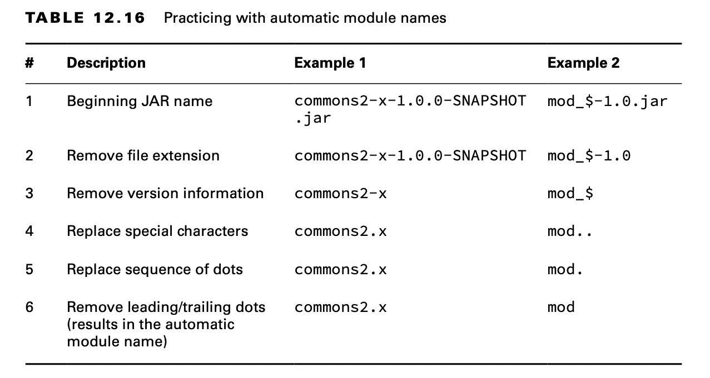
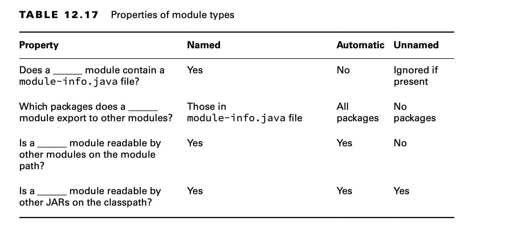

# Comparing Types of Modules

Todos los módulos que hemos usado hasta ahora en este capítulo se denominan `named modules`. Hay otros dos tipos de módulos: `automatic modules` y `unnamed modules`. En esta sección, describimos estos tres tipos de módulos. En el examen, deberá poder compararlos.

## Named Modules

Un `named modules` es uno que contiene un archivo module-info.java. Para revisar, este archivo aparece en la raíz del JAR junto con uno o más paquetes. A menos que se especifique lo contrario, un módulo es un `named modules`. Los `named modules` aparecen en la ruta del módulo en lugar de en la ruta de clases. Más tarde, aprenderá qué sucede si un archivo JAR que contiene un archivo `module-info.java` está en el `classpath`. Por ahora, sepa que no se considera un `named modules` porque no está en la ruta del módulo.

Como una forma de recordar esto, un `named modules` tiene el nombre dentro del archivo module-info.java y está en la ruta del módulo.

## `automatic modules`

Aparece un `automatic modules` en la ruta del módulo pero no contiene un archivo `module-info.java`. Es simplemente un archivo JAR normal que se coloca en la ruta del módulo y se trata como un módulo.

Como una forma de recordar esto, Java determina automáticamente el nombre del módulo. El código que hace referencia a un `automatic modules` lo trata como si hubiera un archivo module-info.java presente. Exporta automáticamente todos los paquetes. También determina el nombre del módulo. ¿Cómo determina el nombre del módulo, te preguntarás? Excelente pregunta.

Cada archivo JAR contiene una carpeta especial llamada META-INF y, dentro de ella, un archivo de texto llamado MANIFEST.MF. Puede ser creado automáticamente cuando se crea el JAR o a mano por el autor del JAR.

Se animó a los autores a declarar el nombre que pretendían usar para el módulo agregando una propiedad denominada Automatic-Module-Name en su archivo MANIFEST.MF.

**About the MANIFEST.MF File**

Un archivo JAR contiene un archivo de texto especial llamado META-INF/MANIFEST.MF que contiene información sobre el JAR. Ha existido durante mucho más tiempo que los módulos, desde los primeros días de Java y los JAR, para ser exactos. La figura muestra cómo encaja el manifiesto en la estructura de directorios de un archivo JAR.

El manifiesto contiene información adicional sobre el archivo JAR. Por ejemplo, a menudo contiene la versión de Java utilizada para crear el archivo JAR. Para los programas de línea de comandos, la clase con el método main() se especifica comúnmente.

Cada línea en el manifiesto es un par clave/valor separado por dos puntos. Puede pensar en el manifiesto como un mapa de nombres y valores de propiedades. El manifiesto predeterminado en Java 17 tiene este aspecto:

```json
    Manifest-Version: 1.0
    Created-By: 17 (Oracle Corporation)
```

Especificar una sola propiedad en el manifiesto permitió a los proveedores de bibliotecas facilitar las cosas para las aplicaciones que querían usar su biblioteca en una aplicación modular. Puede considerarlo como una promesa de que cuando la biblioteca se convierta en un `named modules`, utilizará el nombre del módulo especificado.

Si el archivo JAR no especifica un nombre de `automatic modules`, Java aún le permitirá usarlo en la ruta del módulo. En este caso, Java determinará el nombre del módulo por usted.

Java determina el nombre del `automatic modules` basándose en el nombre de archivo del archivo JAR. Repasemos las reglas comenzando con un ejemplo. Supongamos que tenemos un archivo JAR llamado holiday-calendar-1.0.0.jar.

Primero, Java eliminará la extensión .jar del nombre. Luego, Java eliminará la versión del final del nombre del archivo JAR. Esto es importante porque queremos que los nombres de los módulos sean coherentes. ¡Tener un nombre de `automatic modules` diferente cada vez que actualiza a una nueva versión no sería bueno! Después de todo, esto lo obligaría a cambiar la declaración del módulo de su aplicación agradable, limpia y modularizada cada vez que extraiga una versión posterior del JAR del calendario de vacaciones.

Eliminar la versión y la extensión nos da un calendario de vacaciones. Esto nos deja con un problema. Los guiones (-) no están permitidos en los nombres de los módulos. Java resuelve este problema convirtiendo los caracteres especiales del nombre en puntos (.). Como resultado, el nombre del módulo es vacaciones.calendario. Todos los caracteres que no sean letras y números se consideran caracteres especiales en este reemplazo. Finalmente, se eliminan los puntos adyacentes o los puntos iniciales/posteriores.

Como son varias reglas, revisemos el algoritmo en una lista para determinar el nombre de un `automatic modules`:

- Si MANIFEST.MF especifica un nombre de `automatic modules`, utilícelo. De lo contrario, proceda con las reglas restantes.
- Elimine la extensión de archivo del nombre JAR.
- Elimine cualquier información de versión del final del nombre. Una versión son dígitos y puntos con posible información adicional al final: por ejemplo, -1.0.0 o -1.0-RC.
- Reemplace los caracteres restantes que no sean letras y números con puntos.
- Reemplace cualquier secuencia de puntos con un solo punto.
- Quite el punto si es el primer o último carácter del resultado.



## Unnamed Modules

Aparece un `unnamed modules` en el classpath. Como un `automatic modules`, es un JAR regular. A diferencia de un `automatic modules`, está en la ruta de clase en lugar de la ruta del módulo. Esto significa que un `unnamed modules` se trata como un código antiguo y un ciudadano de segunda clase para los módulos.

Un `unnamed modules` no suele contener un archivo module-info.java. Si resulta que contiene uno, ese archivo será ignorado ya que está en el classpath.

Los `unnamed modules` no exportan ningún paquete a `named modules` o automáticos. El `unnamed modules` puede leer desde cualquier archivo JAR en la ruta de clase o ruta del módulo. Puede pensar en un `unnamed modules` como un código que funciona de la forma en que funcionaba Java antes de los módulos. Sí, sabemos que es confuso que algo que no es realmente un módulo tenga la palabra módulo en su nombre.

Puede esperar recibir preguntas en el examen comparando los tres tipos de módulos. Estudie detenidamente la tabla 12.17 y esté preparado para responder preguntas sobre estos elementos en cualquier combinación. Un punto clave a recordar es que el código en el classpath puede acceder a la ruta del módulo. Por el contrario, el código en la ruta del módulo no puede leer desde la ruta de clases.

## Reviewing Module Types

Puede esperar recibir preguntas en el examen comparando los tres tipos de módulos. Estudie detenidamente la tabla 12.17 y esté preparado para responder preguntas sobre estos elementos en cualquier combinación. Un punto clave a recordar es que el código en el classpath puede acceder a la ruta del módulo. Por el contrario, el código en la ruta del módulo no puede leer desde la ruta de clases.




