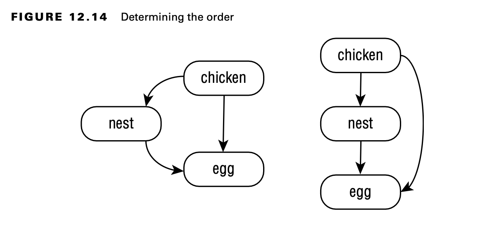
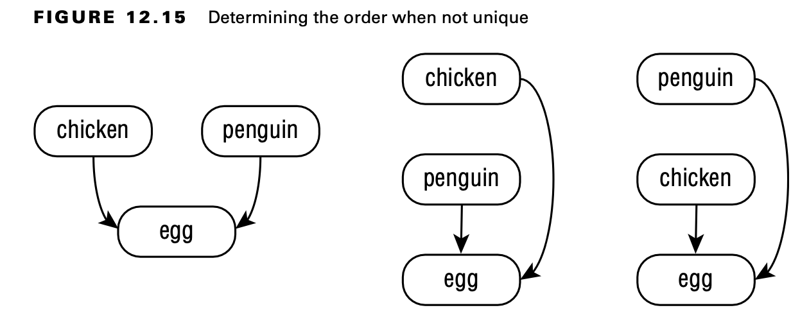
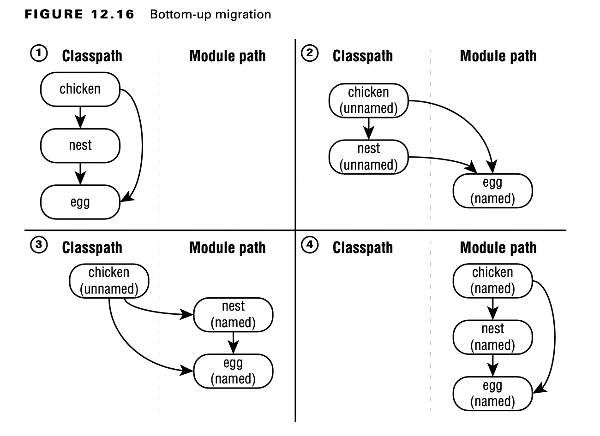
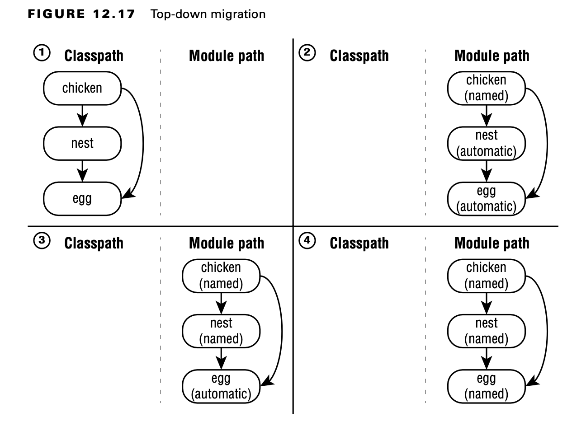
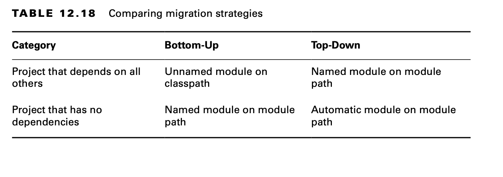
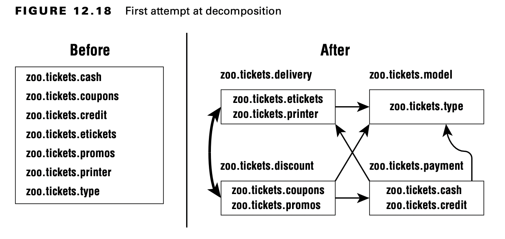
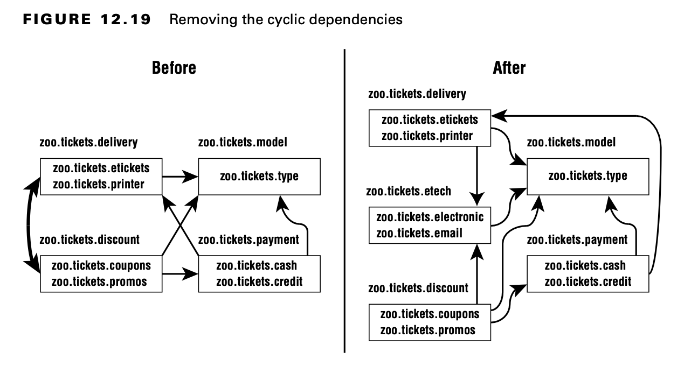

# Migrating an Application

Muchas aplicaciones no se diseñaron para usar el sistema de módulos de la plataforma Java porque se escribieron antes de que se creara o porque eligieron no usarlo. Idealmente, al menos fueron diseñados con proyectos en lugar de como una gran bola de barro. Esta sección le brinda una descripción general de las estrategias para migrar una aplicación existente para usar módulos. Cubrimos el pedido de módulos, la migración de abajo hacia arriba, la migración de arriba hacia abajo y cómo dividir un proyecto existente.

**MigratingYour Applications at Work**

El examen existe en un universo ficticio donde no hay dependencias de código abierto y las aplicaciones son muy pequeñas. Estos escenarios facilitan mucho el aprendizaje y la discusión sobre la migración. En el mundo real, las aplicaciones tienen bibliotecas que no se han actualizado en 10 años o más, gráficos de dependencia complejos y todo tipo de sorpresas.

Tenga en cuenta que puede usar todas las funciones de Java 17 sin convertir su aplicación en módulos (¡excepto las funciones en este capítulo del módulo, por supuesto!). Asegúrese de tener un motivo para la migración y no crea que es necesario.

## Determining the Order

Antes de que podamos migrar nuestra aplicación para usar módulos, necesitamos saber cómo están estructurados los paquetes y las bibliotecas en la aplicación existente.



El lado derecho del diagrama facilita la identificación de la parte superior e inferior a la que se refieren la migración de arriba hacia abajo y de abajo hacia arriba. Los proyectos que no tienen dependencias se encuentran en la parte inferior. Los proyectos que tienen dependencias están en la parte superior.

En este ejemplo, solo hay un orden de arriba a abajo que respeta todas las dependencias. La figura 12.15 muestra que el orden no siempre es único. Dado que dos de los proyectos no tienen una flecha entre ellos, se permite cualquier orden al decidir el orden de migración.



## Exploring a Bottom-Up Migration Strategy

El enfoque más fácil para la migración es una migración de abajo hacia arriba. Este enfoque funciona mejor cuando tiene el poder de convertir cualquier archivo JAR que aún no sea un módulo. Para una migración ascendente, siga estos pasos:

1. Elija el proyecto de nivel más bajo que aún no se haya migrado. (¿Recuerdas la forma en que los ordenamos por dependencias en la sección anterior?)
2. Agregue un archivo module-info.java a ese proyecto. Asegúrese de agregar cualquier exportación para exponer cualquier paquete utilizado por archivos JAR de nivel superior. Además, agregue una directiva require para cualquier módulo del que dependa este módulo.
3. Mueva este módulo con nombre recién migrado de la ruta de clase a la ruta del módulo.
4. Asegúrese de que los proyectos que aún no se hayan migrado permanezcan como módulos sin nombre en el classpath.
5. Repita con el siguiente proyecto de nivel más bajo hasta que haya terminado.
6. Con una migración de abajo hacia arriba, los proyectos de nivel inferior están en buena forma. Esto facilita la migración de los proyectos de nivel superior al final. También fomenta el cuidado en lo expuesto.

Durante la migración, tiene una combinación de módulos con nombre y módulos sin nombre. Los módulos con nombre son los de nivel inferior que se han migrado. Están en la ruta del módulo y no pueden acceder a ningún módulo sin nombre.



Los módulos sin nombre están en el classpath. Pueden acceder a los archivos JAR tanto en la ruta de clase como en la ruta del módulo.

## Exploring a Top-Down Migration Strategy

Una estrategia de migración de arriba hacia abajo es más útil cuando no tiene el control de cada archivo JAR que usa su aplicación. Por ejemplo, supongamos que otro equipo posee un proyecto. Simplemente están demasiado ocupados para migrar. No querrá que esta situación retrase toda su migración.

Para una migración de arriba hacia abajo, siga estos pasos:

1. Coloque todos los proyectos en la ruta del módulo.
2. Elija el proyecto de nivel más alto que aún no se haya migrado.
3. Agregue un archivo module-info.java a ese proyecto para convertir el módulo automático en un módulo con nombre. Nuevamente, recuerde agregar cualquier exportación o requiere directivas. Puede usar el nombre de módulo automático de otros módulos al escribir la directiva require ya que la mayoría de los proyectos en la ruta del módulo aún no tienen nombres.
4. Repita con el siguiente proyecto de mayor nivel hasta que haya terminado.



Con una migración de arriba hacia abajo, está admitiendo que todas las dependencias de nivel inferior no están listas, pero que desea convertir la aplicación en sí misma en un módulo.

Durante la migración, tiene una combinación de módulos con nombre y módulos automáticos. Los módulos con nombre son los de nivel superior que se han migrado. Están en la ruta del módulo y tienen acceso a los módulos automáticos. Los módulos automáticos también se encuentran en la ruta del módulo.


## Splitting a Big Project into Modules

Para el examen, debe comprender el proceso básico de dividir un gran proyecto en módulos. No se le dará un gran proyecto, por supuesto. Después de todo, no hay mucho espacio para hacer una pregunta. Afortunadamente, el proceso es el mismo para un proyecto pequeño.

Suponga que comienza con una aplicación que tiene varios paquetes. El primer paso es dividirlos en agrupaciones lógicas y dibujar las dependencias entre ellos.



Hay un problema con esta descomposición. ¿Lo ves? El sistema del módulo de la plataforma Java no permite dependencias cíclicas. Una dependencia cíclica, o dependencia circular, es cuando dos cosas dependen directa o indirectamente una de la otra. Si el módulo zoo.tickets.delivery requiere el módulo zoo.tickets.discount, zoo.tickets.discount no puede requerir el módulo zoo.tickets.delivery.

Ahora que sabemos que la descomposición de la figura 12.18 no funcionará, ¿qué podemos hacer al respecto? Una técnica común es introducir otro módulo. Ese módulo contiene el código que comparten los otros dos módulos. La figura 12.19 muestra los nuevos módulos sin dependencias cíclicas. Fíjate en el nuevo módulo zoo.tickets.etech. Creamos nuevos paquetes para poner en ese módulo. Esto permite a los desarrolladores poner el código común allí y romper la dependencia. ¡No más dependencias cíclicas!

## Failing to Compile with a Cyclic Dependency

Es extremadamente importante comprender que Java no le permitirá compilar módulos que tengan dependencias circulares. En esta sección, observamos un ejemplo que conduce a ese error del compilador.



Considere el módulo zoo.butterfly descrito aquí:

```python
      package zoo.butterfly; 
      public class Butterfly {
         private Caterpillar caterpillar; 
      }

      module zoo.butterfly { 
         exports zoo.butterfly; 
         requires zoo.caterpillar;
      }
```

No podemos compilar esto todavía, ya que necesitamos construir zoo.caterpillar primero. Después de todo, nuestra mariposa lo requiere. Ahora miramos zoo.caterpillar:

```java
      package zoo.caterpillar; 
      public class Caterpillar {
         Butterfly emergeCocoon() { // logic omitted
         } 
      }

      module zoo.caterpillar { 
         exports zoo.caterpillar; 
         requires zoo.butterfly;
      }
```

Ahora tenemos un punto muerto. Ningún módulo se puede compilar. Este es nuestro problema de dependencia circular en el trabajo. Esta es una de las ventajas del sistema de módulos. Le impide escribir código que tenga una dependencia cíclica. ¡Tal código ni siquiera se compilará!

Java aún le permitirá tener una dependencia cíclica entre paquetes dentro de un módulo. Hace cumplir que no tiene una dependencia cíclica entre módulos.

