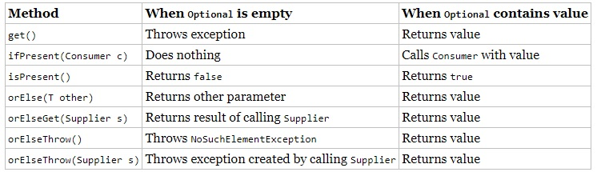
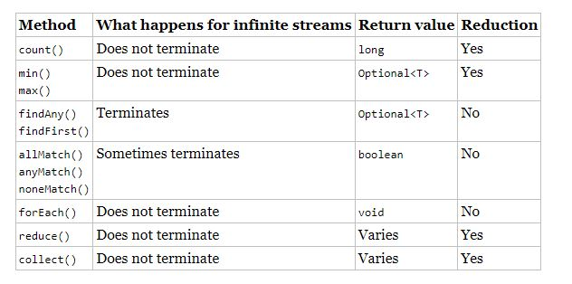
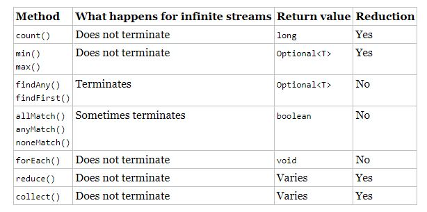
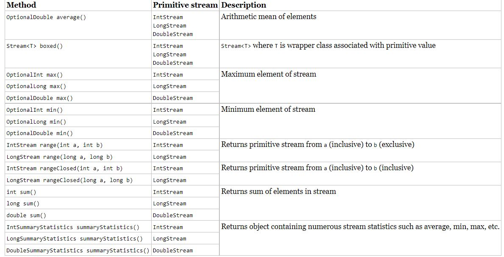
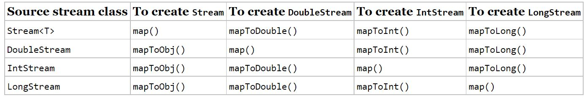
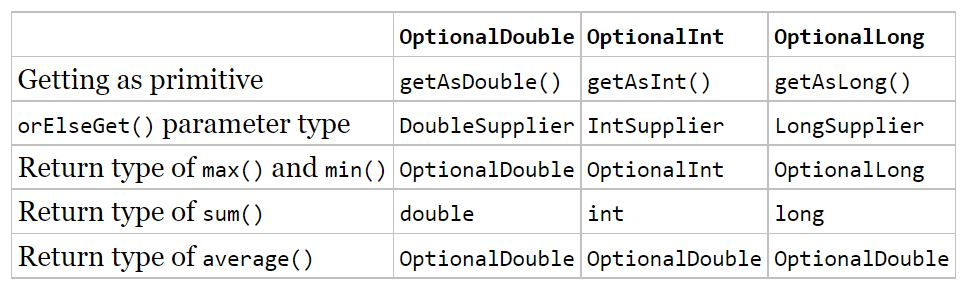
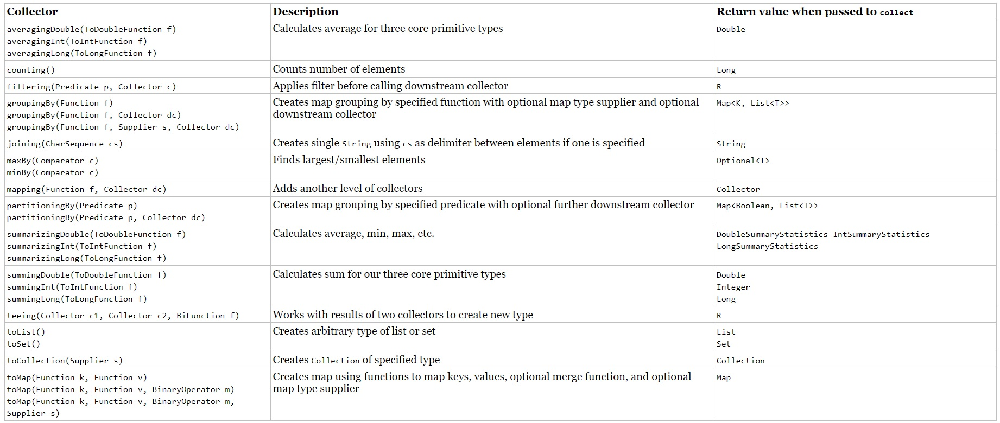

## Optional
### ¿`Optional` es lo mismo que nulo?
Una alternativa a `Optional` es devolver nulo. Hay algunas deficiencias con este enfoque. Una es que no hay una forma clara de expresar que nulo podría ser un valor especial. Por el contrario, devolver un `Optional` es una declaración clara en la API de que es posible que no haya un valor.

Otra ventaja de `Optional` es que puede usar un estilo de programación funcional con `ifPresent()` y los otros métodos en lugar de necesitar una instrucción if. Finalmente, verá hacia el final del capítulo que puede encadenar llamadas opcionales.


```java
@SuppressWarnings({ "unused", "rawtypes" })
	public static void main(String[] args) {
		
		System.out.println("media(50, 60, 80): "+media(50, 60, 80));
		System.out.println("media(): "+media());
		
		/***
		 * Resultado:
		 *  media(50, 60, 80): Optional[63.333333333333336]
			media(): Optional.empty
		 */
		
		// Normalmente queremos ver si hay valor para mostrarlo o no
		
		var resultado = media(92,55,44);
		if(resultado.isPresent()) 
			System.out.println(resultado.get());
		
		try {

			var resultadoVacio = media();
			resultadoVacio.get(); // NoSuchElementException
		} catch (NoSuchElementException e) {
			System.out.println("Si se extre un opcional vacio con get se obtiene excepcion:"+ e.getMessage());
		}
		
		
		// Al crear un Optional, es común querer usar vacío() cuando el valor es nulo. Puede hacer esto con una instrucción 
		
		String value = null;
		Optional op1 = (value == null) ? Optional.empty() : Optional.of(value);
		// Si el valor es nulo, a o se le asigna el Optional vacío. De lo contrario, envolvemos el valor. 
		// Dado que este es un patrón tan común, Java proporciona un método de fábrica para hacer lo mismo.

		Optional<String> op2 =Optional.ofNullable(value);
		
		/**
		 * Ya has visto get() e isPresent(). Los otros métodos le permiten escribir código que usa un Optional en una línea 
		 * sin tener que usar el operador ternario. Esto hace que el código sea más fácil de leer. 
		 * En lugar de usar una instrucción if, que usamos al verificar el promedio anteriormente, 
		 * podemos especificar que se ejecute un Consumer cuando haya un valor dentro de Optional. 
		 * Cuando no lo hay, el método simplemente omite la ejecución del Consumer.
		 */
		
		var resultado2 = media(2,5,45);
		resultado.ifPresent(System.out::println);
		
		// DEALING WITH EMPTY OPTIONAL
		// Si nuestro resultado es empty podemos querer hacer una acción, para eso tenemos la opcion orElse y orElseGet
		var resultadoVacio2 = media();
		System.out.println(resultadoVacio2.orElse(Double.NaN));
		System.out.println(resultadoVacio2.orElseGet(() -> Math.random()));
		
		// Imprime algo asi
		// NaN
		// 0.39556685131214986
		
		// Tambien podemos querer lanzar una excepción tenemos dos opciones
		// orElseThrow
		// orElseThrow(Supplier s)

		var resultadoVacio3 = media();
		try {
			resultadoVacio3.orElseThrow();
		} catch (Exception e) {
			e.printStackTrace();
		}
		try {
			resultadoVacio3.orElseThrow(() -> new IllegalStateException(" ¡La lista de scores no puede estar vacia tronco! "));
			
		} catch (Exception e) {

			e.printStackTrace();
		}
		
        // Los dos métodos que toman un Supplier  tienen nombres diferentes. ¿Ves por qué este código no se compila?

		System.out.println(media().orElseGet(
				   () -> new IllegalStateException())); // DOES NOT COMPILE
		
        // La variable opt es un <Double> opcional. Esto significa que el Supplier  debe devolver un Doble. 
        // Dado que este Supplier devuelve una excepción, el tipo no coincide.

        
		
		
	}
	
	/**
	 * 
	 * @param scores
	 * @return OPtional.Empty si el array de scores esta vario
	 * 		  Optional con la media en otro caso
	 */pipeline
	public static Optional<Double> media(int ...scores){
		
		if(scores.length == 0) {
			return Optional.empty();
		}
		int suma = 0;
		for(int score: scores) {
			suma = suma+score;
		}
		return Optional.of((double)suma/scores.length);
		
	}
```




- static <T> Optional<T>	ofNullable​(T value)	
Returns an Optional describing the given value, if non-null, otherwise returns an empty Optional.

## Streams

Una secuencia en Java es una secuencia de datos. Un stream pipeline consiste en las operaciones que se ejecutan en un stream para producir un resultado. Primero, observamos conceptualmente pipelines. Después de eso, nos metemos en el código.

## Entendiendo el Pipeline Flow

## Crear Stream sources:

### Streams finitos
```java
	// crear un array vacio
	Stream<String> empty = Stream.empty();
	Stream<Integer> unElemento = Stream.of(1);
	Stream<Integer> masElementos = Stream.of(1, 2, 3);
```

Si ejecutasemos por pantalla e empty
```java
   System.out.println(empty);
        // Esto imprime algo así
        // java.util.stream.ReferencePipeline$Head@233fe9b6
```
```java
// Otra forma es generando cosas.
	Stream<Integer> imparesDebajo100 = Stream.iterate(
			1,                // seed
			n -> n < 100,     // Predicate to specify when done
			n -> n + 2);      // UnaryOperator to get next value

	var lista = imparesDebajo100.collect(Collectors.toList());
	lista.forEach(p -> System.out.print(""+p+","));
```

Para temas de concurrencia se ejecuta paralell Strem
```java
	24: var list = List.of("a", "b", "c");
	25: Stream<String> fromListParallel = list.parallelStream();
```


### Stream infinitos

```java
	17: Stream<Double> randoms = Stream.generate(Math::random);
	18: Stream<Integer> oddNumbers = Stream.iterate(1, n -> n + 2);
```

La línea 17 genera un stream de números aleatorios. ¿Cuántos números aleatorios? Los que necesites. Si llama a randoms.forEach(System.out::println), el programa imprimirá números aleatorios hasta que lo elimine. Más adelante en el capítulo, aprenderá sobre operaciones como limit() para convertir el stream infinito en un stream finito.

La línea 18 te da más control. El método iterar() toma una semilla o un valor inicial como primer parámetro. Este es el primer elemento que formará parte de la corriente. El otro parámetro es una expresión lambda que se pasa el valor anterior y genera el siguiente valor. Al igual que con el ejemplo de números aleatorios, seguirá produciendo números impares mientras los necesite.

## Hay que estudiarse esta tabla




## Common Terminal Operations



## Count
public long count()


## Encontrar el maximo y el minimo

La firma de los métodos es la siguiente
```java

	public Optional<T> min(Comparator<? super T> comparator)
	public Optional<T> max(Comparator<? super T> comparator)
```

Algunos ejemplos

```java
    public void minNumber() {
        List<Integer> numbers = List.of(1, 2, 3, 100, 23, 93, 99);
        Optional<Integer> min = numbers.stream().min((i1, i2) -> i1.compareTo(i2));
        
        min.ifPresent(System.out::println); // 1
        
    }

    public void maxNumber() {
        List<Integer> numbers = List.of(1, 2, 3, 100, 23, 93, 99);
        Optional<Integer> max = numbers.stream().max((i1, i2) -> i1.compareTo(i2));    

        
        max.ifPresent(System.out::println); // 100
    }
    
    public void sortedText() {
        
        Stream<String> s = Stream.of("monkey", "ape", "bonobo");
        Optional<String> min = s.min((s1, s2) -> s1.length()-s2.length());
        
        min.ifPresent(System.out::println); // ape
    }
```
    

¿Qué sucede si necesita los valores min() y max() del mismo stream? Por ahora, no puede tener ambos, al menos no usar estos métodos. Recuerde, una secuencia solo puede tener una operación de terminal. Una vez que se ha ejecutado una operación de terminal, la secuencia no se puede volver a utilizar. Como verá más adelante en este capítulo, existen métodos de resumen incorporados para algunos streams numéricos que calcularán un conjunto de valores por usted.

## findAny findFirst

Como su nombre lo indica, el método findAny() puede devolver cualquier elemento de la secuencia. Cuando se invoca en las secuencias que ha visto hasta ahora, normalmente devuelve el primer elemento, aunque este comportamiento no está garantizado.

Estos métodos son operaciones terminales pero no reducciones. La razón es que a veces regresan sin procesar todos los elementos.

El metodo de la firma

```java

	public Optional<T> findAny()
	public Optional<T> findFirst()
```

Este ejemplo encuentra un animal.

```java
	Stream<String> s = Stream.of("monkey", "gorilla", "bonobo");
	Stream<String> infinite = Stream.generate(() -> "chimp");
	
	s.findAny().ifPresent(System.out::println); // monkey (usually)
	infinite.findAny().ifPresent(System.out::println); // chimp
```

Encontrar cualquier coincidencia es más útil de lo que parece. A veces solo queremos probar los resultados y obtener un elemento representativo, pero no necesitamos desperdiciar el procesamiento para generarlos todos. Después de todo, si planeamos trabajar con un solo elemento, ¿por qué molestarnos en buscar más?

## Matching
Estos pueden o no terminar para streams infinitos. Depende de los datos. Al igual que los métodos de búsqueda, no son reducciones porque no necesariamente analizan todos los elementos.

```java
	public boolean anyMatch(Predicate <? super T> predicate)
	public boolean allMatch(Predicate <? super T> predicate)
	public boolean noneMatch(Predicate <? super T> predicate)
```

```java
	var list = List.of("monkey", "2", "chimp");
	Stream<String> infinite = Stream.generate(() -> "chimp");
	Predicate<String> pred = x -> Character.isLetter(x.charAt(0));
	
	System.out.println(list.stream().anyMatch(pred));   // true
	System.out.println(list.stream().allMatch(pred));   // false
	System.out.println(list.stream().noneMatch(pred));  // false
	System.out.println(infinite.anyMatch(pred));        // true

```

Esto muestra que podemos reutilizar el mismo predicado, pero necesitamos un stream diferente cada vez. El método `anyMatch`() devuelve verdadero porque dos de los tres elementos coinciden. El método `allMatch()` devuelve falso porque uno no coincide. El método `noneMatch`() también devuelve falso porque al menos uno coincide. En el stream infinito, se encuentra una coincidencia, por lo que la llamada finaliza. Si llamamos a `allMatch`(), se ejecutaría hasta que elimináramos el programa.

## forEach
```java

	public void forEach(Consumer<? super T> action)
```

Recuerde que puede llamar a `forEach`() directamente en una colección o en un stream. No se confunda en el examen cuando vea ambos enfoques.

## Reduce

El metodo reduce combina un stream en un objeto simple

Hay tres firma de método:

```java
public T reduce(T identity, BinaryOperator<T> accumulator)
 
public Optional<T> reduce(BinaryOperator<T> accumulator)
 
public <U> U reduce(U identity,
   BiFunction<U,? super T,U> accumulator,
   BinaryOperator<U> combiner)
```

Mira el siguiente ejemplo para tratar de concatenar un array de Strings en un String simple sin programación funcional,
Tenemos algo como esto

```java 
	var array = new String[] { "w", "o", "l", "f" };
	var result = "";
	for (var s: array) 
		result = result + s;
	System.out.println(result); // wolf
```

- La *identidad* es el valor inicial de la reducción, en este caso un `String` vacio.
- El *acumulador* combinan el resultado acual con el valor actual del stream.

```java
	Stream<String> stream = Stream.of("w", "o", "l", "f");
	var result = stream.reduce("", (s, c) -> s+c) 
	System.out.println(result); // wolf
```
Observe cómo todavía tenemos la cadena vacía como identidad. También seguimos concatenando los objetos String para obtener el siguiente valor. Incluso podemos reescribir esto con una referencia de método:

```java
	Stream<String> stream = Stream.of("w", "o", "l", "f");
	String word = stream.reduce("", String::concat);
	System.out.println(result); // wolf
```

¿Puedes escribir una reducción para multiplicar todos los objetos Integer en una secuencia? Intentalo. Nuestra solución se muestra aquí:

```java
	Stream<Integer> stream = Stream.of(3, 5, 6);
	System.out.println(stream.reduce(1, (a, b) -> a*b)); // 90
```

Aquí ponemos la identidad a 1 y el acumulador a la multiplicación. En muchos casos, la identidad no es realmente necesaria, por lo que Java nos permite omitirla. Cuando no especifica una identidad, se devuelve un `Optional` porque es posible que no haya ningún dato. Hay tres opciones para lo que está en el `Optional`:

- Si el stream  está vacío, se devuelve un `Optional` empty .
- Si el stream  tiene un elemento, se devuelve.
- Si el stream  tiene varios elementos, se aplica el acumulador para combinarlos.

A continuación se ilustra cada uno de estos escenarios:

```java
    Stream<Integer> empty = Stream.empty();
	Stream<Integer> element = Stream.of(15);
	Stream<Integer> elements = Stream.of(1,3,5,6);
	
	BinaryOperator<Integer> accumulator = (a,b) -> a*b;
	Optional<Integer> emptyResult = empty.reduce(accumulator);
	Optional<Integer> oneElement = element.reduce(accumulator);
	Optional<Integer> threeElements = elements.reduce(accumulator);
	
	emptyResult.reduce(accumulator).ifPresent(System.out::println);           // no output
	oneElement.reduce(opaccumulator).ifPresent(System.out::println);          // 3
	threeElements.reduce(accumulator).ifPresent(System.out::println);         // 90
```

La tercera firma del método `reduce` se utiliza cuando estamos lidiando con diferentes tipos de datos

```java
	Stream<String> stream = Stream.of("w", "o", "l", "f!");
	int length = stream.reduce(0, (i, s) -> i+s.length(), (a, b) -> a+b);
	System.out.println(length); // 5
```

El primer parámetro (0) es el valor del inicializador. Si tuviéramos un stream vacío, esta sería la respuesta. El segundo parámetro es el acumulador. A diferencia de los acumuladores que vio anteriormente, este maneja tipos de datos mixtos. En este ejemplo, el primer argumento, i, es un número entero, mientras que el segundo argumento, s, es una cadena. Agrega la longitud de la Cadena actual a nuestro total acumulado. El tercer parámetro se llama el combinador, que combina cualquier total intermedio. En este caso, a y b son ambos valores enteros.

## Collecting

El método `collect`() es un tipo especial de reducción llamado reducción mutable. Es más eficiente que una reducción regular porque usamos el mismo objeto mutable mientras acumulamos. Los objetos mutables comunes incluyen `StringBuilder` y `ArrayList`. Este es un método realmente útil, porque nos permite sacar datos de streams y ponerlos en otra forma. Las firmas del método son las siguientes:

```java
	public <R> R collect(Supplier<R> supplier,
	BiConsumer<R, ? super T> accumulator,
	BiConsumer<R, R> combiner)
	
	public <R,A> R collect(Collector<? super T, A,R> collector)
```

Basandose en la primera firma del mentodo podemos querer crear un TreeSet o StringBuilder y podriamos hacerlos de la siguinte forma
```java

	Stream<String> stream = Stream.of("w", "o", "l", "f");
	
	StringBuilder word = stream.collect(
	StringBuilder::new,
	StringBuilder::append,
	StringBuilder::append);
	System.out.println(word); // wolf
```

```java
   Stream<String> stream = Stream.of("w", "o", "l", "f");
   TreeSet<String> set =    stream.collect(
                StringBuilder::new,
                StringBuilder::append,
                StringBuilder::append);
	System.out.println(set); // [f, l, o, w]
```
Si no necesitas ordenar el codigo es nas corto

```java
	Stream<String> stream = Stream.of("w", "o", "l", "f");
	Set<String> set = stream.collect(Collectors.toSet());
	System.out.println(set); // [f, w, l, o]
```
## Using Common Intermediate Operations

## Filter

```java
	public Stream<T> filter(Predicate<? super T> predicate)
```
This operation is easy to remember and powerful because we can pass any ``Predicate`` to it. For example, this retains all elements that begin with the letter m:

```java
	Stream<String> s = Stream.of("monkey", "gorilla", "bonobo");
	s.filter(x -> x.startsWith("m"))
	.forEach(System.out::print); // monkey
```

## Removing Duplicates

public Stream<T> distinct()

```java
	Stream<String> s = Stream.of("duck", "duck", "duck", "goose");
	s.distinct()
   .forEach(System.out::print); // duckgoose

```
## Restricting by Position

Los métodos `limit`() y `skip`() pueden hacer que un Stream sea más pequeño, o `limit`() podría hacer un stream finito a partir de un stream infinito. Las firmas del método se muestran aquí:

```java
	public Stream<T> limit(long maxSize)
	public Stream<T> skip(long n)
```

El siguiente código crea una secuencia infinita de números que cuentan desde 1. La operación skip() devuelve una secuencia infinita que comienza con los números que cuentan desde 6, ya que omite los primeros cinco elementos. La llamada limit() toma los dos primeros de esos. Ahora tenemos un stream finito con dos elementos, que luego podemos imprimir con el método forEach():

```java
	Stream<Integer> s = Stream.iterate(1, n -> n + 1);
	s.skip(5)
	.limit(2)
	.forEach(System.out::print); // 67
```

El método map() crea un mapeo uno a uno de los elementos en la secuencia a los elementos del siguiente paso en la secuencia. La firma del método es la siguiente:

```java
	public <R> Stream<R> map(Function<? super T, ? extends R> mapper)
```

Este parece más complicado que los otros que has visto. Utiliza la expresión lambda para averiguar el tipo pasado a esa función y el devuelto. El tipo de devolución es la secuencia que se devuelve.

```java
	public class Book {
		private String name;
		private int releaseYear;
		private String is
	}
        List<Book> lista = List.of(
                new Book("dddRa", 1999, "123654"),
                new Book("ssa historia interminable", 1984, "1236asd54"),
                new Book("aaaRatatui", 1990, "123654asd"));
        
        
        List<String> listaTitulos = lista.stream()
            .map(Book::getName)
            .collect(Collectors.toList());
        
        listaTitulos.stream()
            .map(String::toUpperCase)
            .sorted()
            .forEach(System.out::println);
                        // AAARATATUI
                        // DDDRA
                        // SSA HISTORIA INTERMINABLE
     
        Stream<String> s = Stream.of("monkey", "gorilla", "bonobo");
            s.map(String::length)
           .forEach(System.out::print); // 676
```


## FlatMap

El método flatMap() toma cada elemento de la secuencia y convierte los elementos que contiene en elementos de nivel superior en una sola secuencia. Esto es útil cuando desea eliminar elementos vacíos de una secuencia o combinar una secuencia de listas. Le mostramos la firma del método para mantener la coherencia con los otros métodos para que no crea que estamos ocultando nada. No se espera que puedas leer esto:

```java
public <R> Stream<R> flatMap( Function<? super T, ? extends Stream<? extends R>> mapper)
```

Este galimatías básicamente dice que devuelve un Stream del tipo que contiene la función en un nivel inferior. No te preocupes por la firma. Es un dolor de cabeza.

Lo que debes entender es el ejemplo. Esto pone a todos los animales en el mismo nivel y elimina la lista vacía.

```java
	List<String> cero = List.of();
	var uno = List.of("Bonobo");
	var dos = List.of("Mamá Gorila", "Bebé Gorila");
	Stream<List<String>> animales = Stream.of(cero, uno, dos);
	
	animales.flatMap(m -> m.stream())
		.forEach(System.out::println);
```
Aquí está la salida:

Bonobo
mamá gorila
bebé gorila

Como puede ver, eliminó la lista vacía por completo y cambió todos los elementos de cada lista para que estuvieran en el nivel superior de la 
transmisión.

## Sorting

El método sorted() devuelve un stream con los elementos ordenados. Al igual que ordenar matrices, Java utiliza el ordenamiento natural a menos que especifiquemos un comparador. 

Las firmas del método son estas:`

```java
	public Stream<T> sorted()
	public Stream<T> sorted(Comparator<? super T> comparator)
```
Llamar a la primera firma utiliza el orden de clasificación predeterminado.

```java
	Stream<String> s = Stream.of("brown-", "bear-");
		s.sorted()
		.forEach(System.out::print); // bear-brown-
```
Optionalmente, podemos usar una implementación de Comparator a través de un método o una lambda. En este ejemplo, estamos usando un método:

```java

	Stream<String> s = Stream.of("brown bear-", "grizzly-");
		s.sorted(Comparator.reverseOrder())
	.	forEach(System.out::print); // grizzly-brown bear-
```
Aquí pasamos un Comparador para especificar que queremos ordenar en orden inverso al natural. ¿Listo para uno complicado? ¿Ves por qué esto no compila?
```java

	Stream<String> s = Stream.of("brown bear-", "grizzly-");
	s.sorted(Comparator::reverseOrder);  // DOES NOT COMPILE
```
Eche un vistazo a la segunda firma del método `sorted()` nuevamente. Toma un Comparator, que es una interfaz funcional que toma dos parámetros y devuelve un int. Sin embargo, `Comparator::reverseOrder` no hace eso. Debido a que `reverseOrder()` no acepta argumentos y devuelve un valor, la referencia del método es equivalente a `() -> Comparator.reverseOrder()`, que en realidad es un Supplier<Comparator>. Esto no es compatible con `sorted()`. Mencionamos esto para recordarle que realmente necesita conocer bien las referencias de métodos.

## peek

El método peek() es nuestra última intermediate operation. Es útil para la depuración porque nos permite realizar una operación de stream sin cambiar el stream . La firma del método es la siguiente:

```java
	public Stream<T> peek(Consumer<? super T> action)
```
Puede notar que la operación intermedia peek() toma el mismo argumento que la operación terminal forEach(). Piense en peek() como una versión intermedia de forEach() que le devuelve la transmisión original.

El uso más común de peek() es mostrar el contenido de la secuencia a medida que avanza. Supongamos que cometimos un error tipográfico y contamos los osos que comienzan con la letra g en lugar de la b. Estamos desconcertados por qué el conteo es 1 en lugar de 2. Podemos agregar un método peek() para averiguar por qué.

```java
	var stream = Stream.of("black bear", "brown bear", "grizzly");
	long count = stream
		.filter(s -> s.startsWith("g"))
   		.peek(System.out::println) // grizzly
		.count();              
	System.out.println(count);                          // 1
```

## Putting Together the Pipeline

Las secuencias le permiten utilizar el stream y expresar lo que desea lograr en lugar de cómo hacerlo. Digamos que queremos obtener alfabéticamente los dos primeros nombres de nuestros amigos que tienen cuatro caracteres. Sin streams, tendríamos que escribir algo como lo siguiente:

```java

	var list = List.of("Toby", "Anna", "Leroy", "Alex");
	List<String> filtered = new ArrayList<>();
	for (String name: list)
	if (name.length() == 4) filtered.add(name);
	
	Collections.sort(filtered);
	var iter = filtered.iterator();
	if (iter.hasNext()) System.out.println(iter.next());
	if (iter.hasNext()) System.out.println(iter.next());
```
This works. It takes some reading and thinking to figure out what is going on. The problem we are trying to solve gets lost in the implementation. It is also very focused on the how rather than on the what. With streams, the equivalent code is as follows:

```java
	var list = List.of("Toby", "Anna", "Leroy", "Alex");
	list.stream().filter(n -> n.length() == 4).sorted()
	.limit(2).forEach(System.out::println);

	// Before you say that it is harder to read, we can format it.

	var list = List.of("Toby", "Anna", "Leroy", "Alex");
	list.stream()
	.filter(n -> n.length() == 4)
	.sorted()
	.limit(2)
	.forEach(System.out::println);
```
La diferencia es que expresamos lo que está pasando. Nos preocupamos por los objetos String de longitud 4. Luego los queremos ordenados. Entonces queremos los dos primeros. Entonces queremos imprimirlos. Se relaciona mejor con el problema que estamos tratando de resolver y es más simple.

Una vez que comience a usar sterams en su código, es posible que los use en muchos lugares. ¡Tener un código más corto, más breve y más claro es definitivamente algo bueno!

En este ejemplo, verá las tres partes de la canalización. La figura 10.5 muestra cómo cada operación intermedia en la canalización alimenta a la siguiente.

Ilustración esquemática de una pipeline de stream con múltiples operaciones intermedias
FIGURA 10.5 pipeline de stream con múltiples operaciones intermedias

Recuerde que el capataz de la línea de montaje está averiguando cómo implementar mejor la pipeline de stream. Prepararon todas las mesas con instrucciones de esperar antes de comenzar. Le dicen al trabajador limit() que les informe cuando pasan dos elementos. Le dicen al trabajador ordenado () que simplemente deben recopilar todos los elementos a medida que ingresan y clasificarlos todos a la vez. Después de ordenar, deberían comenzar a pasarlos al trabajador limit() uno a la vez. El stream de datos se ve así:

El método stream() envía a Toby a filter(). El método filter() ve que la longitud es buena y envía a Toby a sorted(). El método sorted() aún no puede ordenar porque necesita todos los datos, por lo que contiene a Toby.
El método stream() envía a Anna a filter(). El método filter() ve que la longitud es buena y envía a Anna a sorted(). El método sorted() aún no puede ordenar porque necesita todos los datos, por lo que contiene a Anna.
El método stream() envía a Leroy a filter(). El método filter() ve que la longitud no coincide y saca a Leroy del procesamiento de la línea de montaje.
El método stream() envía a Alex a filter(). El método filter() ve que la longitud es buena y envía a Alex a sorted(). El método sorted() aún no puede ordenar porque necesita todos los datos, por lo que contiene a Alex. Resulta que sorted() tiene todos los datos requeridos, pero aún no los sabe.
El capataz le dice a sorted() que es hora de ordenar, y la ordenación ocurre.
El método sorted() envía a Alex a limit(). El método limit() recuerda que ha visto un elemento y envía a Alex a forEach(), imprimiendo a Alex.
El método sorted() envía a Anna a limit(). El método limit() recuerda que ha visto dos elementos y envía a Anna a forEach(), imprimiendo a Anna.
El método limit() ahora ha visto todos los elementos que se necesitan y le dice al capataz. El capataz detiene la línea y no se produce más procesamiento en la pipeline.
¿Tener sentido? Probemos algunos ejemplos más para asegurarnos de que lo entiendes bien. ¿Qué crees que hace lo siguiente?
```java

Stream.generate(() -> "Elsa")
   .filter(n -> n.length() == 4)
   .sorted()
   .limit(2)
   .forEach(System.out::println);
```

Se cuelga hasta que mata el programa, o lanza una excepción después de quedarse sin memoria. El capataz ha dado instrucciones a sorted() para que espere hasta que todo esté presente para ordenar. Eso nunca sucede porque hay una stream infinito. ¿Qué pasa con este ejemplo?

```java
Stream.generate(() -> "Elsa")
   .filter(n -> n.length() == 4)
   .limit(2)
   .sorted()
   .forEach(System.out::println);
```

Este imprime a Elsa dos veces. El filtro deja pasar los elementos y limit() detiene las operaciones anteriores después de dos elementos. Ahora sorted() puede ordenar porque tenemos una lista finita. Finalmente, ¿qué crees que hace esto?

Stream.generate(() -> "Olaf Lazisson")
   .filter(n -> n.length() == 4)
   .limit(2)
   .sorted()
   .forEach(System.out::println);

Este también cuelga hasta que matamos el programa. El filtro no permite el paso de nada, por lo que limit() nunca ve dos elementos. Esto significa que tenemos que seguir esperando y desear que aparezcan.

Incluso puede encadenar dos pipelines juntas. Vea si puede identificar las dos fuentes y las dos operaciones de terminal en este código.

```java
30: long count =  Stream.of("goldfish", "finch")
31:    .filter(s -> s.length()> 5)
32:    .collect(Collectors.toList())
33:    .stream()
34:    .count();
35: System.out.println(count);   // 1
```

Las líneas 30 a 32 son una pipeline y las líneas 33 y 34 son otra. Para la primera pipeline, la línea 30 es la fuente y la línea 32 es la operación terminal. Para el segundo gasoducto, la línea 33 es la fuente y la línea 34 es la operación terminal. ¡Ahora esa es una forma complicada de generar el número 1!

Ícono de sugerencia En el examen, es posible que vea canalizaciones largas o complejas como opciones de respuesta. Si esto sucede, concéntrese en las diferencias entre las respuestas. Esas serán sus pistas para la respuesta correcta. Este enfoque también le ahorrará tiempo al no tener que estudiar toda la pipeline en cada opción.

Cuando vea canalizaciones encadenadas, tenga en cuenta dónde están las operaciones de origen y terminal. Esto le ayudará a realizar un seguimiento de lo que está sucediendo. Incluso puede reescribir el código en su cabeza para tener una variable en el medio para que no sea tan largo y complicado. Nuestro ejemplo anterior se puede escribir de la siguiente manera:


```java
List<String> helper =  Stream.of("goldfish", "finch")
   .filter(s -> s.length()> 5)
   .collect(Collectors.toList());
long count = helper.stream()
   .count();
System.out.println(count);
```

## Working with Primitive Streams

Hasta ahora, todas las streams que creamos usaban la interfaz `Stream` con un tipo genérico, como Stream<String>, Stream<Integer>, etc. 

Java en realidad incluye otras clases de stream  además de Stream que puede usar para trabajar con primitivas seleccionadas: int, double y long. Echemos un vistazo a por qué esto es necesario. Supongamos que queremos calcular la suma de números en un stream finito:

```java
	Stream<Integer> stream = Stream.of(1, 2, 3);
	System.out.println(stream.reduce(0, (s, n) -> s + n));  // 6
```
Hay otra forma de hacerlo, mas final, que se muestra aquí:

```java
	Stream<Integer> stream = Stream.of(1, 2, 3);
	System.out.println(stream.mapToInt(x -> x).sum()); // 6
```
Esta vez, convertimos nuestro `Stream<Integer>` en un `IntStream` y le pedimos a `IntStream` que calculara la suma por nosotros. Un `IntStream` tiene muchos de los mismos métodos intermedios y terminales que un Stream, pero incluye métodos especializados para trabajar con datos numéricos. Los Stream primitivos saben cómo realizar ciertas operaciones comunes automáticamente.

Hasta ahora, esto parece una buena conveniencia pero no tan importante. Ahora piensa en cómo calcularías un promedio. Necesitas dividir la suma por el número de elementos. El problema es que los streams solo permiten una pasada. Java reconoce que calcular un promedio es algo común y proporciona un método para calcular el promedio en las clases de stream para las primitivas.

```java
	IntStream intStream = IntStream.of(1, 2, 3);
	OptionalDouble avg = intStream.average();
	System.out.println(avg.getAsDouble());  // 2.0
```
No solo es posible calcular el promedio, sino que también es fácil hacerlo. Claramente, las streams primitivas son importantes. Analizamos la creación y el uso de dichos streams, incluidos los opcionales y las interfaces funcionales.
## Creating Primitive Streams

- IntStream: Used for the primitive types `int`, `short`, `byte`, and `char`
- LongStream: Used for the primitive type `long`
- DoubleStream: Used for the primitive types double and `float`



Algunos ejemplos:

```java
   		DoubleStream empty = DoubleStream.empty();
        empty.forEach(System.out::println);
        
            // No imprime nada
        
        
        DoubleStream threeElements = DoubleStream.of(3.14, 1.2, 1.3);
        OptionalDouble average = threeElements.average();
        average.ifPresent(System.out::println);
        
            // imprime la media
            // 1.8800000000000001
        
        DoubleStream.generate(Math::random)
                .limit(3)
                .forEachOrdered(System.out::println);
        
            /*
             *  0.07890654781186413
                0.28564363465842346
                0.6311403511266134
             */
        
        var fractions = DoubleStream
                .iterate(0.5, p -> p/2)
                .limit(3);
        fractions.forEach(System.out::println);
            
            /*
             *  0.5
                0.25
                0.125
             */
        
        IntStream range = IntStream.range(1, 6);
        range.forEach(p -> System.out.print(" "+p));
        System.out.println();
            //  1 2 3 4 5
        IntStream rangeClosed = IntStream.rangeClosed(1, 6);
        rangeClosed.forEach(p -> System.out.print(" "+p));
        System.out.println();
           //  1 2 3 4 5 6
```




## Using optional with Primitive Streams

```java
        var stream = IntStream.rangeClosed(1, 10);
        OptionalDouble optional = stream.average();
        
        optional.ifPresent(System.out::println); // 5.5
        System.out.println(optional.getAsDouble()); // 5.5
        System.out.println(optional.orElseGet(() -> Double.NaN)); //5.5
```



```java
5: LongStream longs = LongStream.of(5, 10);
6: long sum = longs.sum();
7: System.out.println(sum);     // 15
8: DoubleStream doubles = DoubleStream.generate(() -> Math.PI);
9: OptionalDouble min = doubles.min(); // runs infinitely
```

La línea 5 crea un stream de primitivos largas con dos elementos. La línea 6 muestra que no usamos un opcional para calcular una suma. La línea 8 crea un stream infinito de primitivas dobles. La línea 9 está ahí para recordarle que una pregunta sobre el código que se ejecuta infinitamente también puede aparecer con stream primitivos.

# Resumen de estadísticas

Ha aprendido lo suficiente como para poder obtener el valor máximo de un stream de primitivas int. Si la secuencia está vacía, queremos lanzar una excepción.

```java
	private static int max(IntStream ints) {
		OptionalInt optional = ints.max();
		return optional.orElseThrow(RuntimeException::new);
	}
```
Ahora queremos cambiar el método para tomar un IntStream y devolver un rango. 

El rango es el valor mínimo restado del valor máximo. UH oh. Tanto min() como max() son operaciones de terminal, lo que significa que consumen el stream cuando se ejecutan. No podemos ejecutar dos operaciones de terminal en el mismo stream. Afortunadamente, este es un problema común y las secuencias primitivas lo resuelven con estadísticas de resumen. Estadística es solo una gran palabra para un número que se calculó a partir de datos.

```java
private static int range(IntStream ints) {
   IntSummaryStatistics stats = ints.summaryStatistics();
   if (stats.getCount() == 0) throw new RuntimeException();
   return stats.getMax()-stats.getMin();
}
```
Aquí le pedimos a Java que realizara muchos cálculos sobre la transmisión. Las estadísticas resumidas incluyen lo siguiente:

`SummaryStatistics`:

-	`getCount()` : Returns a long representing the number of values.
-	`getAverage()`: Returns a double representing the average. If the stream is empty, returns 0.
-	`getSum()`: Returns the sum as a double for DoubleSummaryStream and long for IntSummaryStream and LongSummaryStream.
-	`getMin()`: Returns the smallest number (minimum) as a double, int, or long, depending on the type of the stream. If the stream is empty, returns the largest numeric value based on the type.
-	`getMax()`: Returns the largest number (maximum) as a double, int, or long depending on the type of the stream. If the stream is empty, returns the smallest numeric value based on the type.


# Trabajando con conceptos de Stream Pipeline avanzados

¡Felicidades, solo te quedan algunos temas más! En esta última sección de secuencias, aprendemos sobre la relación entre las secuencias y los datos subyacentes, el encadenamiento opcional y la agrupación de recopiladores. ¡Después de esto, deberías ser un profesional con las transmisiones!

# Linking Streams to the Underlying Data

¿Que crees que esto produce?

```java
	25: var cats = new ArrayList<String>();
	26: cats.add("Annie");
	27: cats.add("Ripley");
	28: var stream = cats.stream();
	29: cats.add("KC");
	30: System.out.println(stream.count());
```

La respuesta correcta es 3. Las líneas 25 a 27 crean una Lista con dos elementos. La línea 28 solicita que se cree un stream a partir de esa lista. Recuerde que las transmisiones se evalúan con pereza. Esto significa que la secuencia no se crea en la línea 28. Se crea un objeto que sabe dónde buscar los datos cuando se necesitan. En la línea 29, la Lista obtiene un nuevo elemento. En la línea 30, se ejecuta la pipeline de stream. Primero, mira la fuente y ve tres elementos.

# Encadenando Optionals

```java
private static void threeDigit(Optional<Integer> optional) {
   if (optional.isPresent()) {  // outer if
      var num = optional.get();
      var string = "" + num;
      if (string.length() == 3) // inner if
         System.out.println(string);
   }
}
```

Esto funciona pero contien nested if statements. Esto es complejidad extra, con programacion declarativa.

```java
private static void threeDigit(Optional<Integer> optional) {
   optional.map(n -> "" + n)            // part 1
      .filter(s -> s.length() == 3)     // part 2
      .ifPresent(System.out::println);  // part 3
}
```
Esto es mucho más corto y más expresivo. Con las lambdas, al examen le gusta dividir una sola declaración e identificar las piezas con un comentario. Lo hemos hecho aquí para mostrar lo que sucede con los enfoques de programación funcional y programación no funcional.

Supongamos que se nos da un `Optional` vacío. El primer enfoque devuelve false para la declaración if externa. El segundo enfoque ve un `Optional` vacío y hace que map() y filter() lo pasen. Luego, ifPresent() ve un `Optional` vacío y no llama al parámetro Consumidor.

El siguiente caso es donde se nos da un `Optional`.of(4)`. El primer enfoque devuelve falso para la instrucción if interna. El segundo enfoque asigna el número 4 a "4". El filter() luego devuelve un `Optional` vacío ya que el filtro no coincide, y ifPresent() no llama al parámetro Consumer.

El caso final es donde se nos da un `Optional.of(123)`. El primer enfoque devuelve verdadero para ambas declaraciones if. El segundo enfoque asigna el número 123 a "123". El filter() luego devuelve el mismo `Optional`, y ifPresent() ahora llama al parámetro Consumer.

Ahora supongamos que queremos obtener un `Optional<Integer>` que represente la longitud de la Cadena contenida en otro `Optional`. Suficientemente fácil:

```java
	Optional<Integer> result = optional.map(String::length);
```
¿Qué pasaría si tuviéramos un método auxiliar que hiciera la lógica de calcular algo por nosotros que devuelve Optional<Integer>? Usar el mapa no funciona:

```java
	Optional<Integer> result = optional
	.map(ChainingOptionals::calculator); // DOES NOT COMPILE
```
El problema es que la calculadora devuelve Optional<Integer>. El método `map`() agrega otro `Optional`, dándonos `Optional<Optional<Integer>>`. Bueno, eso no es bueno. La solución es llamar a `flatMap()`, en su lugar:

```java
	Optional<Integer> result = optional
	.flatMap(ChainingOptionals::calculator);
```
Este funciona porque `flatMap` elimina la capa innecesaria. En otras palabras, aplana el resultado. Encadenar llamadas a `flatMap()` es útil cuando desea transformar un tipo `Optional` en otro.

# Using SplitIterator

Suponga que compra una bolsa de comida para que dos niños puedan alimentar a los animales en el zoológico interactivo. Para evitar discusiones, has venido preparado con una bolsa extra vacía. Saca aproximadamente la mitad de la comida de la bolsa principal y la pone en la bolsa que trajo de casa. La bolsa original todavía existe con la otra mitad de la comida.

Un `Spliterator` proporciona este nivel de control sobre el procesamiento. Comienza con una `Collection` o un stream, esa es tu bolsa de comida. Llamas a `trySplit()` para sacar algo de comida de la bolsa. El resto de la comida se queda en el objeto `Spliterator` original.

Las caracteristicas de un `SplitIterator` dependen del origen de datos. Una `Collection` data source es un `Spliterator` básico. Por el contrario, cuando se usa una fuente de datos `Stream`, el `Spliterator` puede ser paralelo o incluso infinito. El `Stream` en sí se ejecuta lazy en lugar de cuando se crea el `Spliterator`.

You do need to know how to work with some of the common methods declared on this interface. The simplified methods you need to know are in Table 10.9.

| Método | Descripción |
| Spliterator<T> trySplit() | Devuelve `Spliterator` que contiene idealmente la mitad de los datos, que se eliminan del `Spliterator` actual. Este método se puede llamar varias veces y eventualmente devolverá un valor nulo cuando los datos ya no se puedan dividir. | 
| void forEachRemaining(Consumer<T> c) | Procesa los elementos restantes en Spl`iterator. | 
| boolean tryAdvance(Consumer<T> c) | Procesa un solo elemento de `Spliterator` si queda alguno. Devuelve si el elemento fue procesado. | 

```java
	12: var stream = List.of("bird-", "bunny-", "cat-", "dog-", "fish-", "lamb-", 
	13:    "mouse-");
	14: Spliterator<String> originalBagOfFood = stream.spliterator();
	15: Spliterator<String> emmasBag = originalBagOfFood.trySplit();
	16: emmasBag.forEachRemaining(System.out::print);  // bird-bunny-cat-
	17:
	18: Spliterator<String> jillsBag = originalBagOfFood.trySplit();
	19: jillsBag.tryAdvance(System.out::print);        // dog-
	20: jillsBag.forEachRemaining(System.out::print);  // fish-
	21: 
	22: originalBagOfFood.forEachRemaining(System.out::print); // lamb-mouse-
```

En las líneas 12 y 13, definimos una Lista. Las líneas 14 y 15 crean dos referencias Spliterator. La primera es la bolsa original, que contiene los siete elementos. El segundo es nuestra división de la bolsa original, colocando aproximadamente la mitad de los elementos en el frente en la bolsa de Emma. Luego imprimimos los tres contenidos de la bolsa de Emma en la línea 16.

Nuestra bolsa de comida original ahora contiene cuatro elementos. Creamos un nuevo Spliterator en la línea 18 y colocamos los dos primeros elementos en la bolsa de Jill. Usamos tryAdvance() en la línea 19 para generar un solo elemento, y luego la línea 20 imprime todos los elementos restantes (¡solo queda uno!).

Comenzamos con siete elementos, eliminamos tres y luego eliminamos dos más. Esto nos deja con dos elementos en la bolsa original creada en la línea 14. Estos dos elementos se generan en la línea 22.

Ahora probemos un ejemplo con un Stream. Esta es una forma complicada de imprimir 123:
```java

   Spliterator<Integer> newBag = originalBag.trySplit();

        newBag.tryAdvance(System.out::print); // 1
        newBag.tryAdvance(System.out::print); // 2
        newBag.tryAdvance(System.out::print); // 3
```

Es posible que haya notado que se trata de una stream infinita. ¡No hay problema! El Spliterator reconoce que la stream es infinita y no intenta darte la mitad. En cambio, newBag contiene una gran cantidad de elementos. Obtenemos los tres primeros ya que llamamos a tryAdvance() tres veces. ¡Sería una mala idea llamar a forEachRemaining() en un stream infinito!

Tenga en cuenta que un Spliterator puede tener una serie de características, como CONCURRENTE, ORDENADO, TAMAÑO y ORDENADO. Solo verá un Spliterator sencillo en el examen. Por ejemplo, nuestro stream infinito no fue TAMAÑO.

# Collecting Results


## Using Basic Collectors



```java
		// joining
        var ohMy = Stream.of("lions", "tigers", "bears");
        String result = ohMy.collect(Collectors.joining(", "));
        System.out.println(result); // lions, tigers, bears

        // Average
        var simpleSteram = Stream.of("test1", "palabra67", "palabramuylarga");
        Double dresult = simpleSteram.collect(Collectors.averagingInt(String::length));
        System.out.println(dresult);// 9.666666666666666

        // Count
        var stream = Stream.of(2, 2, 4, 4, 4, 4, 4, 65, 67, 7, 3455, 234, 234, 234, 234, 23, 234);
        Long nElements = stream.collect(Collectors.counting());
        System.out.println(nElements);// 17

        // toCollection
        var names = Stream.of("Juan", "Laura", "Arturo", "Ita");

        TreeSet<String> simpleTree = names
                .filter((p) -> p.contains("t"))
                .collect(Collectors.toCollection(TreeSet::new));

        simpleTree.forEach(System.out::print);
```
## Collecting into Maps

El código que usa recopiladores que involucran mapas puede ser bastante largo. Lo construiremos lentamente. Asegúrese de comprender cada ejemplo antes de pasar al siguiente. Comencemos con un ejemplo sencillo para crear un mapa a partir de una transmisión:

```java
	var ohMy = Stream.of("lions", "tigers", "bears");
	Map<String, Integer> map = ohMy.collect(
		Collectors.toMap(s -> s, String::length));
		System.out.println(map); // {lions=5, bears=5, tigers=6}
```
```java
		// Una pregunta con truco, ahora vamos a hacer el reverso de la prueba anterior, de forma qie el Map se contenga de 
        // Integer  como clave y String valor.
        try {
            var test = Stream.of("lions", "tigers", "bears");
            Map<Integer, String> someMap = test.collect(Collectors.toMap(
                    String::length,
                    k -> k)); // BAD
           
            
        } catch (Exception e) {
            System.out.println(e.getCause());
            /*
             * Running this gives an exception similar to the following:
             * 
             * Exception in thread "main"
             * java.lang.IllegalStateException: Duplicate key 5
             */
        }
```

```java
	var ohMy = Stream.of("lions", "tigers", "bears");
	TreeMap<Integer, String> map = ohMy.collect(Collectors.toMap(
	String::length,
	k -> k,
	(s1, s2) -> s1 + "," + s2,
	TreeMap::new));
	System.out.println(map); //         // {5=lions,bears, 6=tigers}
	System.out.println(map.getClass()); // class java.util.TreeMap
```
## Grouping, Partitioning, and Mapping

```java
	// Prueba de goupingBy
	var prueba = List.of("Perro", "Gato", "Oso", "Cisne", "Pato", "Liebre", "Conejo"); 
	
	Map<Integer, List<String>> cosas = prueba.stream().collect(Collectors.groupingBy(String::length));
	System.out.println(cosas); // {3=[Oso], 4=[Gato, Pato], 5=[Perro, Cisne], 6=[Liebre, Conejo]}
```

El recopilador `groupingBy()` le dice a `collect()` que debe agrupar todos los elementos de la secuencia en un mapa. La función determina las claves en el Mapa. Cada valor en el Mapa es una Lista de todas las entradas que coinciden con esa clave.

```java
// Prueba de goupingBy con Collectors para pasar a set
        var conjunto = List.of("Perro", "Gato", "Oso", "Cisne", "Pato", "Liebre", "Conejo");
        
        Map<Integer, Set<String>> grouping = conjunto.stream().collect
                (Collectors.groupingBy(String::length, 
                        TreeMap::new, 
                        Collectors.toSet()));
        
        System.out.println(grouping);
```
        
Lo mismo ocurre con List

```java
	var ohMy = Stream.of("lions", "tigers", "bears");
	TreeMap<Integer, List<String>> map = ohMy.collect(
	Collectors.groupingBy(
		String::length,
		TreeMap::new,
		Collectors.toList()));
	System.out.println(map);
```
Partitioning  es un caso especial de agrupación. Con Partitioning , solo hay dos grupos posibles: true y false. Particionar es como dividir una lista en dos partes.

Supongamos que estamos haciendo un letrero para colocarlo afuera de la exhibición de cada animal. Disponemos de dos tamaños de carteles. Uno puede acomodar nombres con cinco o menos caracteres. El otro es necesario para nombres más largos. Podemos dividir la lista según el signo que necesitemos.

   ```java
     // Prueba de Partitioning 
        var listilla = List.of("Perro", "Gato", "Oso", "Cisne", "Pato", "Liebre", "Conejo");
        Map<Boolean, List<String>> kkk = listilla.stream().collect(Collectors.partitioningBy((s) -> s.length() <= 5));
        System.out.println(kkk); //{false=[], true=[Perro, Gato, Oso, Cisne, Pato, Liebre, Conejo]}

```
A diferencia de `groupingBy()`, no podemos cambiar el tipo de Mapa que se devuelve. Sin embargo, solo hay dos claves en el mapa, ¿realmente importa qué tipo de mapa usamos?

En lugar de usar el colector descendente para especificar el tipo, podemos usar cualquiera de los colectores que ya hemos mostrado. Por ejemplo, podemos agrupar por la longitud del nombre del animal para ver cuántos de cada longitud tenemos.

```java
	var ohMy = Stream.of("lions", "tigers", "bears");
	Map<Integer, Long> map = ohMy.collect(
	Collectors.groupingBy(
		String::length,
		Collectors.counting()));
	System.out.println(map);    // {5=2, 6=1}
```
```java
	var ohMy = Stream.of("lions", "tigers", "bears");
	Map<Integer, Optional<Character>> map = ohMy.collect(
	Collectors.groupingBy(
		String::length,
		Collectors.mapping(
			s -> s.charAt(0),
			Collectors.minBy((a, b) -> a - b))));
	System.out.println(map);    // {5=Optional[b], 6=Optional[t]}
```
## Teeing Collectors

```java
	var list = List.of("x", "y", "z");
	Separations result = list.stream()
	.collect(Collectors.teeing(
				Collectors.joining(" "),
				Collectors.joining(","),
				(s, c) -> new Separations(s, c)));
	System.out.println(result);
```
Cuando se ejecuta, el código imprime lo siguiente:

```java
	Separations[spaceSeparated=x y z, commaSeparated=x,y,z]
```
